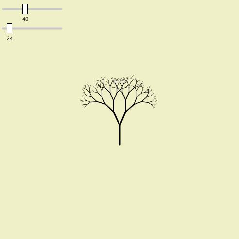

# Slider

## O que é um slider?

Trata-se de um botão que é movido horizontalmente ou verticalmente para controlar uma variável.

## Como fazer um slider usando phyton?


Referência da aplicação de um slider em um sketch construído com python.
Os sliders da imagem acima permitiam a edição paramétrica do objeto. O primeiro botão (variação de 10 a 100) controlava a escala do objeto enquanto o segundo (variação de 0 a 360), manipulava a quantidade de vezes com que os galhos poderiam se replicar. Desse modo, desenhos diversos são gerados a partir das combinações dos botões.



Exemplo da Combinação 1


Exemplo da Combinação 2

``` python
class Slider:
    def __init__(self,low,high,default):
        '''slider has range from low to high
        and is set to default'''
        self.low = low
        self.high = high
        self.val = default
        self.clicked = False
        self.label = '' #blank label
```

Para definir o posicionamento do slider no background:

``` python
def position(self,x,y):
        '''slider's position on screen'''
        self.x = x
        self.y = y
        #the position of the rect you slide:
        self.rectx = self.x + map(self.val,self.low,self.high,0,120)
        self.recty = self.y - 10
```

Para definir a representação gráfica do slider e seus valores randômicos:

``` python
def value(self):
        '''updates the slider and returns value'''
        #gray line behind slider
        strokeWeight(4)
        stroke(200)
        line(self.x,self.y,self.x + 120,self.y)
        #press mouse to move slider
        if mousePressed and dist(mouseX,mouseY,self.rectx,self.recty) < 20:
            self.rectx = mouseX
        #constrain rectangle
        self.rectx = constrain(self.rectx, self.x, self.x + 120)
        #draw rectangle
        strokeWeight(1)
        stroke(0)
        fill(255)
        rect(self.rectx,self.recty,10,20)
        self.val = map(self.rectx,self.x,self.x + 120,self.low,self.high)
        #draw label
        fill(0)
        textSize(10)
        text(int(self.val),self.rectx,self.recty + 35)
        #text label
        text(self.label,self.x + 135,self.y);
        return self.val    
```


