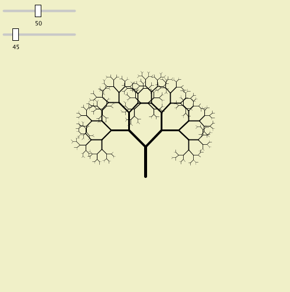

# Slider

## O que é um *slider*?

Trata-se de um elemento de interface que pode ser movido para controlar um valor.

## Como fazer um *slider* no Processing modo Python?



Exemplo de aplicação de *sliders* em um *sketch* permitindo a alteração de um desenho. O primeiro slider (variando de 10 a 100) controla a escala dos galhos enquanto o segundo (variando de 0 a 360), altera o ângul entre os galhos. Desse modo, desenhos diversos são gerados a partir das combinações dos botões.


Exemplo da Combinação 1


Exemplo da Combinação 2

## Exemplo de uso do Slider

```python
# TO DO: código exemplo da árvore com os sliders!!

from slider import Slider

# s1 = Slider(...
# def setup() s1.position(...
# def draw() s1.value()
```


## Funcionamento interno da classe Slider

O código abaixo é utilizado na construção do elemento de interface.

``` python
class Slider:
    def __init__(self,low,high,default):
        '''slider has range from low to high
        and is set to default'''
        self.low = low
        self.high = high
        self.val = default
        self.clicked = False
        self.label = '' #blank label
```

Definição usada para estabelecer o posicionamento do elemento no canvas:

``` python
    def position(self,x,y):
        '''slider's position on screen'''
        self.x = x
        self.y = y
        #the position of the rect you slide:
        self.rectx = self.x + map(self.val,self.low,self.high,0,120)
        self.recty = self.y - 10
```

Método que devolve o valor do slider, desenha na tela o elemento e verificar se foi arrastado.

``` python
    def value(self):
        '''updates the slider and returns value'''
        #gray line behind slider
        strokeWeight(4)
        stroke(200)
        line(self.x,self.y,self.x + 120,self.y)
        #press mouse to move slider
        if mousePressed and dist(mouseX,mouseY,self.rectx,self.recty) < 20:
            self.rectx = mouseX
        #constrain rectangle
        self.rectx = constrain(self.rectx, self.x, self.x + 120)
        #draw rectangle
        strokeWeight(1)
        stroke(0)
        fill(255)
        rect(self.rectx,self.recty,10,20)
        self.val = map(self.rectx,self.x,self.x + 120,self.low,self.high)
        #draw label
        fill(0)
        textSize(10)
        text(int(self.val),self.rectx,self.recty + 35)
        #text label
        text(self.label,self.x + 135,self.y);
        return self.val    
```


