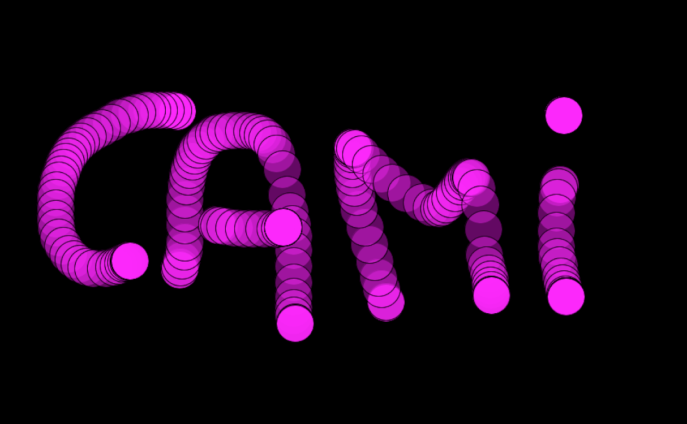

# Disciplina "Programação Criativa"

## Aula 1

[source,shell]
$size (1000,1000)
#caixa alta pois é uma constante
$rectMode(CENTER)
$
#cor em RGB
$fill(200,0,200)
$stroke(255,255,255)
$strokeWeight(10)
$rect(width/2, height/2, 50, 100)
$
#cor em hexa
$fill('#651895')
#quando os numeros sao iguais
$stroke(255)
$circle(100,100,50)
$
#ultimo numero é o alfa para transparente
$fill(255, 255, 255, 100)
$stroke(255)
#quando os numeros sao iguais
$square(width/2, height/2, 250)

[source,shell]
$def setup():
$    size (1000,1000)
$
$def draw():
#CENTER em caixa alta pois é uma constante
$    rectMode(CENTER)
$    
$    fill(200,0,200)#cor em RGB
$    stroke(255,255,255)
$    strokeWeight(10)
$    rect(width/2, height/2, 50, 100)
$    
$    fill('#651895')#cor em hexa
#quando os numeros sao iguais
$    stroke(255)
$    circle(mouseX,mouseY,50)
#ultimo numero é o alfa para transparente
$    fill(255, 255, 255, 100)
#quando os numeros sao iguais usamos só um parametro
$    stroke(255)
$    square(width/2, height/2, 250)

[source,shell]
$def setup():
$    size (1000,1000)
$    background(0)
$
$def draw():
$   
$    fill(255,0,255, 100)
$    rectMode(CENTER)
$    if mousePressed:
$        circle(mouseX,mouseY,50)

[source,shell]
$def setup():
$    size (1000,1000)
$    background(0)
$
$def draw():
$    fill(255,0,255, 100)
$    rectMode(CENTER)
$    sorteio = random(120,179)
$    if mousePressed:
$        circle(mouseX,mouseY,50)
$   else :
$       circle(mouseX,mouseY,100)

