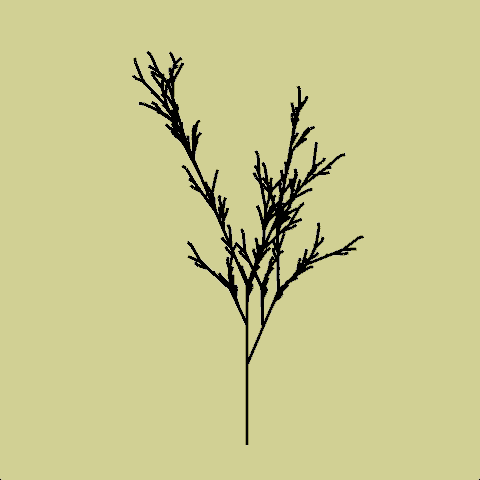

# L-System - Sistema de Lindenmayer

L-Systems são as estruturas e procedimentos criados por Aristide Lindenmayer para estudar o crescimento de algas e plantas, por meio da manipulação de sequências de símbolos. As sequências são geradas por sucessivas iterações da aplicação de regras de substituição. 

A tradução computacional dessas estruturas foi discutida pela primeira vez na serie *Lecture Notes in Biomathematics* com o artigo [Lindenmayer Systems, Fractals, and Plants](https://link.springer.com/content/pdf/10.1007/978-1-4757-1428-9.pdf)  por Przemyslaw Prusinkiewcz e James Hanan (DOI: 10.1007/978-1-4757-1428-9).

> Mais referências:
> 
> - [The Algorithmic Beauty of Plants](http://algorithmicbotany.org/papers/#abop) (+ diversos livros e artigos)
> - [Lindenmayer systems: Describing how things grow with strings of letters, bye Christopher G Jennings](https://www.cgjennings.ca/articles/l-systems/)
> - [L-System User Notes, by Paul Bourke](http://www.paulbourke.net/fractals/lsys/)
> - [Using Lindenmayer Systems to Introduce Computer Science Concepts](https://www.russellgordon.ca/cemc/2017/lindenmayer-systems/)
> - [Wikipedia: L-system](https://en.wikipedia.org/wiki/L-system)


## Pré-requisitos

Para poder entender os exemplos apresentados mais à frente, é preciso familiaridade com algumas ideias do Python:
- como percorrer e "montar" uma cadeia de caracteres (*string*)
- como usar a estrutura de dados dicionário (*dict*)

Podemos percorrer uma palavra com um laço `for`.
```python-cons
>>> for letra in 'aeiou':
       print(letra)
a
e
i
o
u
```

Podemos concatenar novas palavras com o operador `+`. Um *string* vazio com `''` pode ser concatenado sem alterar o resultado.

```python-cons
>>> 'a' + 'e' + 'i' + 'o' + 'u'
'aeioy'

>>> '' + 'a'
'a'  
```
Um dicionário é uma estrutura que guarda *valores* que podem ser encontrados a partir de uma *chave*. Quando consultamos o dicionário com a sintaxe dos colchetes `dicionario[chave]`, se não houver a chave ocorre uma exceção `KeyError`. Usando o método `.get(chave)` é possível evitar essa excessão. Na forma `.get(chave, valor_para_chave_faltando)` é possível escolher o que o dicionário devolve caso a chave não seja encontrada.

```python-cons
>>> ingles = {'maçã': 'apple', 'pêra': 'pear'}
>>> ingles['maçã']
'apple'
>>> ingles['cupuaçu']
Traceback (most recent call last):
  File "<stdin>", line 1, in <module>
KeyError: 'cupuaçu'
>>> fruta = 'banana'
>>> ingles[fruta]
Traceback (most recent call last):
  File "<stdin>", line 1, in <module>
KeyError: 'banana'
>>> ingles.get(fruta, fruta)
'banana'
```
No exemplo abaixo vamos armazenar algumas letras como chaves, e associar uma sequência de letras a elas, as usando para substituir as letras originais.

```python
vogais = {'a': 'aaa', 'e': 'eeê', 'i': 'iih', 'o': 'o-o', 'u': 'üüü'}
palavra = 'anticonstitucionalissimamente'
nova_palavra = ''
for letra in palavra:
    nova_palavra = nova_palavra + vogais.get(letra, letra)
print(nova_palavra)
```
Resultado: **`aaantiihco-onstiihtüüüciiho-onaaaliihssiihmaaameeênteeê`**

## Um exemplo inicial de L-System


```python
axioma = "X"
regras = {"X": "F+[[X]-X]-F[-FX]+X",
          "F": "FF"
          }

tamanho = 10
angulo = 25
iteracoes = 4  # repeticoes (voltas na aplicação das regras)
xo, yo = 300, 500

def setup():
    size(600, 600)
    frase_inicial = axioma
    for i in range(iteracoes):
        frase = ""
        for simbolo in frase_inicial:
            substituicao = regras.get(simbolo, simbolo)
            frase = frase + substituicao
        frase_inicial = frase
    print(len(frase))

    background(240, 240, 200)
    translate(xo, yo)
    for simbolo in frase:
        if simbolo == "F":
            line(0, 0, 0, -tamanho)
            translate(0, -tamanho)
        if simbolo == "+":
            rotate(radians(angulo))
        if simbolo == "-":
            rotate(radians(-angulo))
        if simbolo == "[":
            push_matrix()
        if simbolo == "]":
            pop_matrix()
```

## Uma versão com interatividade

```python
axioma = "X"
regras = {"X": "F+[[X]-X]-F[-FX]+X",
          "F": "FF"
          }
tamanho = 10
angulo = 25
iteracoes = 4  # repeticoes (voltas na aplicação das regras)
xo, yo = 300, 500

def setup():
    global frase
    size(600, 600)
    frase = gerar_sistema(iteracoes, axioma, regras)
    print(len(frase))

def draw():
    background(240, 240, 200)
    translate(xo, yo)
    desenha_sistema(frase)

def gerar_sistema(num, axioma, regras):
    """
    Produz um sistema-L a partir da  frase `axioma`,
    repetindo `num` iterações, as substituições descritas
    nas pelo dicionário `regras`
    """
    frase_inicial = axioma
    for i in range(num):
        frase_nova = ""
        for simbolo in frase_inicial:
            substituicao = regras.get(simbolo, simbolo)
            frase_nova = frase_nova + substituicao
        frase_inicial = frase_nova
    return frase_nova

def desenha_sistema(simbolos):
    """
    Recebe uma frase e desenha de acordo com
    as "regras de desenho".
    """
    for simbolo in simbolos:
        if simbolo == "F":
            line(0, 0, 0, -tamanho)
            translate(0, -tamanho)
        if simbolo == "+":
            rotate(radians(angulo))
        if simbolo == "-":
            rotate(radians(-angulo))
        if simbolo == "[":
            push_matrix()
        if simbolo == "]":
            pop_matrix()

def key_pressed():
    global tamanho, angulo, iteracoes, frase
    if key == 'z':
        tamanho -= 1  # tamanho = tamanho - 1
    if key == 'x':
        tamanho += 1
    if key == 'a':
        angulo -= 1
    if key == 's':
        angulo += 1
    if key == 'q':
        iteracoes -= 1
        frase = gerar_sistema(iteracoes, axioma, regras)
        print(len(frase))
    if key == 'w':
        iteracoes += 1
        frase = gerar_sistema(iteracoes, axioma, regras)
        print(len(frase))
```

## Exemplo 3D



Exemplo usando `P3D` e adicionando `rotate_y()`

```python
axioma = 'X'
regras = {
    'X': 'F+[[X]-X]-F[-FX]+X',
    'F': 'FF',
    }
passo = 5
angulo = 25  # angulo em graus
iteracoes = 5

def setup():
    global frase_resultado
    size(900, 900, P3D)
    frase_inicial=axioma
    for _ in range(iteracoes):
        frase_resultado = ''
        for simbolo in frase_inicial:
            substituir = regras.get(simbolo, simbolo)
            frase_resultado = frase_resultado + substituir
        # print(frase_inicial, frase_resultado)
        frase_inicial=frase_resultado
    print(len(frase_resultado))

def draw():
    background(210, 210, 150)
    stroke_weight(3)
    angulo = 25
    # angulo = mouse_x / 70.0
    translate(width / 2, height * 0.8)
    rotate_y(frame_count / 100.0)
    for simbolo in frase_resultado:
        if simbolo == 'X':   # se simbolo for igual a 'X'
            pass
        elif simbolo == 'F':   # else if (senão se) o simbolo é F
                line(0, 0, 0, -passo)
                translate(0, -passo)
                rotate_y(radians(-angulo))
        elif simbolo == '+':
            rotate(radians(-angulo))  # + random(-5, 5)))
        elif simbolo == '-':
            rotate(radians(+angulo))  # + random(-5, 5)))
        elif simbolo == '[':
            push_matrix()
        elif simbolo == ']':
            pop_matrix()
```
