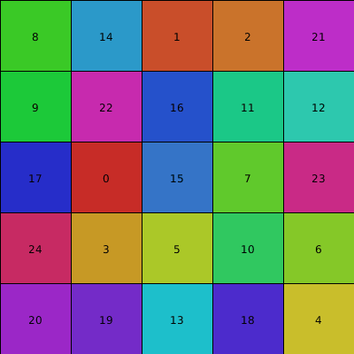

# Mais aleatoriedade

Vamos começar revisando a  função `random()` do py5, que produz números pseudoaleatórios e já vimos anteriormente, em seguida vamos ver um pouco do módulo *random* de Python que pode ser *importado* (com a instrução `import` no início do código), que e tem uma função `random()` e algumas outras funções relacionadas.

### A função `random()` do py5

Cada vez que chamamos a função `random()` com um valor de argumento, como em `sorteio = random(1);` um número entre zero e o argumento passado (servindo de limite superior, mas não incluso) é produzido. 


Se dois valores forem usados, por exemplo `random (-5, 5)` serão produzidos números de ponto flutuante (*float*) entre -5 e 5 (não incluso o 5 final). 

### O módulo `random` da biblioteca padrão do Python

No Python a função `random()` precisa ser importada do módulo `random` com a a seguinte  instrução:

```python
from random import random
```


Mas, se fizermos isso "matamos" o `random()` do py5. Uma alternativa, se quisermos manter as duas, é escrever: 

`from random import random as py_random`

Dessa forma ao chamar a função escreveremos `py_random()`, uma outra opção ainda é importar o módulo todo com outro nome.

`import random as rnd` 

E nesse caso usaremos `rnd.random()`, por exemplo. 

Note que a função `random()` em Python não recebe argumentos (isto é não vai nada dentro dos parênteses) e devolve o equivalente a `random(1)` no py5, por esse motivo  não me  parece tão flexível e útil. No entanto, o módulo `random` de Python oferece outras funções muito simpáticas, quero dizer, interessantes: `choice()`, `sample()`, e `shuffle()`.

#### Produzindo números inteiros com `random.randint` ou `py5.random_int`

É comum querermos produzir números pseudoaleatórios inteiros, vejamos trê maneiras:

- No Processing tradicional a forma mais comum era truncar, convertendo com `int()`, como em `sorteio_inteiro = int(random(-5, 6))` que 'sorteia' com igual probabilidades os números de -5 a 5.

- Podemos usar a função `randint()` do módulo `random` do Python da seguinte maneira:
  
  ```python
  from random import randint
  sorteio_inteiro = randint(-5, 5)
  ```

- Ou ainda a função `random_int()` do py5, que funciona da mesma maneira. 
    
  
  ```python
  # Um outro exemplo
  for _ in range(100):
      valor = random_int(1, 5) # 'sorteia' os números 1, 2, 3, 4, 5
      print(valor)  
  
  # Resultado: produz 100 valores de 1 a 5, INCLUI O 5!!!
  ```

#### Selecionando um único item com `choice()`

A função `choice(colection)` devolve um item de uma coleção (tupla, lista, conjunto). Para cada execução um item é escolhido (pseudo)aleatoriamente.

```python
from random import choice

frutas = ("uva", "jaca", "melancia", "ubu", "pitanga")
sorteio = choice(frutas)  # 'sorteia' fruta da tupla de frutas
print(sorteio)
# Um resultado possível no console:
# jaca
```

Veja também outro exemplo, mais visual.

```python
from random import choice

cores = [color(200, 0, 0), color(0, 200, 0), color(0, 0, 200)]

def draw():
    c = choice(cores) # sorteia uma cor da lista de cores
    fill(c)
    rect(25, 25, 50, 50)
```


#### Selecionando uma amostra (sem repetição de itens)

*Sample* significa amostra, e usamos `sample(colection, k)` onde `k` é o tamanho da amostra (e não pode ser maior que tamanho da população) para obter uma lista com `k` itens.

```python
from random import sample

cores = (color(200, 0, 0),
         color(200, 200, 0),
         color(0, 200, 200),
         color(200, 0, 200),
         color(0, 200, 0),
         color(0, 0, 200))

# uma lista com duas cores
duas_cores = sample(cores, 2)

print(len(duas_cores))  # resultado: 2
```

#### Misturando a ordem de uma sequência mutável

Ao executar `shuffle(minha_sequencia)` fazemos com que `minha_sequencia`, que, atenção, não pode ser uma sequência vazia, seja reordenada 'aleatoriamente'.

```python
from random import shuffle

letras = ['A', 'B', 'C', 'D', 'E']
shuffle(letras)
print(letras)
# a cada execução uma ordem diferente:
# ['C', 'B', 'D', 'A', 'E']
# ['D', 'C', 'E', 'B', 'A']
# ...
```

A coleção precisa ser ordenada e mutável, como uma lista, não pode ser uma tupla, que é imutável, ou um conjunto que não guarda a ordem dos elementos.

Veja um outro exemplo de `shuffle()`, embaralhando uma lista de tuplas que representam as posições em uma grade. As cores e os números são relativos à ordem dos elementos na lista (0, vermelho) é o primeiro quadrado da lista.

```python
from random import shuffle 

tam = 80

def setup():
    size(400, 400)
    text_align(CENTER, CENTER)
    color_mode(HSB)  # matiz, saturacao, brilho
    frameRate(1)

def draw():
    posicoes = []  # lista vazia
    for y in range(0, height, tam):
        for x in range(0, width, tam): 
            posicoes.append((x, y))  # tupla (x, y)

    shuffle(posicoes)  # Embaralha a lista gerada 

    for i, (x, y) in enumerate(posicoes):  # desenha os quadrados 
        fill(i * 10, 200, 200) # i influencia o matiz
        rect(x, y, tam, tam)
        fill(0)
        text(i, x + tam / 2, y + tam / 2) # escrevendo o números   
```



### Sementes dos geradores pseudoaleatórios (*random seed*)

Como os números produzidos por `random()` não são verdadeiramente aleatórios, e sim produzidos por algorítmos geradores determinísticos, é possível fixar um parâmetro inical, conhecido como semente (*seed*), o que permite reproduzir novamente a mesma sequência de números.

Para fixar o início do gerador de `random()` no py5 usamos `random_seed(numero_inteiro)`.

```python
random_seeed(numero_inteiro)  # ajusta a semente no py5
s = random(10, 20)  # Função random() do py5
```

Já para as funções do módulo `random` do Python usamos a função `seed()` do módulo `random`.

```python
from random import random, choice, seed 

seed(numero_inteiro)
c = choice(('A', 'B', 'C'))
r = random() * 100  # random do Python sobrepôs o random do Processing
```

ou ainda

```python
import random as rnd

rnd.seed(numero_inteiro)
c = rnd.choice(('A', 'B', 'C'))
r = rnd.random() * 100
```

### Um exemplo de uso do `random.seed()` do Python

Modificando o exemplo anterior com `shuffle`.

```python
from random import shuffle, seed

tam = 80

def setup():
    size(400, 400)
    text_align(CENTER, CENTER)
    color_mode(HSB)  # matiz, saturacao, brilho

def draw():
    seed(mouse_x)
    posicoes = []  # lista vazia
    for y in range(0, height, tam):
        for x in range(0, width, tam): 
            posicoes.append((x, y))  # tupla (x, y)

    shuffle(posicoes)  # Embaralha a lista gerada 

    for i, (x, y) in enumerate(posicoes):  # desenha os quadrados 
        fill(i * 10, 200, 200) # i influencia o matiz
        rect(x, y, tam, tam)
        fill(0)
        text(i, x + tam / 2, y + tam / 2) # escrevendo o números 
```

### Um exemplo do `random_seed()` do py5

Neste exemplo abaixo usamos uma semente para manter 'congelados' os números gerados por `random()` entre frames do `draw()`, mantendo a interatividade de ajuste do ângulo da árvore com o mouse. Quando uma imagem é exportada, o nome do arquivo contém a semente (_seed_) do gerador de números pseudoaleatórios.

```python
def setup():
    global seed
    size(500, 500)
    seed = int(random(1000))
    print(seed)

def draw():
    random_seed(seed)
    background(240, 240, 200)
    translate(250, 300)
    galho(60)

def galho(tamanho):  # definição do galho/árvore
    ang = radians(mouse_x)
    reducao = .8
    stroke_weight(tamanho / 10)
    line(0, 0, 0, -tamanho)
    if tamanho > 5:
        push_matrix()
        translate(0, -tamanho)
        rotate(ang)
        galho(tamanho * reducao - random(0, 2))
        rotate(-ang * 2)
        galho(tamanho * reducao - random(0, 2))
        pop_matrix()

def key_pressed():  # executada quando uma tecla for precinada
    if key_code == LEFT:
        seed = seed - 1
    if key_code == RIGHT:
        seed = seed + 1
    if key == ' ':  # barra de espaço precionada, sorteia nova "seed"
        seed = int(random(100000))
        print(seed)
    if key == 's':  # tecla "s" precionada, salva a imagem PNG
        nome_arquivo = 'arvore-s{}-a{}.png'.format(seed, mouse_x % 360)
        save_frame(nome_arquivo)
        print("PNG salvo")
```


