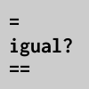

# Qual a diferença entre "=" e "==" em Python?
<!--

-->

## O símbolo "=" é o operador de atribuição

```python
num = 3  # faça `num` ser uma referência ao valor 3`
# Resultado: Modificada a variável `num`.
```

Na prática, do lado direito do `=` aparecem expressões que produzem algum valor, e que são avaliadas(calculadas) primeiro. Em seguida acontece a atribuição, a variável à esquerda passa apontar para o valor calculado na memória.


```python
soma = a + b
media = (a + b) / 2.

# Aumentando em 1 um contador
contador = contador + 1

# Uma forma equivalente com o operador de atribuição aumentada
contador += 1  # equivale a contador = contador + 1
```

## O símbolo "==" é o operador relacional que faz a comparação de igualdade

```python
num == 3  # o valor de `num` é igual ao valor 3?
# Ninguém escreve isso desse jeito, em geral vai dentro de outra estrutura.
# Mas o resultado seria o valor `True` ou `False`
# se você fizer print(num == 3), por exemplo
```

Na prática  `==`  é usado dentro de estruturas como `if` (ou `while`, por exemplo) que permitem a execução condicional de outras instruções:

```python
if num == 3:  # se valor de `num` for igual a 3
    print("você tem três chances")
```

De forma análoga, temos um operador relacional que indica desigualdade `!=':

```python
if num != 0:  # se num não for igual a zero
    print("você ainda tem {} chance(s)".format(num))

# equivalente a: if not num == 0
```

## Assuntos relacionados

- [Variáveis](variaveis.md)
- [Condicionais e operadores lógicos](condicionais_py.md)

## Glossário

[**variável**](https://penseallen.github.io/PensePython2e/02-vars-expr-instr.html#termo:variável) Um nome que se refere a um valor.

[**atribuição**](https://penseallen.github.io/PensePython2e/02-vars-expr-instr.html#termo:atribuição) Uma instrução que atribui um valor a uma variável.

[**operador relacional**](https://penseallen.github.io/PensePython2e/05-cond-recur.html#termo:operador%20relacional) Um destes operadores, que compara seus operandos: `==`, `!=`, `>`, `<`, `>=` e `<=`.

[**instrução condicional**](https://penseallen.github.io/PensePython2e/05-cond-recur.html#termo:instrução%20condicional) Uma instrução que controla o fluxo de execução, dependendo de alguma condição (expressão avaliada como `True` ou `False`).
