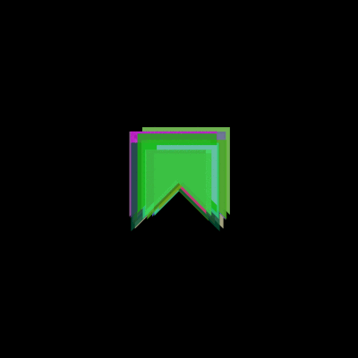
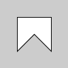
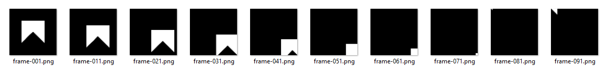
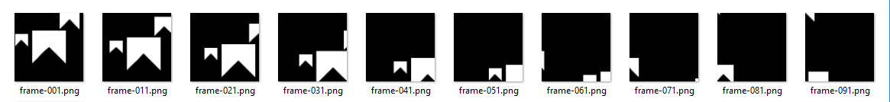

# Orientação a objetos com bandeirinhas
## Um exemplo em 7 passos



O material abaixo serviu de base para o artigo:

> VILLARES, A. B. A.; MOREIRA, D. DE C.; GOMES, M. R. [Ensino de programação em um contexto de exploração gráfica com Processing modo Python](https://villares.github.io/mestrado/VILLARES_MOREIRA_GOMES_GRAPHICA_2017). In: Anais GRAPHICA 2017 - XII International Conference on Graphics Engineering for Arts and Design. Anais…Araçatuba(SP) UNIP, 2017.

*Para executar [instale o Processing com o modo Python](http://villares.github.io/como-instalar-o-processing-modo-python/)*

Bandeirinhas são um tema recorrente da cultura visual brasileira, visível não só nas Festas Juninas como explorado largamente por artistas visuais como Alfredo Volpi. Foram escolhidas para gerar reconhecimento e interesse visual nas imagens e animações produzidas.

Numa aula que se desenvolve normalmente em cerca de 7 etapas, são introduzidos conceitos de orientação a objetos: Classe, atributos de dados e métodos, instâncias e encapsulamento. Não são abordadadas ainda questões de herança e composição.
Para poder aproveitar o exemplo os alunos tiveram contato em aulas anteriores  com programação [procedural/imperativa](http://cs.lmu.edu/~ray/notes/paradigms/)
 além de vocabulário específico da plataforma Processing:
* Declaração de variáveis e noções de tipagem;
* Métodos de desenho `rect`, `line`, `ellipse`, `beginShape`, `vertex` e `endShape`;
* Controle de atributos gráficos `fill`, `stroke`, `noStroke`, `noFill`, `background`;
* Controle de fluxo de execução e laços (`if`, `else` e `for`);
* Declaração de funções com e sem parâmetros;
* Controle do sistema de coordenadas `pushMatrix`, `translate`, `rotate`, `scale`, `popMatrix`.

### 0. Definindo funções e deslocando o sistema de coordenadas



Começamos com a definição de uma função `bandeirinha()` que recebe como parâmetros as coordenadas onde deve ser desenhada (e pode receber um parâmetro de tamanho opcional) produzindo um polígono fechado em forma de bandeirinha.

No lugar de somar as coordenadas de localização recebidas como parâmetros aos vértices dos polígonos usamos a estratégia de translação do sistema de cordenadas, moveremos a origem e em seguida desenharemos o polígono.

Antes da translação é necessário preservar o sistema original de coordenadas com o comando `pushMatrix()`. Isso pode ser feito simplesmente invocando `pushMatrix()` antes da translação e `popMatrix()` ao final do desenho, ou com a linha `with pushMatrix():` seguida de um bloco indentado de código que executa a translação e o desenho (ao final do bloco, encerra-se o contexto e a origem é restaurada). Usaremos a segunda maneira.

```python
def setup():
    """ Código chamado uma vez no início da execução pelo Processing """
    size(100, 100)  # define as dimensões do 'canvas' do Processing
    bandeirinha(50, 50)  # chama a função bandeirinha


def bandeirinha(px, py, tamanho=50):
    """ Desenha polígono em torno das coordenadas passadas, com tamanho padrão 50 """
    metade = tamanho / 2
    with push_matrix():   # preseservando o sistema de coordenadas anterior,
        translate(px, py)  # translada o sistema de coordenadas
        begin_shape()  # inicia polígono
        vertex(-metade, -metade)
        vertex(-metade, metade)
        vertex(0, 0)
        vertex(metade, metade)
        vertex(metade, -metade)
        endShape(CLOSE)  # encerra polígono, fechando no primeiro vértice
```
A definição da função `setup()` não é obrigatória no Modo Python, mas é a parte inicial da estrutura `setup()`/`draw()` usada na maior parte dos programas que trabalham com interação ou movimento em Processing e é invocada uma única vez no início da execução. Note que neste momento já estará definida a função `bandeirinha()`.

###  1. Redesenhando formas e atualizando variáveis no laço principal



Para se obter o efeito de movimento (animação da bandeirinha) criamos um par de variáveis globais `x` e `y`, inicializadas no `setup()` com as coordenadas do meio da àrea de desenho. Note que o escopo global dessas variáveis precisa ser indicado com a palavra chave `global` quando pretendemos alterá-las.

O novo `draw()` cujo nome faz parte da infraestrutura do Processing para permitir animações, terá automaticamente a execução repetida continuamente, é o "laço principal" do *sketch*. Neste bloco vamos inicialmente limpar a tela com `background()`invocar a função de desenho `bandeirinha()` na posição indicada pelas variáveis `x` e `y`, incrementar as variáveis de posição e por fim checar se estas estão além de um certo limite e precisam ser alteradas (redefinindo a posição para um novo ciclo de incrementos).

```python


def setup():
    """ Código de configuração, executado no início pelo Processing """
    global x, y
    size(100, 100)  # área de desenho
    x, y = width / 2, height / 2   # coordenadas do meio da área de desenho


def draw():
    """ Laço principal de repetição do Processing """
    global x, y
    background(0)  # limpeza do frame, fundo preto
    bandeirinha(x, y)  # desenha o polígono
    x += 1  # incrementa o x
    y += 1  # incrementa o y
    if x > width + 25:
        x = -25
    if y > height + 25:
        y = -25
```
```
...o código continua com a def bandeirinha mostrada anteriormente
```
### 2. Primeira aproximação da classe Bandeirinha

Vamos agora obter o mesmo comportamento usando um objeto da classe `Bandeirinha`.
A classe é definida pelo bloco `class Bandeirinha():` que começa com o método especial `__init__()` que na construção de um novo objeto da classe inicializa os atributos de dados (campos) de posição e tamanho.
O método `desenha()` é praticamente a função que escrevemos no passo inicial, não requer mais os parâmetros de posição e tamanho, uma vez que usa os atributos de posição e tamanho do próprio objeto (instância) quando executado.
O método `anda()` contém o código anteriormente usado para atualizar a posição nas variáveis globais, agora atualiza os atributos de dados (campos ou variáveis de instância) de posição do objeto.
No bloco `setup()` criamos uma instância de bandeirinha no meio da àrea de desenho com a linha`bandeira = Bandeirinha(width / 2, height / 2)` e o bloco `draw()` vai repetidamente limpar a tela e chamar os métodos de desenho e atualização, `bandeira.desenha()` e `bandeira.anda()` respectivamente.

```python


def setup():
    """ Código de configuração, executado no início pelo Processing """
    global bandeira_0
    size(100, 100)  # área de desenho
    bandeira_0 = Bandeirinha(width / 2, height / 2)


def draw():
    """ Laço principal de repetição do Processing """
    background(0)  # atualização do desenho, fundo preto
    bandeira_0.desenha()
    bandeira_0.anda()


class Bandeirinha():
    """ Classe Bandeirinha, com métodos de desenho e atualizaçao ('anda') """

    def __init__(self, px, py, ptamanho=50):
        self.x = px
        self.y = py
        self.tamanho = ptamanho

    def desenha(self):
        """ Desenha polígono em torno das coordenadas do objeto """
        metade = self.tamanho / 2
        with push_matrix():   # preseservando o sistema de coordenadas anterior
            translate(self.x, self.y)  # translada o sistema de coordenadas
            begin_shape()  # inicia polígono
            vertex(-metade, -metade)
            vertex(-metade, metade)
            vertex(0, 0)
            vertex(metade, metade)
            vertex(metade, -metade)
            end_shape(CLOSE)  # encerra polígono, fechando no primeiro vértice

    def anda(self):
        """ atualiza a posição do objeto """
        self.x += 1
        self.y += 1
        if self.x > width + 25:
            self.x = -25
        if self.y > height + 25:
            #             self.y = -25
            # ```
            
            # ### 3. Instanciando mais alguns objetos
            
            # 
            
            # A vantagem da estruturação e encapsulamento de termos um objeto bandeira criado por uma classe Bandeirinha pode começar a ser visto quando instanciamos mais de uma bandeirinha.
            
            # ```python


def setup():
    """ Instancia três bandeirinhas """
    global bandeira_0, bandeira_1, bandeira_2
    size(100, 100)  # área de desenho (width, height)
    meia_largura, meia_altura = width / 2, height / 2
    bandeira_0 = Bandeirinha(meia_largura, meia_altura)
    bandeira_1 = Bandeirinha(80, 10, 30)
    bandeira_2 = Bandeirinha(10, 40, 20)


def draw():
    """ Limpa a tela, desenha e atualiza bandeirinhas """
    background(0)  # atualização do desenho, fundo preto
    bandeira_0.desenha()
    bandeira_0.anda()
    bandeira_1.desenha()
    bandeira_1.anda()
    bandeira_2.desenha()
    bandeira_2.anda()

```
```
...o código continua com a classe Bandeirinha mostrada anteriormente
```
### 4. Ampliando a classe, mudando o comportamento e adicionando outras propriedades.


O passo seguinte é dado ampliando o código da classe Bandeirinha.

No método `__init__()`:
1. Sorteio do tamanho, caso nenhum tenha sido fornecido na expressão construtora;
2. Sorteio da velocidade, decomposta nos componentes horizontal `self.vx` e vertical `self.vy`;
3. Sorteio da cor, ligeiramente translúcida.

No método `desenha()`:
1. Remoção do contorno com `noStroke()`;
2. Aplicação da cor de preenchimento com `fill(self.cor)`.

No método `anda()`:
1. Atualização da posição pela soma dos componentes de velocidade na posição;
2. Tratamento da saída do objeto da área de desenho por qualquer dos lados.

```python


class Bandeirinha():
    """ Classe Bandeirinha, cor sorteada, velocidade sorteada """

    def __init__(self, px, py, ptamanho=None):
        self.x = float(px)
        self.y = float(py)
        if ptamanho:
            self.tamanho = ptamanho
        else:
            self.tamanho = random(50, 200)
        self.vx = random(-1, 1)
        self.vy = random(-1, 1)
        self.cor = color(random(256),  # R
                         random(256),  # G
                         random(256),  # B
                         200)  # alpha

    def desenha(self):
        """ Desenha polígono em torno das coordenadas do objeto """
        metade = self.tamanho / 2
        with push_matrix():   # preseservando o sistema de coordenadas anterior
            translate(self.x, self.y)  # translada o sistema de coordenadas
            no_stroke()  # sem contorno
            fill(self.cor)
            begin_shape()  # inicia polígono
            vertex(-metade, -metade)
            vertex(-metade, metade)
            vertex(0, 0)
            vertex(metade, metade)
            vertex(metade, -metade)
            end_shape(CLOSE)  # encerra polígono, fechando no primeiro vértice

    def anda(self):
        """ atualiza a posição do objeto e devolve do lado oposto se sair """
        self.x += self.vx
        self.y += self.vy
        metade = self.tamanho / 2
        if self.x > width + metade:
            self.x = -metade
        if self.y > height + metade:
            self.y = -metade
        if self.x < -metade:
            self.x = width + metade
        if self.y < -metade:


            #             self.y = height + metade
            # ```
            
            # ### 5. Uma lista de objetos
            
            # Uma estrutura de dados, no caso uma lista, pode de maneira muito simples conter referências para um grande número de objetos.
            # Aqui chegamos rapidamente a um comportamento visualmente interessante instanciando 50 bandeirinhas no `setup()` e em seguida no `draw()` iteramos por estas bandeirinhas de maneira bastante típica em Python com um laço `for `*`object`*` in `*`collection_of_objects`*`:`
            
            # ```python
bandeirinhas = []  # lista de objetos


def setup():
    """ Define área de desenho e popula lista de bandeirinhas """
    size(400, 400)  # área de desenho (width, height)
    meia_largura, meia_altura = width / 2, height / 2
    for _ in range(50):
        nova_bandeirinha = Bandeirinha(meia_largura, meia_altura)
        bandeirinhas.append(nova_bandeirinha)


def draw():
    """ Limpa a tela, desenha e atualiza bandeirinhas """
    background(0)  # atualização do desenho, fundo preto
    for bandeira in bandeirinhas:
        bandeira.desenha()
        bandeira.anda()
```
```
...o código continua com a classe Bandeirinha mostrada anteriormente
```

### 6. Acrescentando e removendo objetos; Mudança da cor com o mouse próximo.

Como extra exemplo dos métodos `append()` e `pop()` da lista, usados nos *eventos* de clique do mouse ou acionamento da barra de espaço no teclado, acrescentando ou removendo objetos respectivamente.

```python


def mouse_pressed():
    """ Acrescenta pequena bandeirinha branca """
    nova_bandeirinha = Bandeirinha(mouse_x, mouse_y, 25)
    nova_bandeirinha.cor = color(255)  # forçando que seja branca!
    bandeirinhas.append(nova_bandeirinha)


def key_pressed():
    """ tecla 'espaço' remove a última bandeirinha da lista """
    if key == ' ' and len(bandeirinhas) > 1:
        removida = bandeirinhas.pop()
```
E o método `desenha()` da bandeirinha agora sofre a influência da distância do mouse;

```python

    def desenha(self):
        """ Desenha polígono em torno das coordenadas do objeto """
        metade = self.tamanho / 2
        with push_matrix():   # preseservando o sistema de coordenadas anterior
            translate(self.x, self.y)  # translada o sistema de coordenadas
            no_stroke()  # sem contorno
            # se o mouse estiver longe, normal, senão, branca
            if dist(mouse_x, mouse_y, self.x, self.y) > metade:
                fill(self.cor)
            else:
                fill(255, 100)
            begin_shape()  # inicia polígono
            vertex(-metade, -metade)
            vertex(-metade, metade)
            vertex(0, 0)
            vertex(metade, metade)
            vertex(metade, -metade)
            end_shape(CLOSE)  # encerra polígono, fechando no primeiro vértice
```
