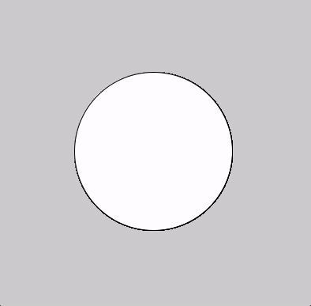
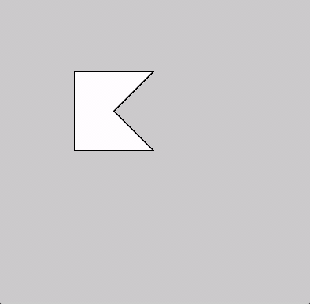

# Detectando a sobreposição de elementos geométricos

Um conjunto interessante de perguntas, no domínio conhecido como geometria computacional, e que tem diversas apliações em jogos e programas gráficos interativos, é se um ponto ou elemento geométrico está encostando ou sobreposto a outro. Esse tipo de problemas são por vezes chamados também de "detecção de colisões".

- O mouse está sobre o botão retangular?
- O ponto que se move neste jogo está sobre o círculo?
- Este elemento está dentro do polígono?
- O círculo encostou no triângulo?

As bibliotecas de simulação física respondem estas perguntas o tempo todo e não só as respondem como implementam sofisticados comportamentos resultantes das colisões simuladas entre objetos. Mas mesmo sem a complexidade adicional da simulação física, pra fazer sketches animados e interativos pode ser muito útil saber responder este tipo de perguntas. 

Uma referência inestimável de funções que respondem as principais perguntas de colisões entre formas é o site [www.jeffreythompson.org/collision-detection/](http://www.jeffreythompson.org/collision-detection/).

Vamos experimentar aqui mostrar alguns dos casos mais simples. Para casos mais complexos, pode ser útil também experimentar usar uma biblioteca especializada em processar geometrias 2D, como *shapely*

## Algumas implementações 

### Ponto e círculo




Um dos casos mais simples, saber se um ponto está em um círculo, pode ser resolvido calculando a distância do ponto ao centro do círculo e comparando essa distância com o raio do círculo (se a distância for menou ou igual ao raio, o ponto está dentro).

```python
# usando a função dist do py5
def point_in_circle(px, py, cx, cy, r):
    return dist(px, py, cx, cy) <= r
```

### Retângulos

#### Retângulo sobrepondo retângulo

```python
def rect_over_rect(x1, y1, w1, h1, x2, y2, w2, h2):
    return (x1 + w1 >= x2 and    # borda direita do r1 passa esquerda do r2 
            x1 <= x2 + w2 and    # borda esquerda do r1 passa direita do r2
            y1 + h1 >= y2 and    # topo do r1 avança sobre base do r2
            y1 <= y2 + h2)       # base do r1 avança sobre topo do r2 

```

#### Retângulo completamente dentro de um retângulo

Aa funçao `rect_in_area()` responde se um primeito retângulo está completamente dentro de um segundo retângulo.

```python

def setup():
    size(400, 400)

def draw():
    background(200)
    rm = mouse_x, mouse_y, 200, 100
    ra = 50, 100, 300, 200
    no_fill()
    rect(*ra)
    if rect_in_area(*rm, *ra):
        fill(0, 200, 0)
    else:
        fill(255)
    rect(*rm)

def rect_in_area(xm, ym, wm, hm, xa, ya, wa, ha):
    return (xa < xm < xa + wa - wm and
            ya < ym < ya + ha - hm)

```

### Ponto e polígono



Um dos mais importantes problemas da geometria comptutacional, esta função, baseada em [Point Inclusion in Polygon Test](https://wrf.ecse.rpi.edu/Research/Short_Notes/pnpoly.html) de W. Randolph Franklin, recebe as coordenadas de um ponto e um iterável com pontos (ou tuplas de coordenadas) representando um polígono.

```python
poly_pts = ((100, 100), (200, 100), (150, 150), (200, 200), (100, 200))

def setup():
    size(400, 400)

def draw():
    if point_in_poly(mouse_x, mouse_y, poly_pts):
        fill(0, 200, 0)
    else:
        fill(255)    
    with begin_closed_shape():
        vertices(poly_pts)
    
def point_in_poly(x, y, poly_pts):
    inside = False
    for i, p in enumerate(poly_pts):
        pp = poly_pts[i - 1]
        xi, yi = p
        xj, yj = pp
        intersect = ((yi > y) != (yj > y)) and (x < (xj - xi) * (y - yi) / (yj - yi) + xi)
        if intersect:
            inside = not inside
    return inside
```

## Experimentando com *shapely*

O mesmo problema do ponto em polígono, mas usando a biblioteca *shapely*.

```python
import shapely  # será necessário instalar a a biblioteca

poly_pts = ((100, 100), (200, 100), (150, 150), (200, 200), (100, 200))
shapely_poly = shapely.Polygon(poly_pts)

def setup():
    size(400, 400)

def draw():
    shapely_point = shapely.Point(mouse_x, mouse_y)
    if shapely_poly.contains(shapely_point):
        fill(0, 200, 0)
    else:
        fill(255)
    
    with begin_closed_shape():
        vertices(poly_pts)
```


