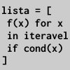

# Compreensão de listas (*list comprehension*)

<!-- thumb para o sumário

-->

É muito comum usarmos um laço de repetição para produzir e acumular elementos em uma estrutura de dados, vamos ver um exemplo de um `for` que acrescenta itens em uma lista. São pontos com um `x` que vai crescendo de 10 em 10 e um `y` pseudoaleatório produzido com a função `random()` do py5, para poder depois desenhar um polígono, aberto e sem preenchimento, com 11 vértices que vai de um lado a outro de uma pequena área de desenho:


```python
for i in range(11):
    x = i * 10
    y = 50 + random(-25, 25)
    pontos.append((x, y))  # os parenteses extra criam uma tupla
    
no_fill()
with begin_shape():
    vertices(pontos)
```

Existe um maneira alternativa de fazer isso usando a sintaxe chamada *compreensão de lista*, compare:

```python
pontos = [(i * 10, 50 + random(-25, 25)) for i in range(11)]

no_fill()
with begin_shape():
    vertices(pontos)
```

Veja se você consegue identificar nos dois exemplos acima os elementos do seguinte padrão geral, que usa um laço de repetição para construir a lista e depois a compreensão de lista. 

```python
lista_resultante = []
for «valor» in «iterável»:
      lista_resultante.append(«novo_elemento»)  # o novo elemento é acrescentado
```

E a forma reescrita

```python
lista_resultante = [«novo_elemento» for «valor» in «iterável»]
```

### Acrescentando uma condição para o acréscimo de elementos

É possível ainda "filtrar", usar uma condição que permite ou não produzir novos elementos.

```python
lista_resultante = []
for «valor» in «iterável»:
    if  «condição»:  # a condição depende do valor
        lista_resultante.append(«novo_elemento»)  # o novo elemento é acrescentado
```
Que pode ser reescrito assim:

```python
lista_resultante = [«novo_elemento» for «valor» in «iterável» if «condição»]
```

Veja mais um exemplo, primeiro um sem "filtragem".

```python
dimensoes_retangulos = [(10, 20), (20, 30), (10, 30), (30, 30), (30, 10)]

areas = []
for a, b in dimensoes_retangulos:
    areas.append(a * b)

areas = [a * b for a, b in dimensoes_retangulos]
```

Agora com "filtragem", ignorando quadrados!

```python
areas = []
for a, b in dimensoes_retangulos:
    if a != b:  # se `a` diferente de `b`, vai ignorar a == b
        areas.append(a * b)

areas = [a * b for a, b in dimensoes_retangulos if a != b]
```
### Expressões geradoras

Se você não precisa dessa coleção de valores mais de uma vez, pode evitar que ela seja guardada na memória, usando expressões geradoras (*generator expressions*) substituindo os colchetes por parênteses, e até mesmo omitindo os parênteses se a expressão for posta como argumento de uma função:

```python
# soma os quadrados dos números pares entre 0 e 98 (o 100 não está incluso).
soma_quadrados = sum(n * n for n in range(100) if n % 2 == 0) # 161700
```
Veja como poderia ficar aquele primeiro exemplo do polígono aleatório aberto.

```python
no_fill()
with begin_shape():
    vertices((i * 10, 50 + random(-25, 25)) for i in range(11))
```

## Compreensão de conjuntos e dicionários

```python
dimensoes_retangulos = [(10, 20), (20, 30), (10, 30), (30, 30), (30, 10), (5, 40)]
areas_sem_repetir = {a * b for a, b in dimensoes_retangulos}
print(areas_sem_repetir) #  set([900, 200, 300, 600])
```

Um dicionário "pré-calculado" das áreas

```
areas_dict = {(a, b): a * b for a, b in dimensoes_retangulos}
# {(30, 30): 900, (20, 30): 600, (10, 30): 300,
#  (10, 20): 200, (30, 10): 300, (5, 40): 200
# }
```

