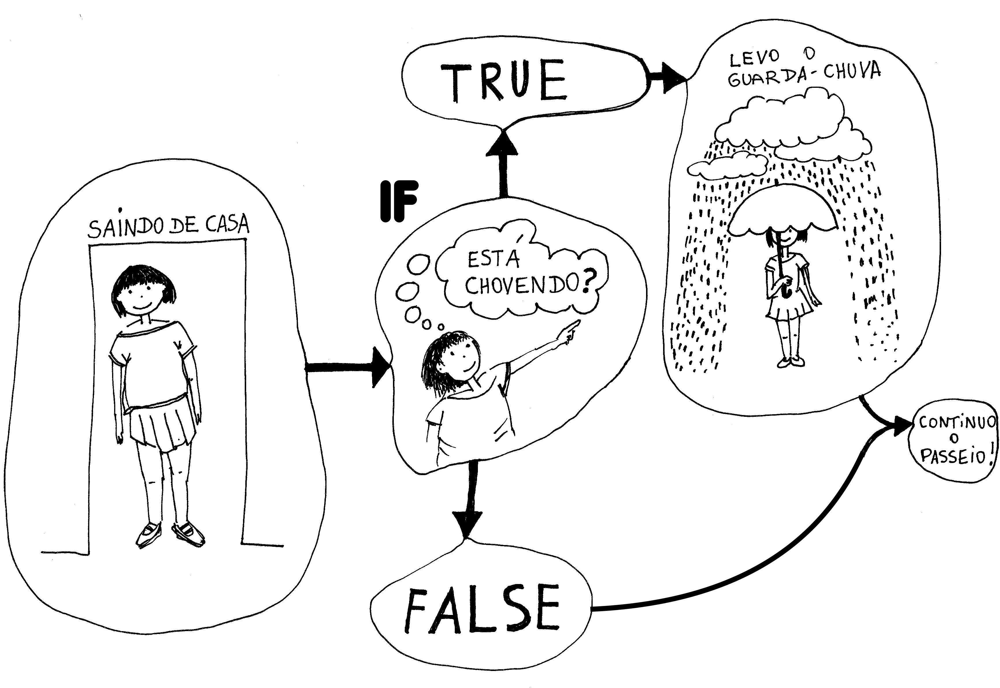
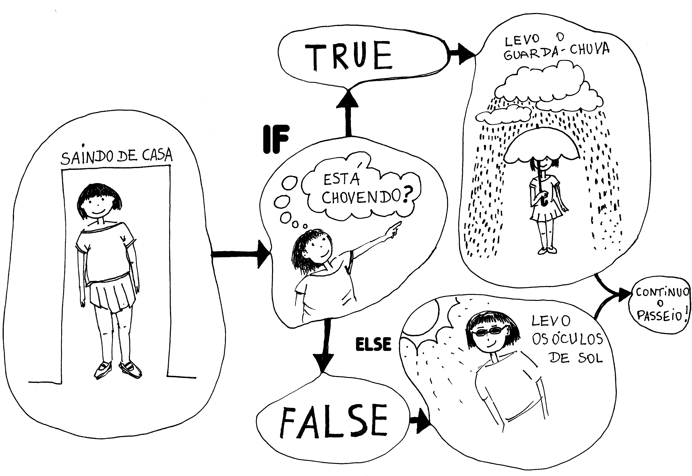

# Execução condicional, operadores relacionais e operadores lógicos

É possível criar instruções que alteram quais partes do seu código serão executadas, dinamicamente, durante a execução do seu programa. Para entender como isso funciona, e as possibilidades enormes que isso proporciona, vamos introduzir a ideia de "condição", um valor que, dependendo das circunstâncias, pode ser verdadeiro (`True`) ou falso (`False`). Podemos dizer que ou bem "a condição é verdadeira" ou "a condição é falsa". Deixaremos para mais tarde falar sobre a origem dos valores que avaliamos e consideramos como "condição", por hora, observe os trechos de código "fantasiosos" mais a abaixo, mas que seguem as estruturas sintáticas reais do Python, apresentadas logo a seguir, ilustrando as mudanças no fluxo de execução se uma condição é verdadeira ou falsa.

## As bifurcações no caminho de execução do código

## Sintaxe `if` e `if`/`else`

```python 
if «condição»: #  se a condição for verdadeira, execute:
    «corpo» 
    
if «condição»: #  se a condição for verdadeira, execute:
    «corpo do `if`» 
else:          #  senão (se a condição é falsa) execute:
   «corpo do `else`»
```

### Imagine o seguinte cenário...

Saindo de casa, se (`if`) está chovendo, a condição *`chovendo`* é verdadeira (`True`), então levo o guarda-chuva;
Opcionalmente, podemos definir que, senão (`else`), quando a condição *`chovendo`* é falsa (`False`), devo levar óculos de sol.

``` python
# a condição "chovendo" é avaliada como True (verdadeiro) ou False (falso)
if chovendo:
    # se verdadeira a condição, então este bloco de código será executado
    levar_guarda_chuva()  
# termina o bloco do “se/então”, continua o passeio.
```


``` python
# a condição "chovendo" é avaliada como True (verdadeiro) ou False (falso)
if chovendo:
    # se verdadeira a condição, então este bloco de código será executado
    levar_guarda_chuva() 
else:               # termina o “se/então” e começa o “senão”
    levar_oculos()   # este bloco será executado apenas quando "chovendo" é falso
# termina o bloco do “senão”, continua o passeio.
```


## Operadores relacionais e operadores lógicos

Em programação, para comparar valores, usamos os chamados operadores relacionais, também chamados de operadores de comparação, como por exemplo `==` (igualdade), `>` (maior que). O resultado dessas operações são os valores especiais `True` (verdadeiro) e `False` (falso) são chamados booleanos (*boolean*, em homenagem a [George Boole](https:#pt.wikipedia.org/wiki/George_Boole))

Os valores booleanos, `True` e `False`, podem ser também combinados e tranformados por meio das operações lógicas **e** (`and`), **ou** (`or`) e **não** (`not`), resultando em valores booleanos também. E podem ser atribiuidos a variáveis.

Muitas vezes valores booleanos são atribuidos a variáveis e servem para representar um *estado* no programa em execução, variáveis conhecidas como "indicadoras" (*flags*) descrevem um estado da operação, como por exemplo `gravando = True`,  `soma_concluida = False`. As variáveis de sistema `is_mouse_pressed` e `is_key_pressed`, por exemplo, se referem a valores booleanos também.

São inúmeras as situações que produzem este tipo de valores, veja mais alguns exemplos:

- A **comparação de igualdade** entre dois valores ou dados fornecido ao seu programa. `key == 's'` é como se fosse uma pergunta, o valor referenciado por `key` equivale a "s"?
- A **comparação de ordem** entre dois valores. `tamanho <= 10` é como a pergunta "`tamanho` é menor ou igual a 10?". Resulta `True` se `tamanho` for menor ou igual a 10, ou `False` se for maior.
- O botão do mouse estar apertado (**estado do botão do mouse**), `is_mouse_pressed` pode ser `True` (apertado) ou `False` (não apertado).
- Uma tecla foi apertada **e** a tecla era 'a'. `is_key_pressed and key == 'a'`. Verdadeiro `True` apenas se uma tecla estiver sendo apertada e a tecla era 'a', senão `False`.

### Um exemplo completo

No exemplo a abaixo usamos uma estrutura `if`/ `else` para escolher a cor de preenchimento dos círculos, como resultado da comparação `mouse_y < 128`. Usamos o valor booleano de `is_mouse_pressed` (`True` ou `False`) em um `if` que determina se algum círculo yé desenhado ou não. Por fim usamos um `if` que combina dois valores usando `and`(**e**), `is_key_pressed` e a comparação de igualdade `==`, para decidir se deve apagar o desenho (`is_key_pressed and key == 'a'`).

``` python
def setup():
    size(256, 256)
    background(0, 100, 0)  # fundo verde

def draw():
    # se a posição Y do mouse for menor que 128 (mouse na metade de cima da tela)
    if mouse_y < 128:    
        fill(255)  # então pede preenchimento branco (se mouse_y é menor que 128)
    else:          # termina o bloco “se/então” e começa o do “senão”
        fill(100)  # preenchimento cinza 100 (se mouse_y não é menor que 128)
                   # termina o bloco do “senão”
                   
    # Se o mouse estiver pressionado
    if is_mouse_pressed:                    
        ellipse(mouse_x, mouse_y, 50, 50) # desenha um círculo na posição do mouse
    # termina o bloco (repare que não faz nada se o mouse estiver solto)
    
    # Se uma tecla foi precionada E a tecla foi o caractere 'a'
    if is_key_pressed and key == 'a':    
        background(0, 100, 0)  # apague a tela com um fundo verde
```


## Quadro de operadores

> "Operadores" são os símbolos que indicam as operações que devem ser realizadas sobre os "operandos". Por exemplo, `+` é um operador de soma, numa [notação infixa](https://pt.wikipedia.org/wiki/Nota%C3%A7%C3%A3o_infixa), ele faz com que a expressão `2 + 3` resulte na soma dos operandos `2` e `3`, que no caso é 5. 

Conheça os operadores relacionais e lógicos, que resultam em valores booleanos.
 
|operador | exemplo de uso | descrição |
|:---:  |:---: |--- |
| `>` | `a > b` |  verdadeiro se *a* **maior** que *b* |
| `>=` | `a >= b` | verdadeiro se *a* **maior ou igual** a *b* |
| `<` | `a < b` | verdadeiro se *a* **menor** que *b* |
| `<=` | `a <= b` | verdadeiro se *a* **menor ou igual** a *b* |
| `==` | `a == b` | verdadeiro se *a* **igual** a *b* |
| `!=` | `a != b` | verdadeiro se *a* **diferente** de *b* |
| `and` | `a and b` | verdadeiro se *a* **e** *b* forem ambos verdadeiros |
| `or` | `a or b` | verdadeiro se *a* **ou** *b* forem verdadeiros |
| `not` | `not a` | se *a* verdadeiro resulta falso, e sendo *a* falso resulta verdadeiro |
| `in` | `a in b` | verdadeiro se elemento *a* **existe dentro** da coleção *b* |
| `is` | `a is b` | verdadeiro se *a* **é o mesmo objeto** do que *b*, não bastando serem iguais |

### Exemplos de expressões com alguns dos operadores

```python
# maior que
n = 12
n_maior_que_10 = n > 10  # True
n = 5
n_maior_que_10 = n > 10  # False
# maior ou igual a
n = 10
n_maior_ou_ingual_a_10 = n >= 10  # True
# menor que / menor ou igual a
n = 5
n_menor_que_10 = n < 10 # True
n_menor_ou_igual_a_4 = n <= 4  # False

# igualdade e diferença
n, m = 10, 10.0    # n é int, m é float
numeros_iguais = n == m  # True  10 é igual a 10.0
numeros_diferentes = n != m  # False
numeros_diferentes = n != 11  # True, 10 não é igual a 11

# operador in (contido em, existe em)
contem_a = 'a' in 'abacaxi'  # True
contem_1 = 1 in [0, 1, 2, 3]  # True
nao_contem_4 = 4 not in [0, 1, 2, 3] # True
```

Para efeitos de operações lógicas, e no uso com `if`, por exemplo, os valores `0` (zero), `None`, `""` (string vazio), `[]` lista vazia, ou qualquer coleção vazia, são considerados como "falsos" (`False`), já qualquer outro número, texto (string) ou coleção com itens, são considerados "verdadeiros" (`True`). 

A função `bool()` converte valores ou expressões entre os parenteses em `True` ou `False` (os chamados valores booleanos) nos permitindo investigar como Python os interpreta! Note que se comparados diretamente entre si zero, `None`, um string vazio e uma lista vazia não são a mesma coisa, mas se convertidos com `bool()` são todos convertidos no valor `False`. Já `1`,`200` ou `"Unicamp"`, serão convertidos com `bool()` em `True`. 

```python
# Agradecimentos à Fabiana Costa que pegou um erro na versão anterior deste exemplo

texto = ""  # aspas sem nada dentro, também funcionaria com `texto = None`
print(bool(texto) == False)  # exibe True
if not texto:   # será acionado se o string texto for vazio ou None
   texto = "novo texto"
# mas...
print(texto == False)  # exibe False!
print(texto == True)  # exibe False!   
# curiosamente...
print(0 == False) # e também `print(1 == True)`, exibem True!
# Internamente verdadeiro e falso (True & False) são 1 e 0 no Python!
# isso permite certas malandragens como multiplicar algo por verdadeiro ou falso...
# resultando no próprio número ou 0 respectivamente.
   
# resumindo
print(bool(""))    # exibe False  (um string, texto, vazio)
print(bool("oi"))  # exibe True   (qualquer outro string)
print(bool(0))     # exibe False  (o número zero)
print(bool(2))     # exibe True   (qualquer outro número)
print(bool([]))    # exibe False  (uma lista vazia)
print(bool([0]))   # exibe True   (uma lista com um zero dentro)
```

O operador `is` é usado mais raramente, em geral você vai querer checar a "igualdade" e não a "identidade" de dois objetos na memória, mas veja o exemplo a seguir, pois demonstra uma característica importante do Python chamada *aliasing*, ou "apelidamento".

```python
ponto_a = (10, 20) # uma tupla representand coordenadas de um ponto
ponto_b = (10, 20) # uma outra tupla, com valores iguais, mas que é outro objeto na memória
ponto_c = ponto_a  # ponto_c é um "apelido" (alias) para o objeto que chamamos de ponto_a

print(ponto_a == ponto_b)  # exibe True, as tuplas são iguais
print(ponto_a is ponto_b)  # exibe False, são objetos diferentes na memória 
print(ponto_a is ponto_c)  # exibe True, são o mesmo objeto na memória
```

## Assuntos relacionados

- [Condições aninhadas e outras estruturas condicionais](condicionais_2.md)

## Glossário

[**expressão booleana**](https://penseallen.github.io/PensePython2e/05-cond-recur.html#termo:expressão%20booleana) Uma expressão cujo valor é True (verdadeiro) ou False (falso).

[**operador relacional**](https://penseallen.github.io/PensePython2e/05-cond-recur.html#termo:operador%20relacional) Um destes operadores, que compara seus operandos: `==`, `!=`, `>`, `<`, `>=` e `<=`.

[**operador lógico**](https://penseallen.github.io/PensePython2e/05-cond-recur.html#termo:operador%20lógico) Um destes operadores, que combina expressões booleanas: `and` (e), `or` (ou) e `not` (não).

[**instrução condicional**](https://penseallen.github.io/PensePython2e/05-cond-recur.html#termo:instrução%20condicional) Uma instrução que controla o fluxo de execução, dependendo de alguma condição (como por exemplo o `if`).

[**condição**](https://penseallen.github.io/PensePython2e/05-cond-recur.html#termo:condição) A expressão booleana em uma instrução condicional que determina qual ramo deve ser executado.

---

Parte desta página é baseada no material do curso https://arteprog.space/programacao-criativa/, em especial os desenhos de Monica Rizzolli, por conta disso se aplicam as seguintes liceças: Texto e imagens: CC BY-NC-SA 4.0; Código: GNU GPL v3.0