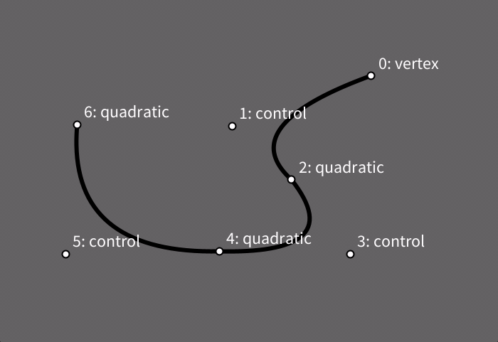
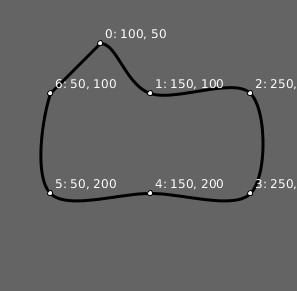

# Desenhando Curvas - I

Agora que já sabemos [desenhar um polígonos com `begin_shape()` e `end_shape()` ou `end_shape(CLOSE)`](poligonos_2.md) podemos experimentar formas curvas no py5, primeiro curvas Bézier cúbicas, com as funções [`bezier_vertex()`](https://py5coding.org/reference/sketch_bezier_vertex.html), em seguida curvas Bézier quadráticas usando [`quadratic_vertex()`](https://py5coding.org/reference/sketch_quadratic_vertex.html) e por fim uma implementação de *Catmull-Rom splines* com [`curve_vertex()`](https://py5coding.org/reference/sketch_curve_vertex.html).

As curvas Bézier levam o nome do engenheiro francês Pierre Bézier, que as desenvolveu a partir dos algorítimos do matemático e físico francês [Paul de Casteljau](https://en.wikipedia.org/wiki/Paul_de_Casteljau), em seus trabalhos na década de 1960 na indústria automotiva. As curvas Bézier descrevem formas a partir das coordenadas de pontos, ou âncoras, que delimitam o início e o fim de um trecho de curva, mas também precisam de coordenadas de "pontos de controle" que em geral ficam fora da curva, alterando o seu comportamento. Essas curvas polinomiais podem ser expressas como a interpolação linear entre alguns pontos como [descrito e ilustrado com animações na Wikipedia](https://pt.wikipedia.org/wiki/Curva_de_B%C3%A9zier).

## Curvas Bézier cúbicas com `bezier_vertex()`


Podemos criar uma forma curva aberta com uma ou mais chamadas a `bezier_vertex()` entre o `begin_shape()` e o `end_shape()`. A curva pode ser fechada se usarmos `end_shape(CLOSE)` ao final.

Note que antes de cada `bezier_vertex()` é preciso que haja algum vértice, um ponto âncora, então, antes da primeira chamada a `bezier_vertex()` em geral é usada uma chamada da função `vertex()`, como neste exemplo a seguir. Este primeiro tipo de curva Bézier que veremos requer dois pontos de controle para cada novo vértice, sem levar em conta o primeiro vértice-âncora, por isso, na função `bezier_vertex()` os quatro primeiros argumentos são as cordenadas de dois pontos de controle e os últimos dois são as coordenadas do vértice. Cada vértice Bézier por sua vez pode servir de âncora para um próximo vértice Bézier, permitindo o encadeamento de trechos curvos.

<!-- editor-pyp5js -->
```python
size(400, 300)
begin_shape()
vertex(100, 50)           # 0: âncora inicial
bezier_vertex(150, 150,   # 1: primeiro ponto de controle do primeiro vértice
              250, 150,   # 2: segundo ponto de controle do primeiro vértice
              200, 200),  # 3: vértice final da primeira curva, âncora da segunda
bezier_vertex(150, 250,   # 4: primeiro ponto de controle do segundo vértice
              50, 200,    # 5: segundo ponto de controle do segundo vértice
              50, 100)    # 6: segundo vértice bezier (final)
end_shape()
```


<details>
  
<summary> Código completo para reproduzir a imagem acima </summary>

<pre>
def setup():
    size(400, 300)
    background(100)
    stroke_weight(3)
    stroke(0)
    no_fill()

    begin_shape()
    vertex(100, 50)            # 0: vértice âncora
    bezier_vertex(150, 150,    # 1: ponto de controle
                  250, 150,    # 2: ponto de controle
                  200, 200),   # 3: vértice
    bezier_vertex(150, 250,    # 4: ponto de controle
                  50, 200,     # 5: ponto de controle
                  50, 100)     # 6: vértice
    end_shape()

    # anotações
    pts = [
        (100, 50),   # 0 
        (150, 150),  # 1
        (250, 150),  # 2
        (200, 200),  # 3
        (150, 250),  # 4
        (50, 200),   # 5
        (50, 100),   # 6
        ]
    stroke_weight(1)
    for i, (x, y) in enumerate(pts):
        fill(255)
        circle(x, y, 5)
        text(f"{i}: {x}, {y}", x+5, y-5)
</pre>

</details>


Repare neste exemplo que quando há o alinhamento entre o segundo ponto de controle de um vértice (2), o próprio vértice (3), e o primeiro ponto de controle (4), pertencente ao próximo vértice em uma sequência de vértices, haverá continuidade na curva de um trecho para outro.

## Curvas Bézier quadráticas com `quadratic_vertex()`



Estas curvas também são construídas dentro de um contexto `begin_shape()`/`end_shape()` e também precisam de um vértice-âncora. comummente obtido usando uma chamada da função `vertex()`, em seguinda, cada chamada a `quadratic_vertex()` inclui nos argumentos as coordenades de um ponto de controle seguidas das coordenadas do novo vértice (que por sua vez pode servir de âncora para vértices Bézier subsequentes).

<!-- editor-pyp5js -->
```python
size(400, 300)
begin_shape()
vertex(100, 50)              # 0: vertex inicial
quadratic_vertex(150, 100,   # 1: ponto de controle
                 250, 100)   # 2: vértice-âncora
quadratic_vertex(250, 200,   # 3: ponto de controle
                 150, 200)   # 4: vértice-âncora
quadratic_vertex(50, 200,    # 5: ponto de controle
                 50, 100)    # 6: vértice-âncora final
end_shape()
```


<details>

<summary> Código completo para reproduzir a imagem acima </summary>

<pre>
def setup():
    size(400, 300)
    background(100)
    stroke_weight(3)
    stroke(0)
    no_fill()

    begin_shape()
    vertex(100, 50)              # 0: vertex âncora inicial
    quadratic_vertex(150, 100,   # 1: ponto de controle
                     250, 100)   # 2: vértice
    quadratic_vertex(250, 200,   # 3: ponto de controle
                     150, 200)   # 4: vértice
    quadratic_vertex(50, 200,    # 5: ponto de controle
                     50, 100)    # 6: vértice
    end_shape()

    pontos = [
        (100, 50),
        (150, 150),
        (250, 100),
        (250, 200),
        (150, 250),
        (50, 200),
        (50, 100),
        ]
    stroke_weight(1)
    for i, ponto in enumerate(pontos):
        x, y = ponto
        fill(255)
        circle(x, y, 5)
        t = f'{i}: {"vertex" if i == 0 else "control" if i % 2 else "quadratic"}'
        text(t, x+5, y-5)

</pre>
</details>

Note como neste exemplo, na sequência final de trechos, há o alinhamento entre o ponto de controle de um vértice (3), o próprio vértice (4), e o ponto de controle (5) do próximo vértice, produzindo continuidade na curva de um trecho para outro.

## Curvas *Catmull-Rom* com `curve_vertex()`

Vejamos agora as *Catmull-Rom splines*, uma forma de descrever curvas que não tem os pontos de controle independentes como as curvas Bézier, a curvatura em seus vértices é influenciada pelos vértices que vem antes e depois deles: é como se cada vértice fosse ao mesmo tempo sua própria âncora e ponto de controle de outros vértices anteriores e posteriores.

Vamos iterar por uma lista de coordenadas em forma de tuplas, da mesma forma que fizemos para desenhar um polígono, só que desta vez vamos experimentar usar `curve_vertex()` que acabamos de mencionar. Considere esta lista de pontos:

```python
pontos = [
    (100, 50),
    (150, 100),
    (250, 100),
    (250, 200),
    (150, 200),
    (50, 200),
    (50, 100),
    ]
```

### Exemplo 1: Comportamento inesperado

Se chamarmos uma vez `curve_vertex()` para cada vértice dentro de um contexto de `begin_shape()` e `end_shape(CLOSE)`obteremos o seguinte resultado, esquisito (estou aqui omitindo parte do código que controla os atributos gráficos e mostra os texto com os índices dos pontos):

```python
begin_shape()
for x, y in pontos:
    curve_vertex(x, y)
end_shape(CLOSE)
```


<details>
  
<summary> Código completo para reproduzir a imagem acima </summary>

 <pre>
 pontos = [
    (100, 50),
    (150, 100),
    (250, 100),
    (250, 200),
    (150, 200),
    (50, 200),
    (50, 100),
    ]

def setup():
    size(300, 300)
    background(100)
    stroke_weight(3)
    stroke(0)
    no_fill()

    begin_shape()
    for x, y in pontos:
        curve_vertex(x, y)
    end_shape(CLOSE)
    stroke_weight(1)
    for i, ponto in enumerate(pontos):
        x, y = ponto
        fill(255)
        circle(x, y, 5)
        text(i, x+5, y-5)
</pre>
</details>

### Exemplo 2: Fechando a curva corretamente

Para obter o resultado esperado (ou, caro leitor, pelo menos o que eu esperava) temos que acrescentar uma chamada com as coordenadas do último vértice antes do primeiro, e do primeiro e segundo vértices depois do último! Diga lá se não é estranho isso!

```python
curve_vertex(pontos[-1][0], pontos[-1][1])
for x, y in pontos:
    curve_vertex(x, y)
curve_vertex(pontos[0][0], pontos[0][1])
curve_vertex(pontos[1][0], pontos[1][1])
end_shape(CLOSE)
```


<details>
<summary> Código completo para reproduzir a imagem acima </summary>

 <pre>
pontos = [
    (100, 50),
    (150, 100),
    (250, 100),
    (250, 200),
    (150, 200),
    (50, 200),
    (50, 100),
    ]

def setup():
    size(300, 300)
    background(100)
    stroke_weight(3)
    stroke(0)
    no_fill()

    begin_shape()
    curve_vertex(pontos[-1][0], pontos[-1][1])
    for x, y in pontos:
        curve_vertex(x, y)
    curve_vertex(pontos[0][0], pontos[0][1])
    curve_vertex(pontos[1][0], pontos[1][1])
    end_shape(CLOSE)
    stroke_weight(1)
    for i, ponto in enumerate(pontos):
        x, y=ponto
        fill(255)
        circle(x, y, 5)
        text(i, x + 5, y - 5)

</pre>
</details>

### Exemplo 3: Curva aberta

É possível fazer uma curva aberta com os mesmo pontos e a mesma influência do último ponto no primeiro, e do primeiro no último, omitindo o `CLOSE`:

```python
curve_vertex(pontos[-1][0], pontos[-1][1])
for x, y in pontos:
    curve_vertex(x, y)
curve_vertex(pontos[0][0], pontos[0][1])
end_shape()
```


<details>
<summary> Código completo para reproduzir a imagem acima </summary>
<pre>
pontos = [
    (100, 50),
    (150, 100),
    (250, 100),
    (250, 200),
    (150, 200),
    (50, 200),
    (50, 100),
    ]

def setup():
    size(300, 300)
    background(100)
    stroke_weight(3)
    stroke(0)
    no_fill()

    begin_shape()
    curve_vertex(pontos[-1][0], pontos[-1][1])
    for x, y in pontos:
        curve_vertex(x, y)
    curve_vertex(pontos[0][0], pontos[0][1])
    curve_vertex(pontos[1][0], pontos[1][1])
    pontos = [
    (100, 50),
    (150, 100),
    (250, 100),
    (250, 200),
    (150, 200),
    (50, 200),
    (50, 100),
    ]


</pre>
</details>

### Exemplo 4: Curva aberta usando diferentes pontos

Agora se não queremos essa influência da curva fechada, é preciso repetir o primeiro e o último vértice.

```python
begin_shape()
curve_vertex(pontos[0][0], pontos[0][1])
for x, y in pontos:
    curve_vertex(x, y)
curve_vertex(pontos[-1][0], pontos[-1][1])
end_shape()
```


<details>
<summary> Código completo para reproduzir a imagem acima </summary>
<pre>
pontos=[
    (100, 50),
    (150, 100),
    (250, 100),
    (250, 200),
    (150, 200),
    (50, 200),
    (50, 100),
    ]

def setup():
    size(300, 300)
    background(100)
    stroke_weight(3)
    stroke(0)
    no_fill()

    begin_shape()
    curve_vertex(pontos[0][0], pontos[0][1])
    for x, y in pontos:
        curve_vertex(x, y)
    curve_vertex(pontos[-1][0], pontos[-1][1])
    end_shape()
    stroke_weight(1)
    for i, ponto in enumerate(pontos):
        x, y = ponto
        fill(255)
        circle(x, y, 5)
        text(i, x+5, y-5)
</pre>

</details>

### Exemplo 5: Usando `end_shape(CLOSE)`

Veja como ficaria acrescentando-se o `CLOSE` em `end_shape(CLOSE)`. Fica um tanto estranha.


<details>
<summary> Código completo para reproduzir a imagem acima </summary>
<pre>
pontos = [
    (100, 50),
    (150, 100),
    (250, 100),
    (250, 200),
    (150, 200),
    (50, 200),
    (50, 100),
    ]

def setup():
    size(300, 300)
    background(100)
    stroke_weight(3)
    stroke(0)
    no_fill()

    begin_shape()
    curve_vertex(pontos[0][0], pontos[0][1])
    for x, y in pontos:
        curve_vertex(x, y)
    curve_vertex(pontos[-1][0], pontos[-1][1])
    end_shape(CLOSE)
    stroke_weight(1)
    for i, ponto in enumerate(pontos):
        x, y=ponto
        fill(255)
        circle(x, y, 5)
        text(i, x+5, y-5)
</pre>
</details>

## Extra: Um testador de curvas interativo

**Desafio:** Você conseguiria escrever o código que permite testar as curvas arrastando os pontos com o mouse, usando a estratégia do exemplo ["arrastando vários círculos"](https://github.com/villares/material-aulas/blob/main/Processing-Python-py5/arrastando_circulos.md#arrastando-v%C3%A1rios-c%C3%ADrculos)?



<details>

<summary>Resposta: Testador para bezier_vertex() com pontos arrastáveis.<a hre="https://abav.lugaralgum.com/pyp5js/py5mode/?sketch=YXJyYXN0YW5kbyUyMCUzRCUyME5vbmUlMEElMEFwb250b3MlMjAlM0QlMjAlNUIlMEElMjAlMjAlMjAlMjAoMTAwJTJDJTIwNTApJTJDJTIwJTIwJTIwJTIzJTIwMCUzQSUyMHZlcnRleCUyMHBvbnRvJTIwJUMzJUEybmNvcmElMjBpbmljaWFsJTIwJTBBJTIwJTIwJTIwJTIwKDE1MCUyQyUyMDE1MCklMkMlMjAlMjAlMjMlMjAxJTNBJTIwcHJpbWVpcm8lMjBwb250byUyMGRlJTIwY29udHJvbGUlMEElMjAlMjAlMjAlMjAoMjUwJTJDJTIwMTUwKSUyQyUyMCUyMCUyMyUyMDIlM0ElMjBzZWd1bmRvJTIwcG9udG8lMjBkZSUyMGNvbnRyb2xlJTBBJTIwJTIwJTIwJTIwKDIwMCUyQyUyMDIwMCklMkMlMjAlMjAlMjMlMjAzJTNBJTIwdiVDMyVBOXJ0aWNlJTIwYmV6aWVyJTBBJTIwJTIwJTIwJTIwKDE1MCUyQyUyMDI1MCklMkMlMjAlMjAlMjMlMjA0JTNBJTIwcHJpbWVpcm8lMjBwb250byUyMGRlJTIwY29udHJvbGUlMEElMjAlMjAlMjAlMjAoNTAlMkMlMjAyMDApJTJDJTIwJTIwJTIwJTIzJTIwNSUzQSUyMHNlZ3VuZG8lMjBwb250byUyMGRlJTIwY29udHJvbGUlMEElMjAlMjAlMjAlMjAoNTAlMkMlMjAxMDApJTJDJTIwJTIwJTIwJTIzJTIwNiUzQSUyMHYlQzMlQTlydGljZSUyMGJlemllciUwQSUyMCUyMCUyMCUyMCU1RCUwQSUwQXMlMjAlM0QlMjAyJTIwJTIzJTIwc2NhbGUlMjBmYWN0b3IlMEElMEFkZWYlMjBzZXR1cCgpJTNBJTBBJTIwJTIwJTIwJTIwc2l6ZSg4MDAlMkMlMjA2MDApJTBBJTBBZGVmJTIwZHJhdygpJTNBJTBBJTIwJTIwJTIwJTIwc2NhbGUocyklMEElMjAlMjAlMjAlMjBiYWNrZ3JvdW5kKDEwMCklMEElMjAlMjAlMjAlMjBzdHJva2Vfd2VpZ2h0KDMpJTBBJTIwJTIwJTIwJTIwc3Ryb2tlKDApJTBBJTIwJTIwJTIwJTIwbm9fZmlsbCgpJTBBJTBBJTIwJTIwJTIwJTIwYmVnaW5fc2hhcGUoKSUwQSUyMCUyMCUyMCUyMGZvciUyMGklMkMlMjAoeCUyQyUyMHkpJTIwaW4lMjBlbnVtZXJhdGUocG9udG9zKSUzQSUwQSUyMCUyMCUyMCUyMCUyMCUyMCUyMCUyMGlmJTIwaSUyMCUzRCUzRCUyMDAlM0ElMEElMjAlMjAlMjAlMjAlMjAlMjAlMjAlMjAlMjAlMjAlMjAlMjB2ZXJ0ZXgoeCUyQyUyMHkpJTBBJTIwJTIwJTIwJTIwJTIwJTIwJTIwJTIwZWxpZiUyMGklMjAlMjUlMjAzJTIwJTNEJTNEJTIwMCUzQSUyMCUyMCUyMyUyMGVsZW1lbnRvcyUyMGRpdmlzJUMzJUFEdmVpcyUyMHBvciUyMDMlMjBkYSUyMGxpc3RhJTBBJTIwJTIwJTIwJTIwJTIwJTIwJTIwJTIwJTIwJTIwJTIwJTIwYzF4JTJDJTIwYzF5JTIwJTNEJTIwcG9udG9zJTVCaSUyMC0lMjAyJTVEJTBBJTIwJTIwJTIwJTIwJTIwJTIwJTIwJTIwJTIwJTIwJTIwJTIwYzJ4JTJDJTIwYzJ5JTIwJTNEJTIwcG9udG9zJTVCaSUyMC0lMjAxJTVEJTBBJTIwJTIwJTIwJTIwJTIwJTIwJTIwJTIwJTIwJTIwJTIwJTIwYmV6aWVyX3ZlcnRleChjMXglMkMlMjBjMXklMkMlMjAlMjAlMjMlMjAlMjBwcmltZWlybyUyMHBvbnRvJTIwZGUlMjBjb250cm9sZSUwQSUyMCUyMCUyMCUyMCUyMCUyMCUyMCUyMCUyMCUyMCUyMCUyMCUyMCUyMCUyMCUyMCUyMCUyMCUyMCUyMCUyMCUyMCUyMCUyMCUyMCUyMGMyeCUyQyUyMGMyeSUyQyUyMCUyMCUyMyUyMCUyMHNlZ3VuZG8lMjBwb250byUyMGRlJTIwY29udHJvbGUlMEElMjAlMjAlMjAlMjAlMjAlMjAlMjAlMjAlMjAlMjAlMjAlMjAlMjAlMjAlMjAlMjAlMjAlMjAlMjAlMjAlMjAlMjAlMjAlMjAlMjAlMjB4JTJDJTIweSklMkMlMjAlMjAlMjAlMjAlMjAlMjMlMjAlMjB2JUMzJUE5cnRpY2UlMEElMjAlMjAlMjAlMjBlbmRfc2hhcGUoKSUwQSUyMCUyMCUyMCUyMCUwQSUyMCUyMCUyMCUyMHN0cm9rZV93ZWlnaHQoMSklMEElMjAlMjAlMjAlMjBmb3IlMjBpJTJDJTIwcG9udG8lMjBpbiUyMGVudW1lcmF0ZShwb250b3MpJTNBJTBBJTIwJTIwJTIwJTIwJTIwJTIwJTIwJTIweCUyQyUyMHklMjAlM0QlMjBwb250byUwQSUyMCUyMCUyMCUyMCUyMCUyMCUyMCUyMGlmJTIwaSUyMCUzRCUzRCUyMGFycmFzdGFuZG8lM0ElMEElMjAlMjAlMjAlMjAlMjAlMjAlMjAlMjAlMjAlMjAlMjAlMjBmaWxsKDIwMCUyQyUyMDAlMkMlMjAwKSUwQSUyMCUyMCUyMCUyMCUyMCUyMCUyMCUyMGVsaWYlMjBkaXN0KG1vdXNlX3glMjAlMkYlMjBzJTJDJTIwbW91c2VfeSUyMCUyRiUyMHMlMkMlMjB4JTJDJTIweSklMjAlM0MlMjAxMCUzQSUwQSUyMCUyMCUyMCUyMCUyMCUyMCUyMCUyMCUyMCUyMCUyMCUyMGZpbGwoMjU1JTJDJTIwMjU1JTJDJTIwMCklMEElMjAlMjAlMjAlMjAlMjAlMjAlMjAlMjBlbHNlJTNBJTBBJTIwJTIwJTIwJTIwJTIwJTIwJTIwJTIwJTIwJTIwJTIwJTIwZmlsbCgyNTUpJTBBJTIwJTIwJTIwJTIwJTIwJTIwJTIwJTIwZWxsaXBzZSh4JTJDJTIweSUyQyUyMDUlMkMlMjA1KSUwQSUyMCUyMCUyMCUyMCUyMCUyMCUyMCUyMHQlMjAlM0QlMjBmJyU3QmklN0QlM0ElMjAlN0IlMjJ2ZXJ0ZXglMjIlMjBpZiUyMGklMjAlM0QlM0QlMjAwJTIwZWxzZSUyMGYlMjJjb250cm9sLSU3QmklMjUzJTdEJTIyJTIwaWYlMjBpJTIwJTI1JTIwMyUyMGVsc2UlMjAlMjJiZXppZXIlMjIlN0QnJTBBJTIwJTIwJTIwJTIwJTIwJTIwJTIwJTIwdGV4dCh0JTJDJTIweCUyMCUyQiUyMDUlMkMlMjB5JTIwLSUyMDUpJTBBJTBBZGVmJTIwbW91c2VfcHJlc3NlZCgpJTNBJTBBJTIwJTIwJTIwJTIwZ2xvYmFsJTIwYXJyYXN0YW5kbyUwQSUyMCUyMCUyMCUyMGZvciUyMGklMkMlMjBwb250byUyMGluJTIwZW51bWVyYXRlKHBvbnRvcyklM0ElMEElMjAlMjAlMjAlMjAlMjAlMjAlMjAlMjB4JTJDJTIweSUyMCUzRCUyMHBvbnRvJTBBJTIwJTIwJTIwJTIwJTIwJTIwJTIwJTIwaWYlMjBkaXN0KG1vdXNlX3glMjAlMkYlMjBzJTJDJTIwbW91c2VfeSUyMCUyRiUyMHMlMkMlMjB4JTJDJTIweSklMjAlM0MlMjAxMCUzQSUwQSUyMCUyMCUyMCUyMCUyMCUyMCUyMCUyMCUyMCUyMCUyMCUyMGFycmFzdGFuZG8lMjAlM0QlMjBpJTBBJTIwJTIwJTIwJTIwJTIwJTIwJTIwJTIwJTIwJTIwJTIwJTIwYnJlYWslMjAlMEElMEFkZWYlMjBtb3VzZV9yZWxlYXNlZCgpJTNBJTBBJTIwJTIwJTIwJTIwZ2xvYmFsJTIwYXJyYXN0YW5kbyUwQSUyMCUyMCUyMCUyMGFycmFzdGFuZG8lMjAlM0QlMjBOb25lJTBBJTBBZGVmJTIwbW91c2VfZHJhZ2dlZCgpJTNBJTBBJTIwJTIwJTIwJTIwZ2xvYmFsJTIwcG9udG9zJTBBJTIwJTIwJTIwJTIwZ2xvYmFsJTIwYXJyYXN0YW5kbyUwQSUyMCUyMCUyMCUyMGlmJTIwYXJyYXN0YW5kbyUyMGlzJTIwbm90JTIwTm9uZSUzQSUwQSUyMCUyMCUyMCUyMCUyMCUyMCUyMCUyMHglMkMlMjB5JTIwJTNEJTIwcG9udG9zJTVCYXJyYXN0YW5kbyU1RCUwQSUyMCUyMCUyMCUyMCUyMCUyMCUyMCUyMHglMjAlMkIlM0QlMjAobW91c2VfeCUyMC0lMjBwbW91c2VfeCklMjAlMkYlMjBzJTBBJTIwJTIwJTIwJTIwJTIwJTIwJTIwJTIweSUyMCUyQiUzRCUyMChtb3VzZV95JTIwLSUyMHBtb3VzZV95KSUyMCUyRiUyMHMlMEElMjAlMjAlMjAlMjAlMjAlMjAlMjAlMjBwb250b3MlNUJhcnJhc3RhbmRvJTVEJTIwJTNEJTIweCUyQyUyMHklMjA%3D">Abrir no editor online.</a></summary>

<pre>
arrastando = None

pontos = [
    (100, 50),   # 0: vertex ponto âncora inicial 
    (150, 150),  # 1: primeiro ponto de controle
    (250, 150),  # 2: segundo ponto de controle
    (200, 200),  # 3: vértice bezier
    (150, 250),  # 4: primeiro ponto de controle
    (50, 200),   # 5: segundo ponto de controle
    (50, 100),   # 6: vértice bezier
    ]

s = 2 # scale factor

def setup():
    size(800, 600)

def draw():
    scale(s)
    background(100)
    stroke_weight(3)
    stroke(0)
    no_fill()

    begin_shape()
    for i, (x, y) in enumerate(pontos):
        if i == 0:
            vertex(x, y)
        elif i % 3 == 0:  # elementos divisíveis por 3 da lista
            c1x, c1y = pontos[i - 2]
            c2x, c2y = pontos[i - 1]
            bezier_vertex(c1x, c1y,  #  primeiro ponto de controle
                          c2x, c2y,  #  segundo ponto de controle
                          x, y),     #  vértice
    end_shape()
    
    stroke_weight(1)
    for i, ponto in enumerate(pontos):
        x, y = ponto
        if i == arrastando:
            fill(200, 0, 0)
        elif dist(mouse_x / s, mouse_y / s, x, y) < 10:
            fill(255, 255, 0)
        else:
            fill(255)
        ellipse(x, y, 5, 5)
        t = f'{i}: {"vertex" if i == 0 else f"control-{i%3}" if i % 3 else "bezier"}'
        text(t, x + 5, y - 5)

def mouse_pressed():
    global arrastando
    for i, ponto in enumerate(pontos):
        x, y = ponto
        if dist(mouse_x / s, mouse_y / s, x, y) < 10:
            arrastando = i
            break 

def mouse_released():
    global arrastando
    arrastando = None

def mouse_dragged():
    global pontos
    global arrastando
    if arrastando is not None:
        x, y = pontos[arrastando]
        x += (mouse_x - pmouse_x) / s
        y += (mouse_y - pmouse_y) / s
        pontos[arrastando] = x, y 
</pre>
  
</details>


<details>

<summary> Resposta: Testador para quadratic_vertex() com pontos arrastáveis. <a href="https://abav.lugaralgum.com/pyp5js/py5mode/?sketch=YXJyYXN0YW5kbyUyMCUzRCUyME5vbmUlMEElMEFwb250b3MlMjAlM0QlMjAlNUIlMEElMjAlMjAlMjAlMjAoMTAwJTJDJTIwNTApJTJDJTIwJTIwJTIwJTIzJTIwMCUzQSUyMHZlcnRleCgpJTIwJUMzJUEybmNvcmElMjBpbmljaWFsJTIwJTBBJTIwJTIwJTIwJTIwKDE1MCUyQyUyMDEwMCklMkMlMjAlMjAlMjMlMjAxJTNBJTIwcG9udG8lMjBkZSUyMGNvbnRyb2xlJTBBJTIwJTIwJTIwJTIwKDI1MCUyQyUyMDEwMCklMkMlMjAlMjAlMjMlMjAyJTNBJTIwdiVDMyVBOXJ0aWNlJTIwZSUyMCVDMyVBMm5jb3JhJTIwZG8lMjBwciVDMyVCM3hpbW8lMEElMjAlMjAlMjAlMjAoMjUwJTJDJTIwMjAwKSUyQyUyMCUyMCUyMyUyMDMlM0ElMjBwb250byUyMGRlJTIwY29udHJvbGUlMEElMjAlMjAlMjAlMjAoMTUwJTJDJTIwMjAwKSUyQyUyMCUyMCUyMyUyMDQlM0ElMjB2JUMzJUE5cnRpY2UlMjBlJTIwJUMzJUEybmNvcmElMjBkbyUyMHByJUMzJUIzeGltbyUwQSUyMCUyMCUyMCUyMCg1MCUyQyUyMDIwMCklMkMlMjAlMjAlMjAlMjMlMjA1JTNBJTIwcG9udG8lMjBkZSUyMGNvbnRyb2xlJTBBJTIwJTIwJTIwJTIwKDUwJTJDJTIwMTAwKSUyQyUyMCUyMCUyMCUyMyUyMDYlM0ElMjB2JUMzJUE5cnRpY2UlMjBmaW5hbCUwQSU1RCUwQSUwQWRlZiUyMHNldHVwKCklM0ElMEElMjAlMjAlMjAlMjBzaXplKDQwMCUyQyUyMDMwMCklMEElMEFkZWYlMjBkcmF3KCklM0ElMEElMjAlMjAlMjAlMjBiYWNrZ3JvdW5kKDEwMCklMEElMjAlMjAlMjAlMjBzdHJva2Vfd2VpZ2h0KDMpJTBBJTIwJTIwJTIwJTIwc3Ryb2tlKDApJTBBJTIwJTIwJTIwJTIwbm9fZmlsbCgpJTBBJTBBJTIwJTIwJTIwJTIwd2l0aCUyMGJlZ2luX3NoYXBlKCklM0ElMEElMjAlMjAlMjAlMjAlMjAlMjAlMjAlMjB2ZXJ0ZXgocG9udG9zJTVCMCU1RCU1QjAlNUQlMkMlMjBwb250b3MlNUIwJTVEJTVCMSU1RCklMjAlMjAlMjMlMjBwcmltZWlybyUyMHBvbnRvJTIwKCVDMyVBRG5kaWNlJTIwMCklMEElMjAlMjAlMjAlMjAlMjAlMjAlMjAlMjBmb3IlMjAocHglMkMlMjBweSklMkMlMjAoeCUyQyUyMHkpJTIwaW4lMjB6aXAocG9udG9zJTVCMSUzQSUzQTIlNUQlMkMlMjBwb250b3MlNUIyJTNBJTNBMiU1RCklM0ElMjAlMjAlMEElMjAlMjAlMjAlMjAlMjAlMjAlMjAlMjAlMjAlMjAlMjAlMjAlMjMlMjBkbyUyMHNlZ3VuZG8lMjBlJTIwdGVyY2Vpcm8lMjBwb250b3MlMjAoJUMzJUFEbmRpY2VzJTIwMSUyMGUlMjAyKSUyMGVtJTIwZGlhbnRlJTIwJTBBJTIwJTIwJTIwJTIwJTIwJTIwJTIwJTIwJTIwJTIwJTIwJTIwcXVhZHJhdGljX3ZlcnRleChweCUyQyUyMHB5JTJDJTIweCUyQyUyMHkpJTBBJTIwJTIwJTIwJTIwJTBBJTIwJTIwJTIwJTIwc3Ryb2tlX3dlaWdodCgxKSUwQSUyMCUyMCUyMCUyMGZvciUyMGklMkMlMjBwb250byUyMGluJTIwZW51bWVyYXRlKHBvbnRvcyklM0ElMEElMjAlMjAlMjAlMjAlMjAlMjAlMjAlMjB4JTJDJTIweSUyMCUzRCUyMHBvbnRvJTBBJTIwJTIwJTIwJTIwJTIwJTIwJTIwJTIwaWYlMjBpJTIwJTNEJTNEJTIwYXJyYXN0YW5kbyUzQSUwQSUyMCUyMCUyMCUyMCUyMCUyMCUyMCUyMCUyMCUyMCUyMCUyMGZpbGwoMjAwJTJDJTIwMCUyQyUyMDApJTBBJTIwJTIwJTIwJTIwJTIwJTIwJTIwJTIwZWxpZiUyMGRpc3QobW91c2VfeCUyQyUyMG1vdXNlX3klMkMlMjB4JTJDJTIweSklMjAlM0MlMjAxMCUzQSUwQSUyMCUyMCUyMCUyMCUyMCUyMCUyMCUyMCUyMCUyMCUyMCUyMGZpbGwoMjU1JTJDJTIwMjU1JTJDJTIwMCklMEElMjAlMjAlMjAlMjAlMjAlMjAlMjAlMjBlbHNlJTNBJTBBJTIwJTIwJTIwJTIwJTIwJTIwJTIwJTIwJTIwJTIwJTIwJTIwZmlsbCgyNTUpJTBBJTIwJTIwJTIwJTIwJTIwJTIwJTIwJTIwZWxsaXBzZSh4JTJDJTIweSUyQyUyMDUlMkMlMjA1KSUwQSUyMCUyMCUyMCUyMCUyMCUyMCUyMCUyMHQlMjAlM0QlMjBmJyU3QmklN0QlM0ElMjAlN0IlMjJ2ZXJ0ZXglMjIlMjBpZiUyMGklMjAlM0QlM0QlMjAwJTIwZWxzZSUyMCUyMmNvbnRyb2wlMjIlMjBpZiUyMGklMjAlMjUlMjAyJTIwZWxzZSUyMCUyMnF1YWRyYXRpYyUyMiU3RCclMEElMjAlMjAlMjAlMjAlMjAlMjAlMjAlMjB0ZXh0KHQlMkMlMjB4JTIwJTJCJTIwNSUyQyUyMHklMjAtJTIwNSklMEElMEFkZWYlMjBtb3VzZV9wcmVzc2VkKCklM0ElMEElMjAlMjAlMjAlMjBnbG9iYWwlMjBhcnJhc3RhbmRvJTBBJTIwJTIwJTIwJTIwZm9yJTIwaSUyQyUyMHBvbnRvJTIwaW4lMjBlbnVtZXJhdGUocG9udG9zKSUzQSUwQSUyMCUyMCUyMCUyMCUyMCUyMCUyMCUyMHglMkMlMjB5JTIwJTNEJTIwcG9udG8lMEElMjAlMjAlMjAlMjAlMjAlMjAlMjAlMjBpZiUyMGRpc3QobW91c2VfeCUyQyUyMG1vdXNlX3klMkMlMjB4JTJDJTIweSklMjAlM0MlMjAxMCUzQSUwQSUyMCUyMCUyMCUyMCUyMCUyMCUyMCUyMCUyMCUyMCUyMCUyMGFycmFzdGFuZG8lMjAlM0QlMjBpJTBBJTIwJTIwJTIwJTIwJTIwJTIwJTIwJTIwJTIwJTIwJTIwJTIwYnJlYWslMjAlMEElMEFkZWYlMjBtb3VzZV9yZWxlYXNlZCgpJTNBJTBBJTIwJTIwJTIwJTIwZ2xvYmFsJTIwYXJyYXN0YW5kbyUwQSUyMCUyMCUyMCUyMGFycmFzdGFuZG8lMjAlM0QlMjBOb25lJTBBJTBBZGVmJTIwbW91c2VfZHJhZ2dlZCgpJTNBJTBBJTIwJTIwJTIwJTIwZ2xvYmFsJTIwcG9udG9zJTBBJTIwJTIwJTIwJTIwZ2xvYmFsJTIwYXJyYXN0YW5kbyUwQSUyMCUyMCUyMCUyMGlmJTIwYXJyYXN0YW5kbyUyMGlzJTIwbm90JTIwTm9uZSUzQSUwQSUyMCUyMCUyMCUyMCUyMCUyMCUyMCUyMHglMkMlMjB5JTIwJTNEJTIwcG9udG9zJTVCYXJyYXN0YW5kbyU1RCUwQSUyMCUyMCUyMCUyMCUyMCUyMCUyMCUyMHglMjAlMkIlM0QlMjBtb3VzZV94JTIwLSUyMHBtb3VzZV94JTBBJTIwJTIwJTIwJTIwJTIwJTIwJTIwJTIweSUyMCUyQiUzRCUyMG1vdXNlX3klMjAtJTIwcG1vdXNlX3klMEElMjAlMjAlMjAlMjAlMjAlMjAlMjAlMjBwb250b3MlNUJhcnJhc3RhbmRvJTVEJTIwJTNEJTIweCUyQyUyMHk%3D">Abrir no editor online.</a></summary>

<pre>
arrastando = None

pontos = [
    (100, 50),   # 0: vertex() âncora inicial 
    (150, 100),  # 1: ponto de controle
    (250, 100),  # 2: vértice e âncora do próximo
    (250, 200),  # 3: ponto de controle
    (150, 200),  # 4: vértice e âncora do próximo
    (50, 200),   # 5: ponto de controle
    (50, 100),   # 6: vértice final
]

def setup():
    size(400, 300)

def draw():
    background(100)
    stroke_weight(3)
    stroke(0)
    no_fill()

    with begin_shape():
        vertex(pontos[0][0], pontos[0][1])  # primeiro ponto (índice 0)
        for (px, py), (x, y) in zip(pontos[1::2], pontos[2::2]):  
            # do segundo e terceiro pontos (índices 1 e 2) em diante 
            quadratic_vertex(px, py, x, y)
    
    stroke_weight(1)
    for i, ponto in enumerate(pontos):
        x, y = ponto
        if i == arrastando:
            fill(200, 0, 0)
        elif dist(mouse_x, mouse_y, x, y) < 10:
            fill(255, 255, 0)
        else:
            fill(255)
        ellipse(x, y, 5, 5)
        t = f'{i}: {"vertex" if i == 0 else "control" if i % 2 else "quadratic"}'
        text(t, x + 5, y - 5)

def mouse_pressed():
    global arrastando
    for i, ponto in enumerate(pontos):
        x, y = ponto
        if dist(mouse_x, mouse_y, x, y) < 10:
            arrastando = i
            break 

def mouse_released():
    global arrastando
    arrastando = None

def mouse_dragged():
    global pontos
    global arrastando
    if arrastando is not None:
        x, y = pontos[arrastando]
        x += mouse_x - pmouse_x
        y += mouse_y - pmouse_y
        pontos[arrastando] = x, y
</pre>

</details>

<details>

<summary> Resposta: Testador para curve_vertex() com pontos arrastáveis. <a href="https://abav.lugaralgum.com/pyp5js/py5mode/?sketch=YXJyYXN0YW5kbyUyMCUzRCUyME5vbmUlMEElMEFwb250b3MlMjAlM0QlMjAlNUIlMEElMjAlMjAlMjAlMjAoMTAwJTJDJTIwNTApJTJDJTBBJTIwJTIwJTIwJTIwKDE1MCUyQyUyMDEwMCklMkMlMEElMjAlMjAlMjAlMjAoMjUwJTJDJTIwMTAwKSUyQyUwQSUyMCUyMCUyMCUyMCgyNTAlMkMlMjAyMDApJTJDJTBBJTIwJTIwJTIwJTIwKDE1MCUyQyUyMDIwMCklMkMlMEElMjAlMjAlMjAlMjAoNTAlMkMlMjAyMDApJTJDJTBBJTIwJTIwJTIwJTIwKDUwJTJDJTIwMTAwKSU1RCUwQSUwQWRlZiUyMHNldHVwKCklM0ElMEElMjAlMjAlMjAlMjBzaXplKDMwMCUyQyUyMDMwMCklMEElMEFkZWYlMjBkcmF3KCklM0ElMEElMjAlMjAlMjAlMjBiYWNrZ3JvdW5kKDEwMCklMEElMjAlMjAlMjAlMjBzdHJva2Vfd2VpZ2h0KDMpJTBBJTIwJTIwJTIwJTIwc3Ryb2tlKDApJTBBJTIwJTIwJTIwJTIwbm9fZmlsbCgpJTBBJTBBJTIwJTIwJTIwJTIwYmVnaW5fc2hhcGUoKSUwQSUyMCUyMCUyMCUyMGN1cnZlX3ZlcnRleChwb250b3MlNUItMSU1RCU1QjAlNUQlMkMlMjBwb250b3MlNUItMSU1RCU1QjElNUQpJTBBJTIwJTIwJTIwJTIwZm9yJTIweCUyQyUyMHklMjBpbiUyMHBvbnRvcyUzQSUwQSUyMCUyMCUyMCUyMCUyMCUyMCUyMCUyMGN1cnZlX3ZlcnRleCh4JTJDJTIweSklMEElMjAlMjAlMjAlMjBjdXJ2ZV92ZXJ0ZXgocG9udG9zJTVCMCU1RCU1QjAlNUQlMkMlMjBwb250b3MlNUIwJTVEJTVCMSU1RCklMEElMjAlMjAlMjAlMjBjdXJ2ZV92ZXJ0ZXgocG9udG9zJTVCMSU1RCU1QjAlNUQlMkMlMjBwb250b3MlNUIxJTVEJTVCMSU1RCklMEElMjAlMjAlMjAlMjBlbmRfc2hhcGUoKSUwQSUyMCUyMCUyMCUyMCUyM3N0cm9rZV93ZWlnaHQoMSklMEElMjAlMjAlMjAlMjBmb3IlMjBpJTJDJTIwcG9udG8lMjBpbiUyMGVudW1lcmF0ZShwb250b3MpJTNBJTBBJTIwJTIwJTIwJTIwJTIwJTIwJTIwJTIweCUyQyUyMHklMjAlM0QlMjBwb250byUwQSUyMCUyMCUyMCUyMCUyMCUyMCUyMCUyMGlmJTIwaSUyMCUzRCUzRCUyMGFycmFzdGFuZG8lM0ElMEElMjAlMjAlMjAlMjAlMjAlMjAlMjAlMjAlMjAlMjAlMjAlMjBmaWxsKDIwMCUyQyUyMDAlMkMlMjAwKSUwQSUyMCUyMCUyMCUyMCUyMCUyMCUyMCUyMGVsaWYlMjBkaXN0KG1vdXNlX3glMkMlMjBtb3VzZV95JTJDJTIweCUyQyUyMHkpJTIwJTNDJTIwMTAlM0ElMEElMjAlMjAlMjAlMjAlMjAlMjAlMjAlMjAlMjAlMjAlMjAlMjBmaWxsKDI1NSUyQyUyMDI1NSUyQyUyMDApJTBBJTIwJTIwJTIwJTIwJTIwJTIwJTIwJTIwZWxzZSUzQSUwQSUyMCUyMCUyMCUyMCUyMCUyMCUyMCUyMCUyMCUyMCUyMCUyMGZpbGwoMjU1KSUwQSUyMCUyMCUyMCUyMCUyMCUyMCUyMCUyMG5vX3N0cm9rZSgpJTBBJTIwJTIwJTIwJTIwJTIwJTIwJTIwJTIwY2lyY2xlKHglMkMlMjB5JTJDJTIwNSklMEElMjAlMjAlMjAlMjAlMjAlMjAlMjAlMjB0JTIwJTNEJTIwJyU3QiU3RCUzQSUyMCU3QiUzQTAzJTdEJTJDJTIwJTdCJTNBMDMlN0QnLmZvcm1hdChpJTJDJTIweCUyQyUyMHkpJTBBJTIwJTIwJTIwJTIwJTIwJTIwJTIwJTIwdGV4dCh0JTJDJTIweCUyMCUyQiUyMDUlMkMlMjB5JTIwLSUyMDUpJTBBJTBBZGVmJTIwbW91c2VfcHJlc3NlZCgpJTNBJTBBJTIwJTIwJTIwJTIwJTIzJTIwcXVhbmRvJTIwdW0lMjBib3QlQzMlQTNvJTIwZG8lMjBtb3VzZSUyMCVDMyVBOSUyMGFwZXJ0YWRvJTBBJTIwJTIwJTIwJTIwZ2xvYmFsJTIwYXJyYXN0YW5kbyUwQSUyMCUyMCUyMCUyMGZvciUyMGklMkMlMjBwb250byUyMGluJTIwZW51bWVyYXRlKHBvbnRvcyklM0ElMEElMjAlMjAlMjAlMjAlMjAlMjAlMjAlMjB4JTJDJTIweSUyMCUzRCUyMHBvbnRvJTBBJTIwJTIwJTIwJTIwJTIwJTIwJTIwJTIwaWYlMjBkaXN0KG1vdXNlX3glMkMlMjBtb3VzZV95JTJDJTIweCUyQyUyMHkpJTIwJTNDJTIwMTAlM0ElMEElMjAlMjAlMjAlMjAlMjAlMjAlMjAlMjAlMjAlMjAlMjAlMjBhcnJhc3RhbmRvJTIwJTNEJTIwaSUwQSUyMCUyMCUyMCUyMCUyMCUyMCUyMCUyMCUyMCUyMCUyMCUyMGJyZWFrJTIwJTIwJTIzJTIwZW5jZXJyYSUyMG8lMjBsYSVDMyVBN28lMEElMEFkZWYlMjBtb3VzZV9yZWxlYXNlZCgpJTNBJTBBJTIwJTIwJTIwJTIwJTIzJTIwcXVhbmRvJTIwdW0lMjBib3QlQzMlQTNvJTIwZG8lMjBtb3VzZSUyMCVDMyVBOSUyMHNvbHRvJTBBJTIwJTIwJTIwJTIwZ2xvYmFsJTIwYXJyYXN0YW5kbyUwQSUyMCUyMCUyMCUyMGFycmFzdGFuZG8lMjAlM0QlMjBOb25lJTBBJTBBZGVmJTIwbW91c2VfZHJhZ2dlZCgpJTNBJTBBJTIwJTIwJTIwJTIwJTIwJTIzJTIwcXVhbmRvJTIwbyUyMG1vdXNlJTIwJUMzJUE5JTIwbW92aWRvJTIwYXBlcnRhZG8lMEElMjAlMjAlMjAlMjAlMjBnbG9iYWwlMjBwb250b3MlMEElMjAlMjAlMjAlMjAlMjBnbG9iYWwlMjBhcnJhc3RhbmRvJTBBJTIwJTIwJTIwJTIwJTIwaWYlMjBhcnJhc3RhbmRvJTIwaXMlMjBub3QlMjBOb25lJTNBJTBBJTIwJTIwJTIwJTIwJTIwJTIwJTIwJTIweCUyQyUyMHklMjAlM0QlMjBwb250b3MlNUJhcnJhc3RhbmRvJTVEJTBBJTIwJTIwJTIwJTIwJTIwJTIwJTIwJTIweCUyMCUyQiUzRCUyMG1vdXNlX3glMjAtJTIwcG1vdXNlX3glMEElMjAlMjAlMjAlMjAlMjAlMjAlMjAlMjB5JTIwJTJCJTNEJTIwbW91c2VfeSUyMC0lMjBwbW91c2VfeSUwQSUyMCUyMCUyMCUyMCUyMCUyMCUyMCUyMHBvbnRvcyU1QmFycmFzdGFuZG8lNUQlMjAlM0QlMjB4JTJDJTIweQ%3D%3D">Abrir no editor online.</a></summary>

<pre>
arrastando = None

pontos = [
    (100, 50),
    (150, 100),
    (250, 100),
    (250, 200),
    (150, 200),
    (50, 200),
    (50, 100)]

def setup():
    size(300, 300)

def draw():
    background(100)
    stroke_weight(3)
    stroke(0)
    no_fill()

    begin_shape()
    curve_vertex(pontos[-1][0], pontos[-1][1])
    for x, y in pontos:
        curve_vertex(x, y)
    curve_vertex(pontos[0][0], pontos[0][1])
    curve_vertex(pontos[1][0], pontos[1][1])
    end_shape()
    stroke_weight(1)
    for i, ponto in enumerate(pontos):
        x, y = ponto
        if i == arrastando:
            fill(200, 0, 0)
        elif dist(mouse_x, mouse_y, x, y) < 10:
            fill(255, 255, 0)
        else:
            fill(255)
        no_stroke()
        circle(x, y, 5)
        t = '{}: {:03}, {:03}'.format(i, x, y)
        text(t, x + 5, y - 5)

def mouse_pressed():
    # quando um botão do mouse é apertado
    global arrastando
    for i, ponto in enumerate(pontos):
        x, y = ponto
        if dist(mouse_x, mouse_y, x, y) < 10:
            arrastando = i
            break  # encerra o laço

def mouse_released():
    # quando um botão do mouse é solto
    global arrastando
    arrastando = None

def mouse_dragged():
     # quando o mouse é movido apertado
     global pontos
     global arrastando
     if arrastando is not None:
        x, y = pontos[arrastando]
        x += mouse_x - pmouse_x
        y += mouse_y - pmouse_y
        pontos[arrastando] = x, y
</pre>

</details>


## Assuntos relacionados

- [Desenhando Polígonos - I](poligonos_1.md)
- [Desenhando Polígonos - II](poligonos_2.md)
- [Sequências e laços de repetição](lacos_py.md)


