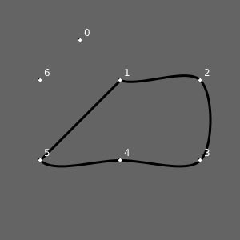
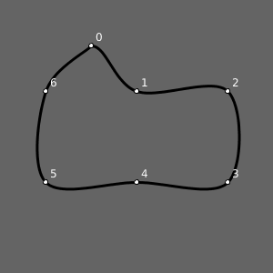
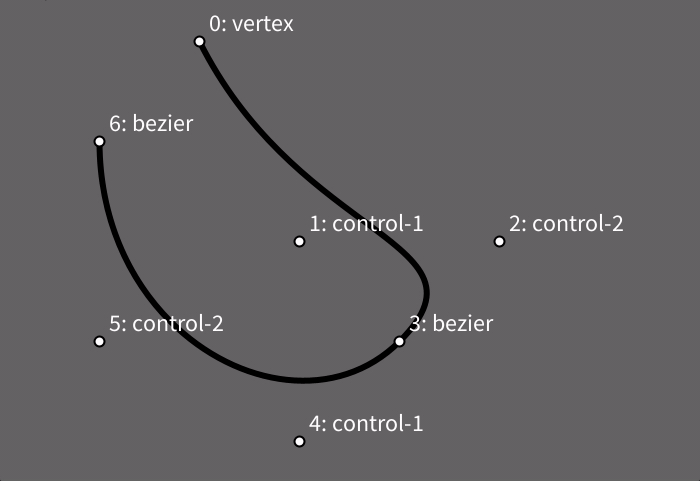
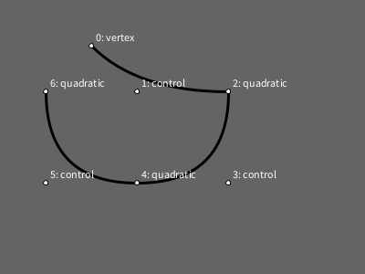

# Desenhando Curvas - I

Agora que já sabemos [desenhar um polígonos com `begin_shape()` e `end_shape()` ou `end_shape(CLOSE)`](poligonos_2.md) podemos experimentar formas curvas no py5, primeiro curvas Bezier, com as funções [`bezier_vertex()`](https://py5coding.org/reference/sketch_bezier_vertex.html), em seguida uma implementação de *splines* Catmull-Rom com [`curve_vertex()`](https://py5coding.org/reference/sketch_curve_vertex.html) e por fim quadráticas com [`quadratic_vertex()`](https://py5coding.org/reference/sketch_quadratic_vertex.html).

## Curvas Bezier com `bezier_vertex()`

As famosas curvas Bezier levam o nome de Pierre Bézier, que as desenvolveu em seus trabalhos na década de 1960 na indústria automotiva, elas descrevem curvas a partir das coordenadas de pontos, ou âncoras, que delimitam o início e o fim de uma curva, mas também precisam de "pontos de controle" que em geral ficam fora da curva, mas controlam o seu comportamento.

Você pode usar um ou mais vértices Bezier entre o `begin_shape()` e o `end_shape()`, e ela pode ser aberta ou fechada (com `end_shape(CLOSE)`), mas antes de cada `bezier_vertex()` é preciso que haja algum outro vértice, um ponto âncora, que marca o início e que pode ser feito com `vertex()`, como neste exemplo a seguir.

No `bezier_vertex()` propriamente dito, os quatro primeiros argumentos são as cordenadas de dois pontos de controle e os últimos dois são as coordenadas do vértice(que pode servir de âncora inicial para um próximo vértice Bezier).

```
 begin_shape()
    vertex(100, 50)         # 0: âncora inicial
    bezier_vertex(150, 150,  # 1: primeiro ponto de controle do primeiro vértice
                 250, 100,  # 2: segundo ponto de controle do primeiro vértice
                 250, 200),  # 3: vértice final da primeira curva, âncora da segunda
    bezier_vertex(150, 250,  # 4: primeiro ponto de controle do segundo vértice
                 50, 200,   # 5: segundo ponto de controle do segundo vértice
                 50, 100)   # 6: segundo vértice bezier (final)
    end_shape(),
```


<details>
<summary> Código completo para reproduzir a imagem acima </summary>
<pre>

def setup():
    size(300, 300)

def draw():
    background(100)
    stroke_weight(3)
    stroke(0)
    no_fill()

    begin_shape()
    vertex(100, 50)
    bezier_vertex(150, 150,
                    250, 100,
                    250, 200),
    bezier_vertex(150, 250,
                    50, 200,
                    50, 100)
    end_shape()


    pontos=[
        (100, 50),
        (150, 150),
        (250, 100),
        (250, 200),
        (150, 250),
        (50, 200),
        (50, 100),
        ]
    stroke_weight(1)
    for i, ponto in enumerate(pontos):
        x, y=ponto
        fill(255)
        ellipse(x, y, 5, 5)
        t="{}: {:3}, {:3}".format(i, x, y)
        text(t, x+5, y-5)

</pre>
</details>

## Curvas com `curve_vertex()`

Agora que já sabemos iterar por uma estrutura de dados, e como usar as coordenadas das tuplas para desenhar um polígono, podemos experimentar a mesma estratégia com outros tipos de vértice.

Vejamos agora o `curve_vertex()`, uma forma de descrever curvas que não tem os pontos de controle como as Bezier, mas tem a curiosa propriedade dos pontos/vértices serem influenciados pelos pontos que vem antes e depois deles. É como se cada ponto fosse ao mesmo tempo sua própria âncora/vértice e ponto de controle de um outro ponto.

Vamos iterar por uma estrutura de dados, e usar as coordenadas de tuplas, da mesma forma que fizemos para desenhar um polígono, só que desta vez vamos experimentar essa estratégia com outros tipos de vértice, os vértices de curva, que acabamos de mencionar. Considere esta lista de pontos:


```python
pontos=[
    (100, 50),
    (150, 100),
    (250, 100),
    (250, 200),
    (150, 200),
    (50, 200),
    (50, 100),
    ]
```

### Exemplo 1: Comportamento inesperado

Se chamarmos uma vez `curve_vertex()` para cada vértice dentro de um contexto de `begin_shape()` e `end_shape(CLOSE)`obteremos o seguinte resultado, esquisito (estou aqui omitindo parte do código que controla os atributos gráficos e mostra os texto com os índices dos pontos):

```python
begin_shape()
for x, y in pontos:
    curve_vertex(x, y)
end_shape(CLOSE)
```



<details>
<summary> Código completo para reproduzir a imagem acima </summary>

 <pre>
 pontos=[
    (100, 50),
    (150, 100),
    (250, 100),
    (250, 200),
    (150, 200),
    (50, 200),
    (50, 100),
    ]

def setup():
    size(300, 300)

def draw():
    background(100)
    stroke_weight(3)
    stroke(0)
    no_fill()

    begin_shape()
    for x, y in pontos:
        curve_vertex(x, y)
    end_shape(CLOSE)
    stroke_weight(1)
    for i, ponto in enumerate(pontos):
        x, y=ponto
        fill(255)
        ellipse(x, y, 5, 5)
        text(i, x+5, y-5)
</pre>
</details>

### Exemplo 2: Fechando a curva corretamente

Para obter o resultado esperado (ou, caro leitor, pelo menos o que eu esperava) temos que acrescentar uma chamada com as coordenadas do último vértice antes do primeiro, e do primeiro e segundo vértices depois do último! Diga lá se não é estranho isso!

```python
curve_vertex(pontos[-1][0], pontos[-1][1])
for x, y in pontos:
    curve_vertex(x, y)
curve_vertex(pontos[0][0], pontos[0][1])
curve_vertex(pontos[1][0], pontos[1][1])
end_shape(CLOSE)
```



<details>
<summary> Código completo para reproduzir a imagem acima </summary>

 <pre>
pontos=[
    (100, 50),
    (150, 100),
    (250, 100),
    (250, 200),
    (150, 200),
    (50, 200),
    (50, 100),
    ]

def setup():
    size(300, 300)

def draw():
    background(100)
    stroke_weight(3)
    stroke(0)
    no_fill()

    begin_shape()
    curve_vertex(pontos[-1][0], pontos[-1][1])
    for x, y in pontos:
        curve_vertex(x, y)
    curve_vertex(pontos[0][0], pontos[0][1])
    curve_vertex(pontos[1][0], pontos[1][1])
    end_shape(CLOSE)
    stroke_weight(1)
    for i, ponto in enumerate(pontos):
        x, y=ponto
        fill(255)
        ellipse(x, y, 5, 5)
        text(i, x + 5, y - 5)

</pre>
</details>

### Exemplo 3: Curva aberta

É possível fazer uma curva aberta com os mesmo pontos e a mesma influência do último ponto no primeiro, e do primeiro no último, omitindo o `CLOSE`:

```python
curve_vertex(pontos[-1][0], pontos[-1][1])
for x, y in pontos:
    curve_vertex(x, y)
curve_vertex(pontos[0][0], pontos[0][1])
end_shape()
```


<details>
<summary> Código completo para reproduzir a imagem acima </summary>
<pre>
pontos=[
    (100, 50),
    (150, 100),
    (250, 100),
    (250, 200),
    (150, 200),
    (50, 200),
    (50, 100),
    ]

def setup():
    size(600, 600)

def draw():
    background(100)
    stroke_weight(3)
    stroke(0)
    no_fill()

    begin_shape()
    curve_vertex(pontos[-1][0], pontos[-1][1])
    for x, y in pontos:
        curve_vertex(x, y)
    curve_vertex(pontos[0][0], pontos[0][1])
    curve_vertex(pontos[1][0], pontos[1][1])
    pontos=[
    (100, 50),
    (150, 100),
    (250, 100),
    (250, 200),
    (150, 200),
    (50, 200),
    (50, 100),
    ]


</pre>
</details>

### Exemplo 4: Curva aberta usando diferentes pontos

Agora se não queremos essa influência da curva fechada, é preciso repetir o primeiro e o último vértice.

```python
begin_shape()
curve_vertex(pontos[0][0], pontos[0][1])
for x, y in pontos:
    curve_vertex(x, y)
curve_vertex(pontos[-1][0], pontos[-1][1])
end_shape()
```


<details>
<summary> Código completo para reproduzir a imagem acima </summary>
<pre>
pontos=[
    (100, 50),
    (150, 100),
    (250, 100),
    (250, 200),
    (150, 200),
    (50, 200),
    (50, 100),
    ]

def setup():
    size(600, 600)

def draw():
    background(100)
    stroke_weight(3)
    stroke(0)
    no_fill()

    begin_shape()
    curve_vertex(pontos[0][0], pontos[0][1])
    for x, y in pontos:
        curve_vertex(x, y)
    curve_vertex(pontos[-1][0], pontos[-1][1])
    end_shape()
    stroke_weight(1)
    for i, ponto in enumerate(pontos):
        x, y=ponto
        fill(255)
        ellipse(x, y, 5, 5)
        text(i, x+5, y-5)
</pre>
</details>


### Exemplo 5: Usando `end_shape(CLOSE)`

Veja como ficaria acrescentando-se o `CLOSE` em `end_shape(CLOSE)`. Fica um tanto estranha.


<details>
<summary> Código completo para reproduzir a imagem acima </summary>
<pre>
pontos=[
    (100, 50),
    (150, 100),
    (250, 100),
    (250, 200),
    (150, 200),
    (50, 200),
    (50, 100),
    ]

def setup():
    size(600, 600)

def draw():
    background(100)
    stroke_weight(3)
    stroke(0)
    no_fill()

    begin_shape()
    curve_vertex(pontos[0][0], pontos[0][1])
    for x, y in pontos:
        curve_vertex(x, y)
    curve_vertex(pontos[-1][0], pontos[-1][1])
    end_shape(CLOSE)
    stroke_weight(1)
    for i, ponto in enumerate(pontos):
        x, y=ponto
        fill(255)
        ellipse(x, y, 5, 5)
        text(i, x+5, y-5)
</pre>
</details>

### Extra: Um testador de curvas interativo

**Desafio:** Você conseguiria escrever o código que permite testar as curvas arrastando os pontos com o mouse, usando a estratégia do exemplo ["arrastando vários círculos"](https://github.com/villares/material-aulas/blob/main/Processing-Python-py5/arrastando_circulos.md#arrastando-v%C3%A1rios-c%C3%ADrculos)?



<details>

<summary> Resposta: Usando a mesma estratégia de "arrastar círculos". </summary>

<pre>
  arrastando = None

  pontos = [
      (100, 50),
      (150, 100),
      (250, 100),
      (250, 200),
      (150, 200),
      (50, 200),
      (50, 100)]

  def setup():
      size(300, 300)

  def draw():
      background(100)
      stroke_weight(3)
      stroke(0)
      no_fill()

      begin_shape()
      curve_vertex(pontos[-1][0], pontos[-1][1])
      for x, y in pontos:
          curve_vertex(x, y)
      curve_vertex(pontos[0][0], pontos[0][1])
      end_shape(CLOSE)
      stroke_weight(1)
      for i, ponto in enumerate(pontos):
          x, y = ponto
          if i == arrastando:
              fill(200, 0, 0)
          elif dist(mouse_x, mouse_y, x, y) < 10:
              fill(255, 255, 0)
          else:
              fill(255)
          circle(x, y, 5)
          t = '{}: {:03}, {:03}'.format(i, x, y)
          text(t, x + 5, y - 5)

  def mouse_pressed():
      # quando um botão do mouse é apertado
      global arrastando
      for i, ponto in enumerate(pontos):
          x, y = ponto
          if dist(mouse_x, mouse_y, x, y) < 10:
              arrastando = i
              break  # encerra o laço

  def mouse_released():
      # quando um botão do mouse é solto
      global arrastando
      arrastando = None

  def mouse_dragged():
       # quando o mouse é movido apertado
       global pontos
       global arrastando
       if arrastando is not None:
          x, y = pontos[arrastando]
          x += mouse_x - pmouse_x
          y += mouse_y - pmouse_y
          pontos[arrastando] = x, y
</pre>

</details>

## Curvas com `quadratic_vertex()`

Essas curvas precisam começar com uma âncora usando a função `vertex()`, em seguinda, cada chamada a `quadratic_vertex()`  inclui um ponto de controle e um novo vértice/ancora.



```python
arrastando = None

pontos = [
    (100, 50),   # 0: vertex() âncora inicial 
    (150, 100),  # 1: ponto de controle
    (250, 100),  # 2: vértice e âncora do próximo
    (250, 200),  # 3: ponto de controle
    (150, 200),  # 4: vértice e âncora do próximo
    (50, 200),   # 5: ponto de controle
    (50, 100),   # 6: vértice final
]

def setup():
    size(400, 300)

def draw():
    background(100)
    stroke_weight(3)
    stroke(0)
    no_fill()

    with begin_shape():
        vertex(pontos[0][0], pontos[0][1])  # primeiro ponto (índice 0)
        for (px, py), (x, y) in zip(pontos[1::2], pontos[2::2]):  
            # do segundo e terceiro pontos (índices 1 e 2) em diante 
            quadratic_vertex(px, py, x, y)
    
    stroke_weight(1)
    for i, ponto in enumerate(pontos):
        x, y = ponto
        if i == arrastando:
            fill(200, 0, 0)
        elif dist(mouse_x, mouse_y, x, y) < 10:
            fill(255, 255, 0)
        else:
            fill(255)
        ellipse(x, y, 5, 5)
        t = f'{i}: {"vertex" if i == 0 else "control" if i % 2 else "quadratic"}'
        text(t, x + 5, y - 5)

def mouse_pressed():
    global arrastando
    for i, ponto in enumerate(pontos):
        x, y = ponto
        if dist(mouse_x, mouse_y, x, y) < 10:
            arrastando = i
            break 

def mouse_released():
    global arrastando
    arrastando = None

def mouse_dragged():
    global pontos
    global arrastando
    if arrastando is not None:
        x, y = pontos[arrastando]
        x += mouse_x - pmouse_x
        y += mouse_y - pmouse_y
        pontos[arrastando] = x, y
```

## Assuntos relacionados

- [Desenhando Polígonos - I](poligonos_1.md)
- [Desenhando Polígonos - II](poligonos_2.md)
- [Sequências e laços de repetição](lacos_py.md)


