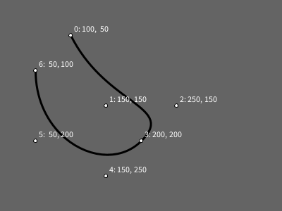

# Desenhando Curvas - I

Agora que já sabemos [desenhar um polígonos com `begin_shape()` e `end_shape()` ou `end_shape(CLOSE)`](poligonos_2.md) podemos experimentar formas curvas no py5, primeiro curvas Bézier cúbicas, com as funções [`bezier_vertex()`](https://py5coding.org/reference/sketch_bezier_vertex.html), em seguida curvas Bézier quadráticas usando [`quadratic_vertex()`](https://py5coding.org/reference/sketch_quadratic_vertex.html) e por fim uma implementação de *Catmull-Rom splines* com [`curve_vertex()`](https://py5coding.org/reference/sketch_curve_vertex.html).

As curvas Bézier levam o nome do engenheiro francês Pierre Bézier, que as desenvolveu a partir dos algorítimos do matemático e físico francês [Paul de Casteljau](https://en.wikipedia.org/wiki/Paul_de_Casteljau), em seus trabalhos na década de 1960 na indústria automotiva, elas descrevem curvas a partir das coordenadas de pontos, ou âncoras, que delimitam o início e o fim de uma curva, mas também precisam de "pontos de controle" que em geral ficam fora da curva, mas controlam o seu comportamento. Essas curvas polinomiais podem ser expressas como a interpolação linear entre alguns pontos como [descrito e illustrado com animações na Wikipedia](https://pt.wikipedia.org/wiki/Curva_de_B%C3%A9zier).

## Curvas Bézier cúbicas com `bezier_vertex()`

Você pode usar um ou mais chamadas a `bezier_vertex()` entre o `begin_shape()` e o `end_shape()`, e a curva pode ser aberta ou fechada (com `end_shape(CLOSE)`). Antes de cada `bezier_vertex()` é preciso que haja algum outro vértice, um ponto âncora, que marca o início, então antes da primeira chamada a `bezier_vertex()` é preciso usar `vertex()`, como neste exemplo a seguir. 

Este tipo de curva Bézier requer dois pontos de controle para cada novo vértice (não levando em conta o primeiro vértice âncora). Na função `bezier_vertex()` os quatro primeiros argumentos são as cordenadas de dois pontos de controle e os últimos dois são as coordenadas do vértice (que pode servir de âncora inicial para um próximo vértice Bézier).

```python
begin_shape()
vertex(100, 50)           # 0: âncora inicial
bezier_vertex(150, 150,   # 1: primeiro ponto de controle do primeiro vértice
              250, 100,   # 2: segundo ponto de controle do primeiro vértice
              250, 200),  # 3: vértice final da primeira curva, âncora da segunda
bezier_vertex(150, 250,   # 4: primeiro ponto de controle do segundo vértice
              50, 200,    # 5: segundo ponto de controle do segundo vértice
              50, 100)    # 6: segundo vértice bezier (final)
end_shape()
```



<details>
<summary> Código completo para reproduzir a imagem acima </summary>
<pre>

def setup():
    size(300, 300)

def draw():
    background(100)
    stroke_weight(3)
    stroke(0)
    no_fill()

    begin_shape()
    vertex(100, 50)
    bezier_vertex(150, 150,
                    250, 100,
                    250, 200),
    bezier_vertex(150, 250,
                    50, 200,
                    50, 100)
    end_shape()

    pontos = [
        (100, 50),
        (150, 150),
        (250, 100),
        (250, 200),
        (150, 250),
        (50, 200),
        (50, 100),
        ]
    stroke_weight(1)
    for i, ponto in enumerate(pontos):
        x, y = ponto
        fill(255)
        circle(x, y, 5)
        t="{}: {:3}, {:3}".format(i, x, y)
        text(t, x+5, y-5)
</pre>
</details>

## Curvas Bézier quadráticas com `quadratic_vertex()`

Essas curvas também precisam começar com um vértice-âncora usando a função `vertex()`, em seguinda, cada chamada a `quadratic_vertex()` inclui nos argumentos as coordenades de um ponto de controle seguidas das coordenadas do novo vértice (que por sua vez pode servir de âncora para vértices Bézier subsequentes).

```python
begin_shape()
vertex(100, 50)              # 0: vertex inicial
quadratic_vertex(150, 100,   # 1: ponto de controle
                 250, 100)   # 2: ponto
quadratic_vertex(250, 200,   # 3: ponto de controle
                 150, 200)   # 4: ponto de controle
quadratic_vertex(50, 200,    # 5: ponto de controle
                 50, 100)    # 6: ponto de controle
end_shape()
```


<details>
<summary> Código completo para reproduzir a imagem acima </summary>
<pre>

def setup():
    size(300, 300)

def draw():
    background(100)
    stroke_weight(3)
    stroke(0)
    no_fill()

    begin_shape()
    vertex(100, 50)              # 0: vertex inicial
    quadratic_vertex(150, 100,   # 1: ponto de controle
                     250, 100)   # 2: ponto
    quadratic_vertex(250, 200,   # 3: ponto de controle
                     150, 200)   # 4: ponto de controle
    quadratic_vertex(50, 200,    # 5: ponto de controle
                     50, 100)    # 6: ponto de controle
    end_shape()

    pontos = [
        (100, 50),
        (150, 150),
        (250, 100),
        (250, 200),
        (150, 250),
        (50, 200),
        (50, 100),
        ]
    stroke_weight(1)
    for i, ponto in enumerate(pontos):
        x, y = ponto
        fill(255)
        circle(x, y, 5)
        t = f'{i}: {"vertex" if i == 0 else "control" if i % 2 else "quadratic"}'
        text(t, x+5, y-5)

</pre>
</details>

## Curvas com `curve_vertex()`

Vejamos agora as *Catmull-Rom splines*, uma forma de descrever curvas que não tem os pontos de controle "fora da curva" como as Bézier e as quadráticas, ao contrário, tem a curiosa propriedade dos pontos/vértices serem influenciados pelos pontos que vem antes e depois deles: é como se cada ponto fosse ao mesmo tempo sua própria âncora/vértice e ponto de controle de outros pontos anteriores e posteriores.

Vamos iterar por uma lista de coordenadas em forma de tuplas, da mesma forma que fizemos para desenhar um polígono, só que desta vez vamos experimentar essa estratégia com, os `curve_vertex()` que acabamos de mencionar. Considere esta lista de pontos:

```python
pontos = [
    (100, 50),
    (150, 100),
    (250, 100),
    (250, 200),
    (150, 200),
    (50, 200),
    (50, 100),
    ]
```

### Exemplo 1: Comportamento inesperado

Se chamarmos uma vez `curve_vertex()` para cada vértice dentro de um contexto de `begin_shape()` e `end_shape(CLOSE)`obteremos o seguinte resultado, esquisito (estou aqui omitindo parte do código que controla os atributos gráficos e mostra os texto com os índices dos pontos):

```python
begin_shape()
for x, y in pontos:
    curve_vertex(x, y)
end_shape(CLOSE)
```


<details>
<summary> Código completo para reproduzir a imagem acima </summary>

 <pre>
 pontos = [
    (100, 50),
    (150, 100),
    (250, 100),
    (250, 200),
    (150, 200),
    (50, 200),
    (50, 100),
    ]

def setup():
    size(300, 300)

def draw():
    background(100)
    stroke_weight(3)
    stroke(0)
    no_fill()

    begin_shape()
    for x, y in pontos:
        curve_vertex(x, y)
    end_shape(CLOSE)
    stroke_weight(1)
    for i, ponto in enumerate(pontos):
        x, y = ponto
        fill(255)
        circle(x, y, 5)
        text(i, x+5, y-5)
</pre>
</details>

### Exemplo 2: Fechando a curva corretamente

Para obter o resultado esperado (ou, caro leitor, pelo menos o que eu esperava) temos que acrescentar uma chamada com as coordenadas do último vértice antes do primeiro, e do primeiro e segundo vértices depois do último! Diga lá se não é estranho isso!

```python
curve_vertex(pontos[-1][0], pontos[-1][1])
for x, y in pontos:
    curve_vertex(x, y)
curve_vertex(pontos[0][0], pontos[0][1])
curve_vertex(pontos[1][0], pontos[1][1])
end_shape(CLOSE)
```


<details>
<summary> Código completo para reproduzir a imagem acima </summary>

 <pre>
pontos = [
    (100, 50),
    (150, 100),
    (250, 100),
    (250, 200),
    (150, 200),
    (50, 200),
    (50, 100),
    ]

def setup():
    size(300, 300)

def draw():
    background(100)
    stroke_weight(3)
    stroke(0)
    no_fill()

    begin_shape()
    curve_vertex(pontos[-1][0], pontos[-1][1])
    for x, y in pontos:
        curve_vertex(x, y)
    curve_vertex(pontos[0][0], pontos[0][1])
    curve_vertex(pontos[1][0], pontos[1][1])
    end_shape(CLOSE)
    stroke_weight(1)
    for i, ponto in enumerate(pontos):
        x, y=ponto
        fill(255)
        circle(x, y, 5)
        text(i, x + 5, y - 5)

</pre>
</details>

### Exemplo 3: Curva aberta

É possível fazer uma curva aberta com os mesmo pontos e a mesma influência do último ponto no primeiro, e do primeiro no último, omitindo o `CLOSE`:

```python
curve_vertex(pontos[-1][0], pontos[-1][1])
for x, y in pontos:
    curve_vertex(x, y)
curve_vertex(pontos[0][0], pontos[0][1])
end_shape()
```


<details>
<summary> Código completo para reproduzir a imagem acima </summary>
<pre>
pontos = [
    (100, 50),
    (150, 100),
    (250, 100),
    (250, 200),
    (150, 200),
    (50, 200),
    (50, 100),
    ]

def setup():
    size(600, 600)

def draw():
    background(100)
    stroke_weight(3)
    stroke(0)
    no_fill()

    begin_shape()
    curve_vertex(pontos[-1][0], pontos[-1][1])
    for x, y in pontos:
        curve_vertex(x, y)
    curve_vertex(pontos[0][0], pontos[0][1])
    curve_vertex(pontos[1][0], pontos[1][1])
    pontos = [
    (100, 50),
    (150, 100),
    (250, 100),
    (250, 200),
    (150, 200),
    (50, 200),
    (50, 100),
    ]


</pre>
</details>

### Exemplo 4: Curva aberta usando diferentes pontos

Agora se não queremos essa influência da curva fechada, é preciso repetir o primeiro e o último vértice.

```python
begin_shape()
curve_vertex(pontos[0][0], pontos[0][1])
for x, y in pontos:
    curve_vertex(x, y)
curve_vertex(pontos[-1][0], pontos[-1][1])
end_shape()
```


<details>
<summary> Código completo para reproduzir a imagem acima </summary>
<pre>
pontos=[
    (100, 50),
    (150, 100),
    (250, 100),
    (250, 200),
    (150, 200),
    (50, 200),
    (50, 100),
    ]

def setup():
    size(600, 600)

def draw():
    background(100)
    stroke_weight(3)
    stroke(0)
    no_fill()

    begin_shape()
    curve_vertex(pontos[0][0], pontos[0][1])
    for x, y in pontos:
        curve_vertex(x, y)
    curve_vertex(pontos[-1][0], pontos[-1][1])
    end_shape()
    stroke_weight(1)
    for i, ponto in enumerate(pontos):
        x, y = ponto
        fill(255)
        circle(x, y, 5)
        text(i, x+5, y-5)
</pre>
</details>


### Exemplo 5: Usando `end_shape(CLOSE)`

Veja como ficaria acrescentando-se o `CLOSE` em `end_shape(CLOSE)`. Fica um tanto estranha.


<details>
<summary> Código completo para reproduzir a imagem acima </summary>
<pre>
pontos = [
    (100, 50),
    (150, 100),
    (250, 100),
    (250, 200),
    (150, 200),
    (50, 200),
    (50, 100),
    ]

def setup():
    size(600, 600)

def draw():
    background(100)
    stroke_weight(3)
    stroke(0)
    no_fill()

    begin_shape()
    curve_vertex(pontos[0][0], pontos[0][1])
    for x, y in pontos:
        curve_vertex(x, y)
    curve_vertex(pontos[-1][0], pontos[-1][1])
    end_shape(CLOSE)
    stroke_weight(1)
    for i, ponto in enumerate(pontos):
        x, y=ponto
        fill(255)
        circle(x, y, 5)
        text(i, x+5, y-5)
</pre>
</details>

### Extra: Um testador de curvas interativo

**Desafio:** Você conseguiria escrever o código que permite testar as curvas arrastando os pontos com o mouse, usando a estratégia do exemplo ["arrastando vários círculos"](https://github.com/villares/material-aulas/blob/main/Processing-Python-py5/arrastando_circulos.md#arrastando-v%C3%A1rios-c%C3%ADrculos)?


<details>

<summary> Resposta: Testador para curve_vertex() com pontos arrastáveis. </summary>

<pre>
  arrastando = None

  pontos = [
      (100, 50),
      (150, 100),
      (250, 100),
      (250, 200),
      (150, 200),
      (50, 200),
      (50, 100)]

  def setup():
      size(300, 300)

  def draw():
      background(100)
      stroke_weight(3)
      stroke(0)
      no_fill()

      begin_shape()
      curve_vertex(pontos[-1][0], pontos[-1][1])
      for x, y in pontos:
          curve_vertex(x, y)
      curve_vertex(pontos[0][0], pontos[0][1])
      end_shape(CLOSE)
      stroke_weight(1)
      for i, ponto in enumerate(pontos):
          x, y = ponto
          if i == arrastando:
              fill(200, 0, 0)
          elif dist(mouse_x, mouse_y, x, y) < 10:
              fill(255, 255, 0)
          else:
              fill(255)
          circle(x, y, 5)
          t = '{}: {:03}, {:03}'.format(i, x, y)
          text(t, x + 5, y - 5)

  def mouse_pressed():
      # quando um botão do mouse é apertado
      global arrastando
      for i, ponto in enumerate(pontos):
          x, y = ponto
          if dist(mouse_x, mouse_y, x, y) < 10:
              arrastando = i
              break  # encerra o laço

  def mouse_released():
      # quando um botão do mouse é solto
      global arrastando
      arrastando = None

  def mouse_dragged():
       # quando o mouse é movido apertado
       global pontos
       global arrastando
       if arrastando is not None:
          x, y = pontos[arrastando]
          x += mouse_x - pmouse_x
          y += mouse_y - pmouse_y
          pontos[arrastando] = x, y
</pre>

</details>

<details>

<summary> Resposta: Testador para quadratic_vertex() com pontos arrastáveis. </summary>

<pre>
arrastando = None

pontos = [
    (100, 50),   # 0: vertex() âncora inicial 
    (150, 100),  # 1: ponto de controle
    (250, 100),  # 2: vértice e âncora do próximo
    (250, 200),  # 3: ponto de controle
    (150, 200),  # 4: vértice e âncora do próximo
    (50, 200),   # 5: ponto de controle
    (50, 100),   # 6: vértice final
]

def setup():
    size(400, 300)

def draw():
    background(100)
    stroke_weight(3)
    stroke(0)
    no_fill()

    with begin_shape():
        vertex(pontos[0][0], pontos[0][1])  # primeiro ponto (índice 0)
        for (px, py), (x, y) in zip(pontos[1::2], pontos[2::2]):  
            # do segundo e terceiro pontos (índices 1 e 2) em diante 
            quadratic_vertex(px, py, x, y)
    
    stroke_weight(1)
    for i, ponto in enumerate(pontos):
        x, y = ponto
        if i == arrastando:
            fill(200, 0, 0)
        elif dist(mouse_x, mouse_y, x, y) < 10:
            fill(255, 255, 0)
        else:
            fill(255)
        ellipse(x, y, 5, 5)
        t = f'{i}: {"vertex" if i == 0 else "control" if i % 2 else "quadratic"}'
        text(t, x + 5, y - 5)

def mouse_pressed():
    global arrastando
    for i, ponto in enumerate(pontos):
        x, y = ponto
        if dist(mouse_x, mouse_y, x, y) < 10:
            arrastando = i
            break 

def mouse_released():
    global arrastando
    arrastando = None

def mouse_dragged():
    global pontos
    global arrastando
    if arrastando is not None:
        x, y = pontos[arrastando]
        x += mouse_x - pmouse_x
        y += mouse_y - pmouse_y
        pontos[arrastando] = x, y
</pre>

</details>


## Assuntos relacionados

- [Desenhando Polígonos - I](poligonos_1.md)
- [Desenhando Polígonos - II](poligonos_2.md)
- [Sequências e laços de repetição](lacos_py.md)


