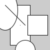

# Primeiros passos e desenho básico

Se você seguiu os passos [para instalar Thonny IDE com o py5](https://abav.lugaralgum.com/como-instalar-py5) , verifique se a opção *imported mode* está ativada no menu **py5** e experimente digitar o código abaixo no editor de código, e, em seguida, clique no botão com a seta triangular para frente (executar/*run*). 

<!-- editor-pyp5js -->
```python
# área de desenho, largura (width) 400, altura (height) 400
size(400, 400)
# um retângulo na posição x=100, y=50, com largura 150 e altura 200
rect(100, 50, 150, 200)
```

> **Nota:** Alguns dos exemplos deste material, mas não todos, funcionam no editor [pyp5js adaptado](https://abav.lugaralgum.com/material-aulas/pyp5js/py5mode), e podem ser editados clicando no botão "Abrir no editor online".


> **Nota:** Se você teve este erro, não esqueça de ligar a opção ***imported mode for py5*** no menu **py5** do Thonny.
> 

Experimente alterar os números entre parênteses e executar novamente!

## Área de desenho e coordenadas

Usamos a função `size()` para indicar o tamanho da área de desenho que desejamos(sem ela é gerada uma pequena tela de 100 por 100 pixels). Processing nos oferece automaticamente duas variáveis, os nomes `width` e `height`, que referenciam os valores de largura e altura da área de desenho, respectivamente. Podemos mostrar esses valores na parte de baixo da janela, o *console* ou *shell*, usando a função `print()` (exibir).

<!-- editor-pyp5js -->
```python
size(400, 400) # define o tamanho da área de deseno (w, h)
print(width)   # exibe no console largura atual da tela
print(height)  # exibe no console altura atual da tela
```


O computador precisa saber a posição de cada elemento a ser desenhado, e para informá-la usaremos coordenadas cartesianas, um par de números **x** e **y** que indicam posições ao longo de dois eixos, X(horizontal) e Y(vertical). Isso nos permite especificar uma posição precisa na grade, e, por convenção, para fazer isso indicamos o valor de **x** primeiro, e em seguida o valor de **y**.

Note que o eixo X cresce para a direita como de costume(nas aulas de matemática), mas o eixo Y é 'invertido' com valores crescendo 'para baixo'. Por exemplo, um ponto em(5, 14) fica a 5 unidades da borda esquerda da tela e 14 unidades para baixo do topo.


## Desenhando algumas formas

<!-- editor-pyp5js -->
```python
rect(20, 10, 40, 80)     # retângulo (x, y, largura, altura)
ellipse(10, 20, 50, 80)  # oval (x, y, largura, altura)
line(10, 10, 50, 50)     # linha do ponto 1 ao ponto 2 (x1, y1, x2, y2)
point(40, 50)            # ponto em x:40 y:50
square(55, 30, 40)       # quadrado na posição x:55 y:30 e lado:40
circle(50, 100, 40)      # círculo na posição x:50 y:100 e diâmetro:40
```



Repare como os elementos desenhados por último sobrepõe aqueles desenhados antes. Veja também como ponto é bastante sutíl com apenas 1 pixel na espessura de traço padrão.

## Cores e atributos gráficos (preenchimento e traço de contorno)

Para mudar as cores do preenchimento branco e do traço de contorno preto que são usadas inicialmente para desenhar as formas, podemos indicar 3 números de 0 a 255 para definir uma combinação de vermelho (*Red*), verde (*Green*) e azul (*Blue*). É preciso definir a cor *antes* de pedir o desenho de uma forma!

<!-- editor-pyp5js -->
```python
fill(0, 255, 0)         # preenchimento com verde máximo Red:0 Green:255 Blue:0
circle(50, 50, 50)      # produz um círculo verde

```


Uma outra maneira de indicar cores é com a notação hexadecimal, `'#RRGGBB`. No exemplo abaixo, FF é 255 em hexadecimal, então `#00FF00` equivale a 0 de vermelho, 255 de verde , e 0 de azul, que resulta no mesmo círculo verde.

<!-- editor-pyp5js -->
```python
fill('#00FF00')  # preenchimento verde
circle(50, 50, 50, 50)  # produz um círculo verde
```

É possível ajustar a cor de preenchimento de uma forma com `fill()` a cor de traço do contorno com `stroke()`, pedir uma forma sem preenchimento com `no_fill()` ou sem traço de contorno com `no_stroke()`. A espessura do traço de contorno pode ser controlada com `stroke_weight()`.

<!-- editor-pyp5js -->
```python
fill(255, 0, 0)     # cor de preenchimento vermelha
no_stroke()         # sem traço de contorno
square(50, 50, 40)  # produz um quadrado branco 
no_fill()           # sem preenchimento, formas vazadas
stroke(0, 0, 255)   # exemplo de cor do traço azul 
stroke_weight(10)   # espessura do traço de contorno 10 pixels
circle(50, 50, 50)  # produz um círculo vazado com contorno verde
```


## Fundo (*background*) e limpeza da área de desenho

O fundo preenche a área de desenho com uma cor e apaga qualquer coisa que já tenha sido desenhada (o que vai se mostrar útil quando fizermos animações).

<!-- editor-pyp5js -->
```python
square(10, 10, 80)       # não vai ser visto!
background(255, 255, 0)  # fundo amarelo, limpa a tela 
fill(128)
no_stroke()
square(50, 50, 40)
stroke(255)
stroke_weight(5)
no_fill()
circle(50, 50, 50)
```


## Onde encontrar os nomes das funções, o vocabulário, e os seus significados?

O tempo todo vamos consultar o que é conhecido documentação de referência. Para o vocabulário de desenho da biblioteca py5, que é o que estamos usando para desenhar, ela fica em [py5coding.org](https://py5coding.org/reference/summary.html), mas aqui mesmo neste material tem um [sumário traduzido da referência](sumario-referencia-py5.md) que você pode consultar!

Para a linguagem Python em si, sua sintaxe, palavras-chave, funções embutidas e a chamada "biblioteca padrão" do Python que é enorme, e você pode consultar a documentação em [docs.python.org/pt-br/3/](https://docs.python.org/pt-br/3/).

## Comentários, o que são e como criar comentários em Python?

Comentários são anotações, pedaços de texto no código, que não são executados pelo computador, são ignorados. Em Python, comentários começam com `#` e vão até o final da linha. Quando o `#` é no começo da linha ocupam uma linha inteira, e servem também como uma maneira rápida de desativar um trecho do código! Em inglês tem até uma expressão para isso: *comment out* (desativar por meio de um comentário).

Os Comentários são feitos principalmente para o benefício as pessoas que colaboram com você e estão lendo o código, como, por exemplo, uma pessoa muito importante que é você-daqui-a-uma-semana, entender qual era o objetivo daquele pedaço do programa. Os comentários que você está vendo neste material didático talvez não sejam um exemplo muito bom de comentários pois eles estão explicando funcionamento muito elementar das funções e experessões usadas, idealmente, anote o seu código com explicações curtas que falem mais do motivo ou objetivo daquele bloco e não esqueça de mudá-los quando o objetivo e o código mudar.

<!-- editor-pyp5js -->
```python
# Oi eu sou um comentário de uma linha inteira

# área de desenho 900 por 900 pixels para caber no meu site <- outro comentário
size(900, 900)

# background(0) <- instrução desativada, isso aqui tudo virou um comentário!

"""
Extra: Com três aspas no começo e no final podemos produzir textos (strings)
de várias linhas que são usados como uma espécie de comentário também, uma vez
que contém explicações para humanos, e não executam, assim como comentários.

Quando ficam logo no começo do corpo de uma definição de função ou classe, são
chamados 'docstrings' (textos de documentação).
"""
```

## Próximos passos

- [Variáveis](variaveis.md)
- [Desenhando polígonos](poligonos_1.md)
- [O que é indentação?](indentacao.md) - primeiro contato com `setup()` e `draw()`
- [Mais sobre cores(RGB e HSB)](mais_sobre_cores.md)

---

A ilustração do sistema de coordenadas foi reproduzida do curso [Progração Criativa](https://arteprog.space/programacao-criativa/)
