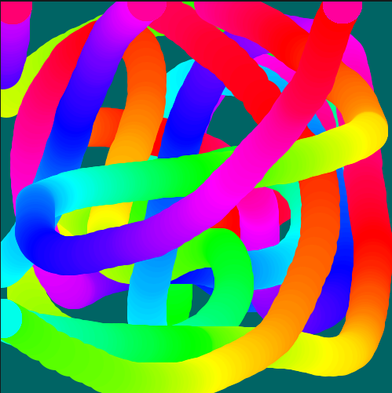

# Divisão por zero e o resto da divisão

## O problema da divisão por zero (e um pouco sobre tratamento de exceções)

Provavelmente você se lembra que o resultaddo de dividir um número por zero é em geral considerado um valor "indefinido" na maior parte dos contextos matemáticos. Em Python se o seu programa for obrigado a avaliar essa conta ele vai parar tudo e "levantar uma exceção" chamada `ZeroDivisionError`.

> Exceções são um tipo de erro que é diferente dos erros de sintaxe, você também pode encontrá-as descritas como "erros em tempo de execução". Lidar com elas é às vezes inescapável, um procedimento conhecido como "captura" ou "tratamento" de exceções. Pra dar uma idea do que estamos falando, imagine que você pediu ao Python para gravar um arquivo no seu computador, mas o sistema operacional avisou que não foi possível (acabou o espaço, por exemplo, ou o caminho indicado da pasta não existe), acontecerá um `IOError`, e se o programa não foi preparado para tratar esse tipo de exceção graciosamente com um aviso para a pessoa que pediu a gravação, sua execução vai ser interrompida.

Voltando para a questão da divisão por zero, imagine que você tem no meio do seu programa uma divisão mas o número que divide, o denominador, é variável e de vez em quando ele pode ser zero, como se proteger da interupção do seu programa?

Isso pode acontecer, do denominador variar, por diversos motivos, por ele ser resultado de uma outra conta que varia, por depender de dados externos, da posição do mouse ou de uma resposta da pessoa usando o programa!

Uma maneira de resolver é testar antes de qualquer divisão cujo denominador varia se ele vale 0 (ou se não vale 0) e propor uma execução que não dependa dessa operação de divisão caso ele seja 0:

```python
if denomidador == 0:   # se denominador é igual a 0
    resultado = 1000000 
else:
    resultado = 10 / denominador
```

Ou o equivalente

```python
if denomidador != 0:   # se denominador não é igual a 0, != significa "é diferente de"
    resultado = 10 / denominador
else:
    resultado = 1000000
```

Uma outra maneira, talvez mais sofisticada, é usar uma estrutura para exceções do Python, que futuramente vai servir em casos como erros na manipulação de arquivos e outros em que você precisa "tentar" fazer a operação que pode não funcionar (que pode "levantar uma exceção"):

```python
try:
    resultado = 10 / denominador
except ZeroDivisionError:
    resultado = 1000000
```

#### Uma outra maneira, malandra

Quando você sabe que os valores do denomidador nunca ficam negativos, e o resultado da divisão pode ser um número aproximado*, é possível somar algum valor que apenas impeça o denomidador de ser zero.

> Lembrando que operações com números do tipo *ponto flutuante* são frequententemente boas aproximações, leia mais sobre isso em [Números inteiros (*int*) e de ponto flutuante (*float*)](numeros.md).

```python
tangente_aproximada = dy / (0.00001 + distancia)

fator_de_crescimento = 1 / (1 + mouse_x)  # o resultado é no mínimo 1 e sem divisão por zero pois mouse_x nunca fica negativo
```

## Agora a parte divertida: O resto da divisão

Em inglês a operação para obter o resto da divisão com inteiros tem o nome de *modulo* ou *modulus* o que pode causar uma grande confusão pois na matemática em português a palavra 'módulo' com a notação `|num|` é usada também para falar do valor absoluto (sem o sinal) de um número (em programação usamos `abs()` para isso), e em Python módulo é o nome de pedaço organizado de uma *biblioteca de funções de programação*, em geral um arquivo `.py`.

Mas estamos falando então aqui do resto da divisão com inteiros. "Quantas vezes o 3 cabe no 7? duas! e sobra quanto? 1".
O resto da divisão nos inteiros de 7 por 3 é 1. Em Python obtemos esse valor com o operador `%`.

```python
resto = 7 % 3
print(resto)  # exibe: 1
```

E essa operação é **extremamente útil**, para saber se um número é par ou ímpar, se é divisível por um certo número ou para produzir sequencias que se repetem!

### Testando se um número é par

```python
if a % 2 == 0:
    print('a é par!')
else:
    print('a é impar!')
```

Um exemplo visual, em que a cor do círculo muda se o número do quadro é par ou impar.

<!-- editor-pyp5js -->
```python
def setup():
    size(500, 500)
    background(0, 100, 100)
    no_stroke()  

def draw():
    # se o número do do quadro for par, preenchimento preto
    if frame_count % 2:
        fill(0)
    else:  # senão, preenchimento branco
        fill(255)
    circle(mouse_x, mouse_y, 100)
```


### Testando se um número é divisível por outro

```python
if a % b == 0:
    print('a é divisível por b!')
else:
    print('a não é divisível por b!')
```

### Mantendo os números circulando até um valor máximo

Para qualquer valor de **a**, o resultado da expressão **a % b** sempre é menor que **b**, e no máximo vale **b - 1**.
Podemos usar **n % max** em uma sequencia crescente de números **n** para obter uma sequência de números com repetição periódica da seguinte maneira:

```python
for n in range(10):  # pegue um n para cada número de 0 a 9
   print(n % 2)      # exiba no console o resto da divisão de n por 2
```

Resultado:

```
0
1
0
1
0
1
```

Outro exemplo.

```python
for n in range(100):  # pegue um n para cada número de 0 a 99
   print(n % 5)       # exiba no console o resto da divisão de n por 5
```

Resultado (truncado, seriam 100 números):

```
0
1
2
3
4
0
1
…
4
```

Um exemplo visual, em que as cores são definidas pelo matiz, com um número que vai de 0 a 255 e volta para o 0, calculado a partir do resto da divisão do número do quadro (`frame_count`) por 256.

<!-- editor-pyp5js -->
```python
def setup():
    size(500, 500)
    background(0, 100, 100)
    no_stroke()
    color_mode(HSB) # matiz, saturação, brilho

def draw():
    matiz = frame_count % 256
    fill(matiz, 255, 255)
    circle(mouse_x, mouse_y, 50)
```



## Assuntos relacionados

- [Valores e seus tipos](tipagem_py.md)
- [Números inteiros (*int*) e de ponto flutuante (*float*)](numeros.md)
