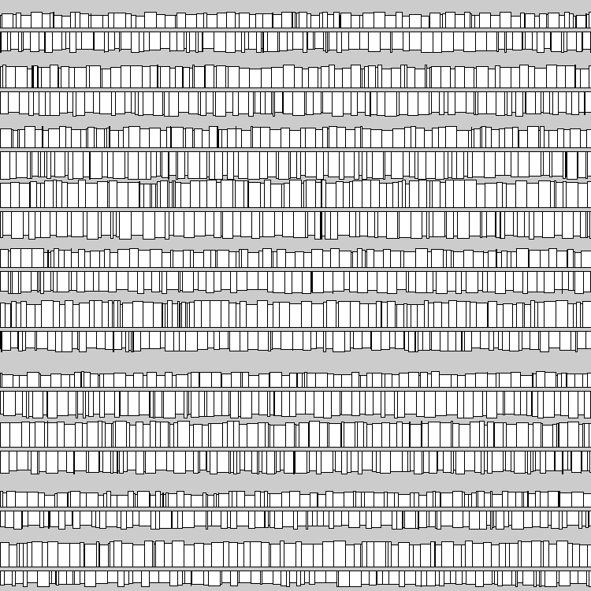

# Lendo e escrevendo dados em arquivos CSV

# *Comma Separated Values*, um formato de intercâmbio primitivo, porém ainda útil

Vamos ver aqui como ler e escrever dados simples em um arquivo CSV, o nome vem de *Comma Separated Values*, isto é, um arquivo texto com valores separados por vígula (mas às vezes se usam outros separadores como tabulções, no que teoricamente deveriam ser um TSV...).  Tanto o Processing como o a biblioteca padrão do Python tem ferramentas para ajudar a lidar com este formato. 

Para reproduzir o exemplo, você pode baixar o arquivo arquivo [`dados.csv`](assets/dados.csv), cujas primeiras linhas são mostradas trabaixo.

```
nome, valor, area, largura, comprimento, x, y
A1, 800, 32, 2, 16, 0, 19
A3, 2520, 252, 14, 18, 2, 17
...
```
Exemplo de código que lê o arquivo e desenha retângulos a partir das infotmações.
Note que cada linha do arquivo se torna um pequeno dicionário, cujas chaves são os nomes das colunas (que podem ser encontrados em `reader.fieldnames`. Os valores são sempre *strings* e por vezes precisam ser convertidos em números.



```python
import csv

with open('dados.csv') as csvfile:
    reader = csv.DictReader(csvfile)
    print(reader.fieldnames)
    # ['nome', 'valor', 'largura', 'comprimento', 'x', 'y']
    linhas = list(reader)
    
def setup():
    size(750, 750)
    for item in linhas:
        nome = item['nome']
        x = int(item['x'])
        y = int(item['y'])
        w = int(item['largura'])
        h = int(item['comprimento'])
        v = float(item['valor'])
        rect(x, y, w, h)
```

# Assuntos relacionados

* [Textos no programa, no console e na tela(*strings*)](strings_py.md)
* Se quiser ler mais sobre CSV na documentação do Python: [`csv` — CSV File Reading and Writing](https://docs.python.org/3/library/csv.html)
