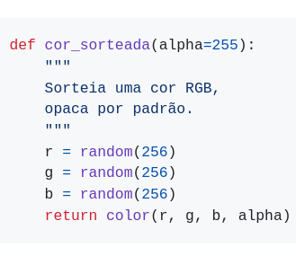

# Argumentos opcionais e valores padrão (*default*)
<!-- para sumário

-->
## Argumentos opcionais em funções que conhecemos

Você já reparou que a função `rect()` aceita 4, 5 ou 8 argumentos? Você pode invocar `rect()` das seguintes maneiras([confira na referência se preferir](https://py.processing.org/reference/rect.html)):

```
rect(x, y, largura, altura)
rect(x, y, largura, altura, raio_cantos)
rect(x, y, largura, altura, raio_sup_esq, raio_sup_dir, raio_inf_dir, raio_inf_esq)`
```

Outro caso é a função `fill()` para pedir uma cor de preenchimento:

```
fill(cinza)
fill(cinza, alpha_opacidade)
fill(r, g, b)
fill(r, g, b, alpha_opacidade)
```

## Como fazer isso nas funções que definimos?

Em Python é possível obter esse mesmo tipo de comportamento que vimos acima em uma função que nós estamos definindo. Há mais de uma estratégia para fazer isso, vamos explorar aqui uma das mais simples.

Vamos partir do exemplo de uma função que devolve cores geradas com `random()`, cuja primeira versão era mais ou menos assim:

```python
def cor_sorteada():
    """ Sorteia uma cor RGB """
    r = random(256)
    g = random(256)
    b = random(256)
    return color(r, g, b)
```

Agora imagine que gostaríamos de especificar um valor de opacidade(*alpha*) opcionalmente. Caso nenhum argumento seja usado na chamada da função, `alpha` recebe um valor *default* (padrão), `alpha = None`. O que permite agir de maneira diferente com ou sem o argumento.

```python
def cor_sorteada(alpha=None):
    """
    Sorteia uma cor RGB,
    com opacidade se fornecida.
    """
    r = random(256)
    g = random(256)
    b = random(256)
    if alpha is not None:
        return color(r, g, b, alpha)
    else:
        return color(r, g, b)
```

O exemplo anterior foi feito para mostrar uma estratégia muito usada para argumentos opcionais, mas, uma vez que `alpha` quando vale **255** significa opaco, dá no mesmo que criar uma cor sem mencionar o alpha, poderíamos fazer tudo até mais simples:

```python
def cor_sorteada(alpha=255):
    """
    Sorteia uma cor RGB,
    opaca por padrão.
    """
    r = random(256)
    g = random(256)
    b = random(256)
    return color(r, g, b, alpha)
```
