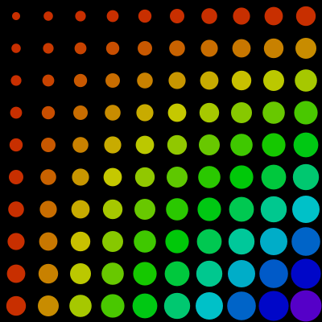

# Grades retangulares: filas e colunas de elementos

Para produzir uma grade retangular de elementos (filas e colunas) podemos utilizar laços de repetição 'encaixados' ou 'aninhados' (*nested*).

Vamos começar com uma fila de círculos:

```python
size(400, 40)
num_colunas = 10
w_coluna = 40
for coluna in range(num_colunas):  # coluna vai de 0 a 9
    x = coluna * w_coluna + w_coluna / 2  # começa 20 e aumenta de 40 em 40
    circle(x, 20, 35)
```


Seria possível obter o mesmo resultado usando a estratégia `range(inicio, parada, passa)`

```python
# deslocamento (offset) inicial: 20 - deslocamento horizontal de cada círculo: 40 
for x in range(20, 400, 40): # 10 números de 20 a 380, incluso, de 40 em 40
    circle(x, 20, 35) # círculos de diâmetro 35
```

Imagine que é possível escrever de forma parecida uma fila vertical, uma coluna de círculos... 

<details>
  <summary>Pense em como você escreveria o código e depois clique para a resposta</summary>

<pre>
size(400, 400) 
for fila in range(num_filas):  # fila vai de 0 a 9
    y = fila * h_fila + h_fila / 2
    circle(20, y, 35)
# deslocamento (offset) inicial: 20 - deslocamente vertical de cada círculo: 40
for y in range(20, 400, 40): # 10 números de 20 a 380, incluso, de 40 em 40 
    ellipse(20, y, 35, 35) # círculos de diâmetro 35 
</pre>

</details>

Em seguida, veremos o empilhamento de filas se torna uma grade de elementos:

```python
size(400, 400)
num_filas = num_colunas = 10
h_fila = w_coluna = 40
for fila in range(num_filas):  # fila vai de 0 a 9
    y = fila * h_fila + h_fila / 2
    for coluna in range(num_colunas):  # coluna vai de 0 a 9
        x = coluna * w_coluna + w_coluna / 2
        circle(x, y, 35)
```


A mesma grade usando o `range()` com início, parada e passo.

```python     
# deslocamento (offset) inicial: 20 - largura das colunas: 40 
for x in range(20, 400, 40): # 10 números de 20 a 380, de 40 em 40
    # deslocamento (offset) inicial: 20 - altura das filas: 40  
    for y in range(20, 400, 40): # 10 números de 20 a 380, de 40 em 40
        circle(x, y, 35) # círculos de diâmetro 35
```

É possível também fazer uma "fila de colunas", mudando só a ordem de encaixa dos laços (e ordem em que os círculos são desenhados) mas não o resultado visual final. Veja um exemplo, um pouco ampliado, em que a posição do elemento altera a cor e o tamanho:

```python
colunas = 10
filas = 10

def setup():  
    size(400, 400)
    color_mode(HSB)

def draw():
    background(0)
    no_stroke()
    cw = width / colunas # largura celula/coluna (também altura da fila)
    for j in range(filas):
        y = j * cw + cw / 2
        for i in range(colunas):
            x = i * cw + cw / 2
            # diâmeto baseado na soma da linha  coluna
            d = 10 + cw * (i + j) / (colunas * 2.5)
            # matiz baseado no produto da linha e coluna
            h = 10 + (i * j) * 2.2
            c = color(h, 255, 200)
            fill(c)
            # desenho do elemento em x, y
            circle(x, y, d)

```


### Assuntos relacionados

- [Sequências e laços de repetição](lacos_py.md)
- [Cores com HSB (Matiz, Saturação e Brilho)](cores_HSB.md)
- [Usando uma função geradora (*generator*)](grades2.md)
- [Uma grade com recursividade](https://abav.lugaralgum.com/material-aulas/Processing-Python-py5/recursao_py.html#uma-grade-recursiva)

