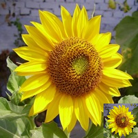

# Como usar imagens externas

## Acessando um arquivo com `load_image()`

Podemos carregar(_load_) na memória imagens digitais a partir de arquivos externos nos formatos PNG, JPG, GIF, TIF entre outros. Para isso usamos a função `load_image()`, mas é preciso indicar onde está o arquivo (o chamado 'caminho completo' do arquivo), ou que ele esteja dentro da mesma pasta que o seu _sketch_ (programa).

```
sketch_2022_09a           (pasta/folder do sketch)
   L  sketch_2022_09.py   (arquivo com o código)
   L  imagem.jpg          (imagem)
```

Note que a operação de carregar o arquivo de imagem é relativamente demorada e nunca deve ser executada dentro do laço `draw()`. Em geral só precisamos carregar uma vez a imagem e fazemos isso no `setup()`. Também é comum criarmos uma variável global que faz referência à imagem, neste exemplo a variável `img`:

```python

def setup():
    size(400, 400)
    global img
    img = load_image("image.jpg")  # arquivo JPG na pasta /data/

def draw():
    # é possível forçar um tamanho com image(imagem, 0, 0, 100, 100)
    image(img, 0, 0)
    # img.width e img.height são as dimensões da imagem original
    # podemos mostrar uma imagem com metade da sua largura e altura originais assim:
    # image(img, 0, 0, img.width / 2, img.height / 2)

```

Se a imagem tiver ** exatamente ** a mesma dimensão da área de desenho ela pode ser usada em `background()`.

```python
def setup():
    size(600, 400)
    global imagem_fundo
    # fundo tem que ter exatamente 600x400 pixels
    imagem_fundo = load_image("fundo.png")


def draw():
    background(imagem_fundo)

    # outros desenhos sobre o fundo aqui
```

Pode ser conveniente simplesmente usar a função `image()` como visto anteriormente, para desenhar a imagem na área de desenho logo no começo do `draw()`, caso suas dimensões não sejam iguais a área de desenho.

```python


def setup():
    size(600, 400)
    global imagem_fundo
    imagem_fundo = load_image("fundo.png")


def draw():
    # vai forçar/distorcer o tamanho na imagem
    image(imagem_fundo, 0, 0, width, height)

    # ou usamos image(imagem_fundo, 0, 0) mas pode faltar ou sobrar imagem em relação à área.
    # outros desenhos sobre o fundo aqui
```

## Acessando a cor de um pixel da tela ou de uma imagem

Use `get()` para os pixels visíveis na tela ou o método `.get()` para os pixels em uma imagem `Py5Image`. Como no exemplo abaixo:

```python
   def setup():
        size(500, 500)
        global imagem
        # carregando uma imagem da pasta /data/
        imagem = load_image('arquivo.png')

    def draw():
        iw, ih = imagem.width, imagem.height
        print(iw, ih)
        cor = imagem.get(mouse_x, mouse_y)  # cor do pixel sob o mouse
        fill(cor)
        no_stroke()
        image(imagem, 0, 0)
        circle(mouse_x, mouse_y, 30)
```

## Copiando uma imagem ou parted de uma imagem com `copy()`

Podemos copiar imagens digitais previamente carregadas na memória para uma região específica da janela de exibição. Se a região a ser copiada e a região a ser colada a imagem tiverem tamanhos diferentes, então o conteúdo será automaticamente redimensionado na região de destino.

Os parâmetros aceitos pela função `copy()` são:

- `src`: imagem fonte(**Opcional**, caso não seja especificada, se refere à própria tela de desenho)
- `sx`: coordenada X do ponto superior esquerdo da região a ser copiada da imagem fonte
- `sy`: coordenada Y do ponto superior esquerdo da região a ser copiada da imagem fonte
- `sw`: largura da região a ser copiada da imagem fonte
- `sh`: altura da região a ser copiada da imagem fonte
- `dx`: coordenada X do ponto superior esquerdo da região de destino na janela
- `dy`: coordenada Y do ponto superior esquerdo da região de destino na janela
- `dw`: largura da região de destino na janela
- `dy`: altura da região de destino na janela

Use `copy()` para copiar pixels de uma imagem `Py5Image`, ou de uma região da tela, para outra região da tela.

```python


def setup():
    size(400, 200)
    global imagem
    imagem = load_image('sunflower.png')


def draw():
    image(imagem, 0, 0)
    copy(0, 0, 200, 200, 200, 0, 200, 200)

```


```python


def setup():
    size(200, 200)
    global imagem, imagem2
    imagem = load_image('sunflower.png')
    imagem2 = load_image('sunflower.png')


def draw():
    image(imagem, 0, 0)
    copy(imagem2, 0, 0, 200, 200, 150, 150, 50, 50)

```



## Assuntos relacionados

- Estrutura de pixels das imagens em [Pixels e imagens](pixels.md)
- [Exportando imagens](exportando_imagem.md)
