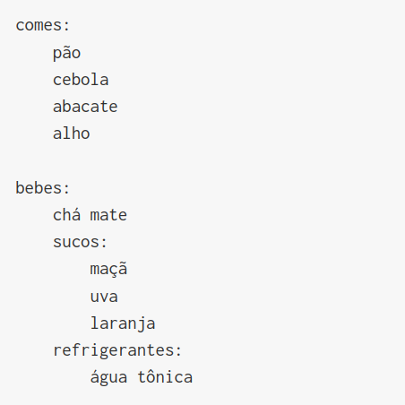

# O que é indentação?
<!--

-->
A palavra *indentação* também significa  'recuo',  veja este exemplo de uma lista de compras relativamente organizada:

```
comes:
    pão
    cebola
    abacate
    alho

bebes:
    chá mate
    sucos:
        maçã
        uva
        laranja
    refrigerantes:
        água tônica
```

O espaço que faz os itens ficarem 'dentro' das categorias é a *indentação*. Exatamente da mesma maneira, em Python, criamos blocos de código que estão 'dentro' de estruturas. Note os dois pontos(`: `) antes de um bloco indentado na lista de compras.

Essa sintaxe com o espaço de indentação, e com `:`, vai ser usada em inúmeras estruturas de Python, como `if`/`elif`/`else`,  nos laços de repetição `for` e `while`, na definição de funções com `def`, entre outras.

## Animando uma estrela com o movimento do mouse

Vamos ver agora um exemplo que precisa de indentação, avançando um pouco em ideias cujos detalhes você pode retomar depois na página sobre [movimento e interatividade](setup_draw.md).

### A função `setup()` e a função `draw()`

> Você vai ler mais para frente sobre as [definições de funções](funcoes_py.md), e como o py5 chama (aciona) essas funções para você. Por enquanto, encare como uma forma de organização do código que você vai imitar.

Podemos reorganizar o código anterior mostrado no [primeiro contato com polígonos](poligonos_1.md) colocando os configurações iniciais (*setup*), como  `size(200, 200)`, dentro da definição de função `def setup(): `, e a parte que desenha (*draw*) dentro de `def draw(): `.

A função `setup()` vai ser executada apenas uma vez no começo, e a função `draw()` fica repetindo sem parar, permitindo o movimento. Dentro do `draw()` a linha `background(0, 0, 200)` pinta o fundo de azul, mas também apaga o desenho do quadro anterior.

Repare como a indentação é o que determina o que está dentro de cada função.

<!-- editor-pyp5js -->
```python
def setup():
    size(400, 400)

def draw():
    background(0, 0, 200)  # para limpar a área de desenho
    x, y = width / 2, height / 2  # coordenadas do centro
    a = mouse_x / 4  # `a` é calculado dividindo o X do mouse por 4
    b = mouse_y / 4  # `b` é calculado dividindo o Y do mouse por 4
    begin_shape()    # começa a desenhar o polígono
    vertex(x - a, y - a)
    vertex(x - b, y)
    vertex(x - a, y + a)
    vertex(x, y + b)
    vertex(x + a, y + a)
    vertex(x + b, y)
    vertex(x + a, y - a)
    vertex(x, y - b)
    end_shape(CLOSE)  # garante que o polígono é fechado
```

<div id = "iframe_DIV" >  </div>
<a id="iframe_A" href="https://abav.lugaralgum.com/material-aulas/Processing-Python/assets/indentacao/">Veja o resultado aqui</a>

## Assuntos relacionados

- [Movimento e interatividade com `setup()` e `draw()`](setup_draw.md)
- [Criando uma animação](movimento_py.md)
- [Definição de funções](funcoes_py.md)
- Estrelas de muitas pontas com [laços de repetição `while`](while.md)
- Você pode ver usos mais avançados de `begin_shape()` na [referência](https://py5coding.org/reference/sketch_begin_shape.html).
- Você pode montar os vértices a partir de [estruturas de dados com laços de repetição ou fazer polígonos com furos](poligonos_2.md)
