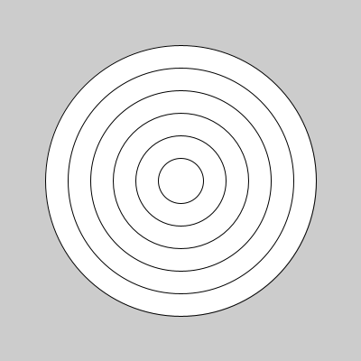
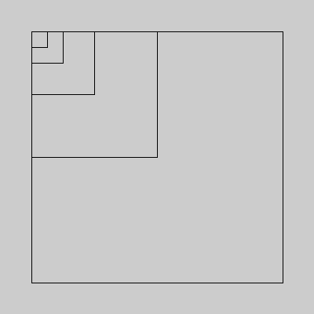
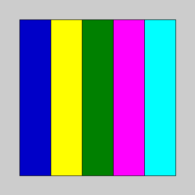
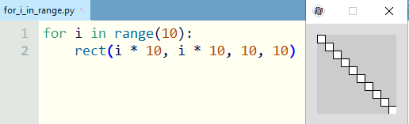
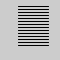
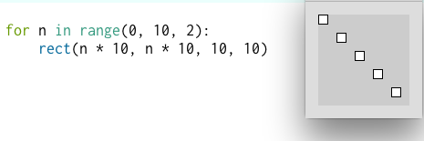
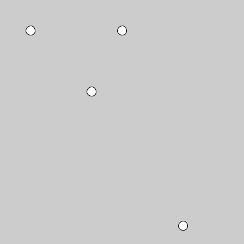

# Repetição com laços `for`

É muito comum em programação pedir ao computador que repita uma ação várias vezes, possivelmente com variações. Para fazer isso frequentemente usamos os chamados laços de repetição (*loops*) e o processo de repetir operações também é por vezes chamado de iteração (note que não é i**n**teração, que é outra coisa).

Usando a estrutura `for` podemos fazer uma ação para cada item de um 'iterável', coleções como as estruturas de dados, ou para cada item produzido por um gerador iterador. Imagine fazer algo para cada linha devolvida por um leitor de arquivos, ou ainda para cada número entregue por uma faixa de números inteiros (que pose der criada com a função embutida `range()`).  

Em cada ciclo um item é atribuido a uma variável, cujo nome vem logo após o `for` e antes do `in`. No bloco indentado de código, também conhecido como o *corpo*, acontecem ações, quase sempre usando o valor do item atribuído à variável no início de cada ciclo. 

```python
for «variavel» in «iterável»:
    «corpo»
```
## Andando por uma coleção de elementos

Uma das estruturas de dados mais versáteis do Python são as listas, podemos criar uma lista no código envolvendo elementos separados por vírgulas em colchetes, como no exemplo abaixo uma lista de números chamada `diâmetros` par desenhar círculos concêntricos.



```python
size(400, 400)
diâmetros = [300, 250, 200, 150, 100, 50]  # uma lista de números
for d in diâmetros:  # atribua a variável `d` para cada diâmetro
    circle(200, 200, d)  # desenha a cada volta um círculo o diâmetro `d` da vez
```

Note que começamos pelo círculo maior por conta dos cículos serem opacos, e dessa maneira os menores não escondem os maiores que foram desenhados antes. No exemplo seguinte vamos desligar o preenchimento dos quadrados e desenhá-los em tamanho crescente.

```python
size(400, 400)
no_fill()  # formas sem preenchimento
tamanhos = [20, 40, 80, 160, 320]
for t in tamanhos:
    square(40, 40, t)
```


Se introduzirmos uma varíavel para a posição, podemos atualizá-la dentro do laço. Veja um laço que percorre uma lista de cores.

```python
size(400, 400)

no_fill()  # formas sem preenchimento

cores = [
    color(0, 0, 200),    # azul
    color(255, 255, 0),  # amarelo
    color(0, 128, 0),    # verde
    color(255, 0, 255),  # magenta
    color(0, 255, 255),  # ciano
    ]
x = 40
for c in cores:
    fill(c)
    rect(x, 40, 64, 320)
    x = x + 64
```



Se você tiver instalada a biblioteca `matplotlib` pode pedir as cores pelo nome, então a lista pode ficar `cores = ['blue', 'yellow', 'green', 'magenta', 'cyan']`

## Produzindo sequências de inteiros com `range()`

A função embutida `range()` do Python produz um "objeto range", poderíamos talvez traduzir *range* como "faixa"; esses objetos especiais que são "faixas de números inteiros" podem ser usados nos laços `for`. 

**Você consegue imaginar o resultado do código a seguir?**

```python
for n in range(10): # para cada número do range(10) 
    print(n)        # n vai ter um valor diferente a cada ciclo
```
<details>
  <summary>clique para ver o resutado no console</summary>

<pre>
0
1
2
3
4
5
6
7
8
9
</pre>
</details>

Outra maneira de ver exatamente os números, os exibindo com a função `print()`, é convertertendo estes objetos em listas com `list(range(n))`. Usando `range()` com o argumento 10, `range(10)`, nos exemplos abaixo, vamos obter uma lista de 10 números inteiros.

**Você consegue imaginar como é essa lista?**

```python
print(list(range(10)))
```

<details>
  <summary>clique para ver a resposta</summary>

<code>[0, 1, 2, 3, 4, 5, 6, 7, 8, 9]</code>
</details>

Então para produzir uma fila de círculos, podemos fazer assim.

```python
size(400, 40)
for n in range(10):    # n vai de 0 a 9
    x = 20 + n * 40    # x começa como 20 e aumenta de 40 em 40
    circle(x, 20, 35)  # círculos com diâmetro 35
```


**Qual você acha que é o resultado de usar `range(1, 11)`?**

```python
print(list(range(1, 11)))
```

<details>
  <summary>clique para ver a resposta</summary>

<code>[1, 2, 3, 4, 5, 6, 7, 8, 9, 10]</code>

</details>

### Mais maneiras de usar `range()`

Podemos usar `range(parada)` ou `range(inicio, parada)`, o número da parada nunca aparece no resultado, não está inclus. O número de início, se houver, será o primeiro número, senão, o Python começa a contar do zero. Há ainda a forma  `range(inicio, parada, passo)`. Veja como poderia ser escrito o exemplo da fila de círculos.

```
for x in range(20, 400, 40): # 10 números de 20 a 380 (em passos de 40)
    circle(x, 20, 35) # círculos de diâmetro 35
```

### Sobre os nomes das variáveis usadas no `for` e "repetições simples

É tradicional usar certos nomes de variável `i`, `j` e `k`, por exemplo, para armazenar números de 'contadores' ou 'índices' que vão variando a cada volta do laço `for`.



Algumas vezes nem vamos usar os itens! Só queremos repetir a operação, então em vez de guardar o valor em uma variável nomeada com `x`, `y`, `n` ou `i` usamos uma variável com o curioso nome`_` (*underscore*, ou como muitos falam 'underline'). Isso é uma dica de quem está escrevendo o código de que o valor da variável vai ser desprezado. Exemplo:

```python
for _ in range(3): # repita 3 vezes!
   print("viva!")
```

<details>
  <summary>clique para ver o resutado no console</summary>

<pre>
viva!
viva!
viva!
</pre>
</details>

## Mais exemplos com `range()`

Veja a seguir mais alguns exemplos com o resultado oculto para você tentar resolver antes de olhar.

### Linhas

Agora outro exemplo usando `range()` com efeito visual.

```python
for i in range(14):
    y = 10 + 5 * i
    line(30, y, 80, y)
```

**Quais serão os valores de y e como fica o desenho das linhas?**
<details>
  <summary>clique para ver os resultados</summary>



<pre>
i: 0   y: 10 # início
i: 1   y: 15 # 10 + 5 * 1
i: 2   y: 20
i: 3   y: 25
...
i: 13  y: 75 # final
</pre>
</details>

#### Você conseguiria escrever um `for` para desenhar as linhas na vertical?
<details>
  <summary>clique para ver a resposta</summary>

<pre>
for j in range(14):
    x = 10 + 5 * j
    line(x, 30, x, 80)
</pre>


</details>

**Você consegue imaginar um desenho usando esse tipo de repetição e números [pseudo-aleatórios](aleatoriedade_1.md) com `random()`?**

### Mais sobre o `range()`



> `range(0, 10, 2)` produz os números 0, 2, 4, 6, 8

A função `range()` aceita argumentos na forma `range(início, parada, passo)`, *início* será o primeiro número, e a sequência para antes do número *parada*, aumentando com o número do *passo*, veja este exemplo com resultado visual com linhas:

```python
for x in range(10, 80, 5): # x começa valendo 10 e termina valendo 75
    line(x, 30, x, 80)     # x aumenta de 5 em 5
```

**Você consegue imaginar o resultado visual?**
<details>
  <summary>clique para ver o resutado visual</summary>


</details>

## Um pouco mais sobre listas e tuplas

Nos primeiros exemplos, percorremos com o laço `for` uma lista (`list`), que é uma estrutura de dados do Python para armazenar uma sequência ordenada mutável de itens ou elementos. Uma outra estrutura para sequências de elementos no Python, que é imutável, se chama tupla (`tuple`).

```python
# Uma lista de nomes de cores
cores = ['blue', 'green']
cores.append('red')  # append acrescenta um item no final da lista
print(cores) 
# Resutado exibido no console: ['blue', 'green', 'red']

cores[0] = 'yellow'  # 0 é o índice do primeiro item da lista
print(cores) 
# Exibe: ['yellow', 'green', 'red']

# consultando um item pelo índice
print(cores[1]) 
# Exibe: green

del cores[1]   # remove o segundo item
print(cores) 
# Exibe: ['yellow', "red']

# Uma tupla de cantores sertanejos
cantores = 'Milionário', 'José Rico'
print(cantores)
# Exibe: ('Milionário', 'José Rico')

cantores.append('Zezé')
# Exibe: Traceback (most recent call last):
#  File "<stdin>", line 1, in <module>
# AttributeError: 'tuple' object has no attribute 'append'
```

A principal diferença, além do fato de que uma lista é construida com colchetes `[ ,]`, e uma tupla é construída com uma ou mais vírgulas apenas, se necessário em envolta em parenteses `( ,)`, é que uma lista permite que seus itens sejam alterados, itens podem ser adicionados, removidos, ou, como um todo, podem ser reordenados. Por conta disso, dizemos que uma lista é *mutável*.

Já uma tupla não pode ter itens removidos, addicionados ou ser reordenada, dizemos que ela é *imutável* (mesmo se um item dela for mutável e com isso puder ter o seu conteúdo mais interno alterado). Não preocupa muito o fato das tuplas serem imutáveis, se for necessária uma correção ou atualização de uma tupla, podemos criar uma nova com a alteração em substituição da original. Uma das vantagens das tuplas é que elas ocupam menos espaço na memória, um outro é de que elas podem ser armazenadas em um conjunto (`set`) ou serem chaves de um dicionário (`dict`).

Tuplas são bastante convenientes quando a ordem dos elementos tem significado. Um termo usado para se referir a uma coleção em que a ordem importa e não faz sentido reordenar os elementos é 'registro', imagine uma coleção de tuplas com nomes, emails e telefones, por exemplo, essas tuplas funcioanam como registros, como linhas em uma planilha em que cada posição (a coluna da planilha) tem um signifiado.

Para um exemplo da geometria, podemos fazer uma tupla com coordenadas x e y, dessa forma, a primeira posição 'significa', isto é, a ordem indica, um valor no eixo X e a segunda posição indica um valor no eixo Y:

```python
posicao = (150, 50)  #  x: 150 y: 50

print(posicao[0])  # exibe 150
print(posicao[1])  # exibe 50
```

Podemos 'desempacotar' uma tupla, atribuindo os seus valores a variáveis, desde que o número de variáveis seja igual ao número de itens:

```python
posicao = 250, 120  # ou posição = (250, 120) 
x, y = posicao # x passa a valer 250 e y passa a valer 120

# mais simples, mas com o mesmo resultado, do que escrever:
# x = posicao[0]  
# y = posicao[1]  
```

**Juntando as coisas**

E é possível fazer tuplas com tuplas dentro, listas com listas dentro, listas com tuplas dentro e etc. Vamos experimentar fazer uma lista de tuplas representando as coordenadas de alguns pontos:

```python
pontos = [(10, 10), (100, 20), (200, 50), (50, 150)]
```

**Qual é o resultado de `print(pontos[3])`?**
<details>
  <summary>clique para ver a resposta</summary>

<code>(50, 150)</code>

</details>
 
### Iterando pelos dados

Finalmente vamos usar a estrutura de iteração, o *loop* `for`, para repetir a ação de desenhar um círculo, usando as coordenadas das tuplas de coordenadas na lista `pontos`:

```python
size(400, 400)
pontos = [(10, 10), (100, 20), (200, 50), (50, 150)]
for t in pontos:
    x, y = t # 'desempacotando' a tupla (x, y)
    circle(x, y, 15)
```

ou ainda podemos escrever abreviadamente assim:

```python
size(400, 400)
pontos = [(50, 50), (300, 370), (200, 50), (150, 150)]
for x, y in pontos:
    circle(x, y, 15)
```



## Assuntos relacionados

[**Grades retangulares**: filas e colunas de elementos](grades.md)

[**Mais sobre sequências e fatias** - tuplas e listas, mais sobre iterar sobre estruturas de dados e enumerar elementos](lacos_py.md)

[Laços de repetição com `while`](while.md) 

### Glossário

[**loop**](https://penseallen.github.io/PensePython2e/04-caso-interface.html#termo:loop) **(laço)** Parte de um programa que pode ser executada repetidamente.
