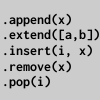

# Métodos das listas
<!--

-->

Listas são coleções ordenadas, sequências mutáveis, e como quase tudo em Python, são objetos e por isso vem acompanhadas de uma série de funções que podem ser acionadas com a *sintaxe do ponto* (*dot syntax*).

>**Nota:** Na programação orientada a objetos vemos que funções atreladas a objetos de uma classe são conhecidas como métodos.

Antes de chegar aqui, provavelmente, você já leu neste material que é possível acrescentar itens à uma lista escrevendo `lista.append(item)`, mas existem outras possibilidades, que veremos a seguir!

- `.extend(iterável)` - Prolonga a lista, adicionando no fim todos os elementos da coleção ou iterável passado como argumento.

- `.insert(i, x)` - Insere um item `x` em uma dada posição `i`. O primeiro argumento é o índice do elemento antes do qual será feita a inserção, assim `a.insert(0, x)` insere um elemento na frente da lista e `a.insert(len(a), x)` e equivale a `a.append(x)`.

- `.remove(x)` - Remove o primeiro item encontrado na lista cujo valor é igual a *x*. Se não existir valor igual, uma exceção [`ValueError`](https://docs.python.org/pt-br/3.8/library/exceptions.html#ValueError) é levantada.

- `.pop(i)` - Remove um item na posição `i` da lista e o devolve. Se nenhum índice é especificado, `.pop()` remove e devolve o último item da lista.

- `.index(x [, inicio[, parada]])` - Devolve o índice base-zero do primeiro item cujo valor é igual a `x`, levantando uma excessão [`ValueError`](https://docs.python.org/pt-br/3.8/library/exceptions.html#ValueError") se este valor não existe. Os argumentos opcionais `inicio` e `parada` são interpretados como nas notações de fatiamento e são usados para limitar a busca para uma subsequência específica da lista. O índice retornado é calculado relativo ao começo da sequência inteira e não referente ao argumento `parada`. 

> **Nota:** Os colchetes na demonstração do método indicam que os parâmetros são opcionais e não devem ser escritos! Ao chamar o método, vocẽ pode usar `lista.index(x)`, `lista.index(x, inicio)` ou`lista.index(x, inicio, parada)`. Você verá este tipo de notação frequentemente na documentação do Python.

- `.count(a)` - Devolve o número de vezes em que `a` aparece na lista.

- `.sort([key=None][, reverse=False])` - Ordena os itens na lista(os argumentos podem ser usados para personalizar a ordenação, veja também a função [`sorted()`](https://docs.python.org/pt-br/3.10/library/functions.html#sorted) para maiores explicações).

- `.reverse()` - Inverte a ordem dos elementos na lista. Existe também a função [`reversed()`](https://docs.python.org/pt-br/3.10/library/functions.html#reversed), que devolve um iterador que produz uma sequência de itens em ordem invertida da sequeência dos itens da lista, e pode ser consumido em um laço `for`, por exemplo.

- `.clear()` - Remove todos os itens da lista, equivale a `del a[:]`. Foi ascrecentado a partir do Python 3.3 apenas.

- `.copy()` - Devolve uma cópia rasa da lista. Equivalente a `a[:]`.

## Para saber mais

Você pode ler mais na Documentação do Python sobre as listas e outras estruturas de dados em [5.1. Mais sobre listas](https://docs.python.org/pt-br/3.10/tutorial/datastructures.html#more-on-lists).

