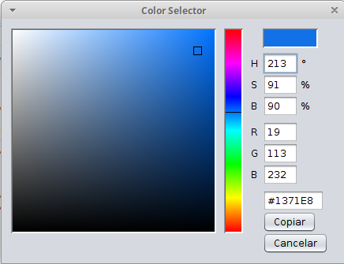
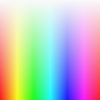

# Mais sobre cores

Vamos falar aqui sobre como definir e manipular as cores, fingindo que podemos defini-las pelas intensidades e frequências das 'luzinhas' no monitor, ou no projetor, que vai exibir nosso trabalho.

>A dura verdade é que a síntese da cor acontece em um lugar escuro e úmido, o cérebro. A percepção de cor no final das contas depende do contexto em que ela se apresenta, um pixel, que em teoria produz uma determinada cor, vai ser entendido como outra cor dependendo do ambiente, especialmente o restante da imagem em volta. Se quiser ler mais sobre isso, procure sobre *neurociência da percepção das cores*.

As principais funções do *py5* que esperam receber uma sequência de números que vai indicar uma cor são:
- `fill()` - cor de preenchimento das formas(ṕode ser desativado com `no_fill()`
- `stroke()` - cor de traço, ou contorno, das formas(ṕode ser desativado com `no_stroke()`
- `color()` - essa função recebe os mesmo argumentos que as anteriores e produz um valor único que pode ser armazenado e passado para outras funções representando uma cor.
- `background()` - cor de fundo, serve também para limpar a tela, não aceita cores translúcidas, aceita também uma imagem, `Py5Image`, do mesmo tamanho que a tela.

Por baixo dos panos o Processing trata as cores como um número inteiro "bem grande", com 32 bits, então não se espante que ao pedir `print()` de uma variável com uma cor você vai ver um porção de números negativos grandes!. O negativo tem a ver com o primeiro bit desses números inteiros no caso das cores opacas.

## Definindo cores com RGB (ou RGBA)

Por padrão escolhemos cores no Processing com trincas de números entre **0** e **255** que representam valores de intensidade nos canais **R** (*Red*, vermelho), **G** (*Green*, verde) e **B** (*Blue*, azul). Um quarto número define a opacidade (*Alpha*) pode ser usado para indicar cores translúcidas (**0** fica totalmente transparente, e invisível, e **255** totalmente opaca, como se não tivesse sido usado o quarto número). 

```python
stroke_weight(5)
stroke(200, 0, 0)  # traço vermelho
fill(200, 200, 0)  # preenchimento amarelo
rect(3, 3, 50, 50)

stroke(0, 200, 0)       # traço verde
fill(0, 200, 200, 200)  # preenchimento ciano tranlúcido
rect(25, 25, 50, 50)

stroke(0, 0, 200)       # traço azul
fill(200, 0, 200, 200)  # preenchimento magenta translúcido
rect(47, 47, 50, 50)
```


Uma maneira de escolher uma cor e obter os valores RGB dela é usando a ferramenta no menu do py5 do Thonny IDE (*py5 > Color Selector...*).



## Cores com HSB (Matiz, Saturação e Brilho)

Se chamaramos a função *color_mode* com a constante **HSB**, `color_mode(HSB)`, podemos passar a usar números representando Matiz(*Hue*), Saturação(*Saturation*) e Brilho(*Brightness*).

```python
color_mode(HSB)
# fila de linhas com cores saturadas
for x in range(100):
    stroke(x * 2.5, 255, 255)
    line(x, 0, x, 33)
# fila de linhas com saturação reduzida
for x in range(100):
    stroke(x * 2.5, 128, 255)
    line(x, 33, x, 66)
# fila de linhas com brilho reduzido
for x in range(100):
    stroke(x * 2.5, 255, 128)
    line(x, 66, x, 100)
```


É possível reverter pra o modo **RGB** padrão chamando `color_mode(RGB)`.

## Mudando a escala de valores

Normalmente, os valores, tanto RGB como HSB são indicados em uma escala de ** 0 ** a ** 255**, mas isso pode ser alterado na chamada a `color_mode()` como no exemplo abaixo.

```python
# H, S e B indo de 0 a 100
color_mode(HSB, 100)
for h in range(100):
  for s in range(100):
    stroke(h, s, 100)
    point(h, s)
```



Também é possível indicar o valor máximo de cada canal **RGB** usando `color_mode(RGB, max_r, max_g, max_b)` ou no caso do modo HSB, `color_mode(HSB, max_h, max_s, max_b)`. Você vai encontrar por aí exemplos com **360** como máximo para o matiz(*hue*), fazendo referência a distribuição de matizes em um círculo, e também outros que usam **1** como valor máximo para brilho e saturação(assim 0.5 passa a significar 50 % de saturação ou brilho, por exemplo).

## Sobre a notação hexa com `#`

É possível usar a notação hexadecimal começando com `#` seguido por `RRGGBB`, também conhecida como cor hexa e apreciada por web-designers e comum também no Processing Java, mas só entre aspas no modo Python, como em `fill("#FFAA00"`) nas funções `color()`, `fill()`,  `background()` e `stroke()`.
