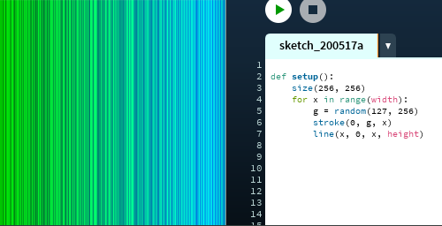
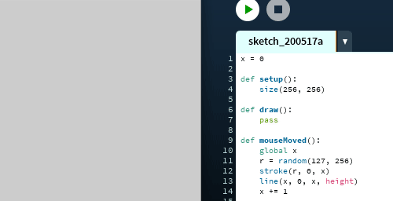
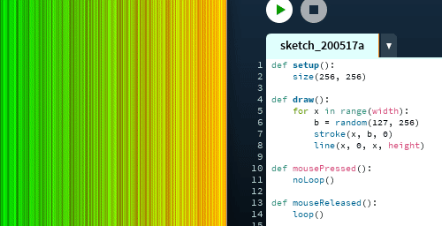

# Parando o `draw()`

O laço principal do processing é uma função de nome `draw()` que devemos definir quando queremos fazer * sketches * animados ou interativos, e cujo conteúdo fica sendo repetido. O processing, normalmente, chama para nós essa função sem parar, cada ciclo é um * frame * (quadro de uma animação). vamos ver aqui algumas 'estratégias alternativas' à repetição continua do `draw()`.

# Um *sketch* sem `draw()`

é possível trabalhar  com desenhos estáticos sem o `draw()`,  sem `setup()` também para * sketches * muito simples, ou apenas com `setup()` como no exemplo abaixo.

# Um corpo de`draw()` vazio

para poder usar as funções disparadas por eventos, como `key_pressed()` ou `mouse_pressed()` é preciso que seja criada uma função `draw()`, mesmo que vazia.  em python é possível criar uma função vazia com a palavra chave `pass` no corpo da função, algo como 'passar a vez em um jogo'. veja abaixo um exemplo com a função `mouse_moved()`.

> nada é desenhado até que o evento do movimento do mouse dispare a função `mouse_moved()` que desenha as linhas.

# Usando `noLoop()` e `loop()`

mesmo com o desenho sendo feito dentro de `draw()`, como de costume, é possível fazer com que a função pare de repetir, invocando `no_loop()`.  isso pode ser feito no `setup()`, dentro do próprio `draw()` ou em alguma função disparada por evento. Já a função `loop()`, que faz o `draw()` voltar  a ser executado repetidas vezes, tem que ser invocada dentro de alguma função disparada por evento, como`mouse_released()` no exemplo abaixo.

> `draw()` para quando um botão do mouse é apertado e volta a repetir quando é solto.

neste  exemplo a função `draw()` é executada 4 vezes e para, chamando `no_loop()`, se alguma tecla for apertada, `loop()` é executada dentro de `key_pressed()` e temos mais 4 execuções de `draw()`.

> cada vez que uma tecla é pressionada, `draw()` é executada 4 vezes.

O operador `%` é usado para obter o resto da divisão do número do frame(`frame_count`) por 4 . veja como são os resultados:

| frame_count | % 4 (resto da divisão por 4) |
| ---------- | ---------------------------- |
| 1 | 1 |
| 2 | 2 |
| 3 | 3 |
| 4 | 0 |
| 5 | 1 |
| 6 | 2 |
| 7 | 3 |
| 8 | 0 |
| ... | ... |

# A função `redraw()`

por fim vejamos a função `redraw()`, que quando  usada, marca para que seja executado um único * frame * de `draw()`. no exemplo abaixo, a repetição de `draw()` está pausada por conta de `no_loop()` em `setup()`.

> um novo ciclo de `draw()` é executado quando o mouse for clicado.
