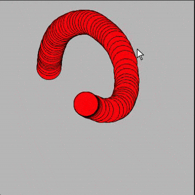
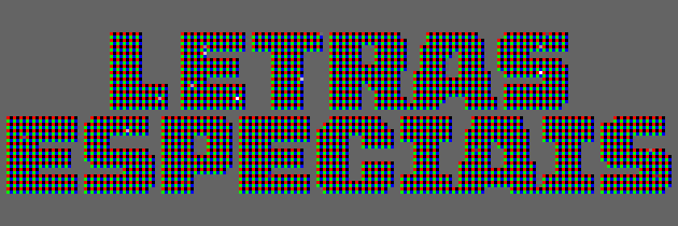

# Desenhando em um espaço fora da tela (*offscreen buffer*)

Em vez de desenhar diretamente na tela como fazemos normalmente, podemos obter uma área de desenho fora da área visível do *sketch* com a função [create_graphics()](https://py5coding.org/reference/sketch_create_graphics.html), que cria um objeto *Py5Graphics* com as dimensões que determinarmos. Essa estratégia é conhecida também como "usar um _offscreen buffer_".

Depois de manipular essa área de desenho virtual é possível consultar os pixels que ela contém, e mostrá-la, se quisermos, na área de desenho normal com a função `image()`, a mesma que usamos para mostrar na tela um objeto *Py5Image*, como uma imagem externa carregada  com `load_image()` .

Algumas usos comuns desta estratégia são:

- Desenhar cumulativamente (com rastro) em uma camada, enquanto se anima elementos, com limpeza do frame, em outra camada;
- Preparar uma imagem cujos pixels serã consultados para produzir o desenho principal;
- Salvar o imagens em camadas separadas para posterior tratamento;
- Desenhar uma imagem muito maior do que a tela, para [salvar em alta resolução](exportando_imagens.md);
- Criar uma [máscaras de recorte](recortando_imagens.md) ou criar imagem ou textura que gostaríamos de recortar;
- Desenhar mais rápido na tela, de uma vez só, possivelmente reaproveitando um desenho com partes já prontas. Uma estratégia semelhante existe para objetos vetorias, que consiste em desenhar um objeto ou *grupo* de objetos *Py5Shape*, que pode ser criado com a função [create_shape()](http://py5coding.org/reference/sketch_create_shape.html) e pode depois ser desenhado na tela com `shape()`.

## Animando o fundo de um desenho com acumulação



Note como neste exemplo o fundo é apagado a cada frame (com uma cor que varia) e seria possível produzir uma animação com outros elementos sendo desenhados. Enquanto isso, no objeto `img` acontece um desenho com acumulação como normalmente fazemos na tela principal.

```python
def setup():
    size(400, 400)
    global img
    img = create_graphics(400, 400)  # Objeto Py5Graphics

def draw():
    background(sin(radians(frame_count)) * 128 + 128)    
    if is_mouse_pressed:
        img.begin_draw()
        img.fill(255, 0, 0)
        img.circle(mouse_x, mouse_y, 50)
        img.end_draw()
    image(img, 0, 0)

def key_pressed():
    img.begin_draw()
    img.clear()  # limpa o área de desenho a deixando transparente
    img.end_draw()
```

## Pegando pixels de letras escondindas



Pode ser útil desenhar em um *offscreen buffer* com a intenção de consultar os pixels para fazer o desenho principal, como neste caso com tipografia em que um texto é desenhado em *img* para que possamos desenhar uma grade de elementos baseada na disposição dos pixels da imagem auxiliar.

```python
def setup():
    global img
    size(700, 300)
    background(0)
    no_stroke()
    frame_rate(10)
    f = create_font('Tomorrow ExtraBold', 140)
    img = create_graphics(width, height)
    img.begin_draw()
    img.smooth()
    img.text_font(f)
    img.text_size(120)
    img.text_leading(100)
    img.text_align(CENTER, CENTER)
    img.text('LETRAS\nEPECIAIS', width / 2, height / 2)
    img.end_draw()

def draw():
    background(100)
    step = 8
    for x in range(0, width, step): 
        for y in range(0, height, step):
            xc, yc = step / 2 + x, step / 2 + y
            px = img.get_pixels(int(xc), int(yc))
            if px != 0:
                draw_grid(x, y, step)

def draw_grid(x, y, step):
    random_spark = 0 if random(100) > 1 else random(255)
    grid_positions = (
        (0, 0, color(255, 0, 0)),
        (0, 1, color(0, 255, 0)),
        (1, 1, color(0, 0, 255)),
        (1, 0, random_spark)
    )
    for xo, yo, fill_color in grid_positions:
        fill(fill_color)
        rect(x + xo * step / 2, y + yo * step / 2, step / 2, step / 2)
```

## Camadas que podem ser salvas em separado

No exemplo abaixo são feitos dois desenhos, que podem ser salvos separadamente e também mostrados juntos na tela. Repare com as imagens salvas tem o fundo transparente, e a imagem na tela aparece com o cinza padrão ao fundo.

```python
def setup():
    global c0, c1
    size(600, 400)
    # camada 0
    c0 = create_graphics(600, 400)
    c0.begin_draw()
    # c0.background(200) # fundo (opaco)
    c0.clear()  # limpa os pixels, deixa transparente
    c0.fill(255, 0, 0)
    c0.rect(100, 100, 100, 100)
    c0.end_draw()
    # camada 1
    c1 = create_graphics(600, 400)
    c1.begin_draw()
    c1.clear()  # limpa os pixels, deixa transparente
    c1.fill(0, 0, 200)
    c1.ellipse(200, 200, 200, 200)
    c1.end_draw()

def draw():
    # desenhe as camandas na tela
    image(c0, 0, 0)
    image(c1, 0, 0)

def key_pressed():
    if key == 's':
        c0.save('camada0.png', drop_alpha=False)
        c1.save('camada1.png', drop_alpha=False)
        save_frame("camadas-combinadas.png")
```


## Assuntos relacionados

- [Recortando e mascarando imagens](recortando_imagens.md)
- [Exportando imagens](exportando_imagem.md)
