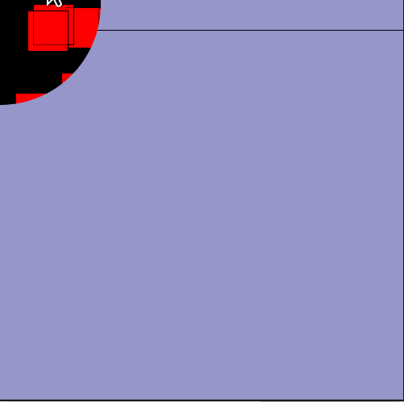

# Desenhando em um espaço fora da tela (*offscreen buffer*)

É possível desenhar em um objeto especial, uma espécie de tela virtual, criando superfícies * Py5Graphics * com a função[create_graphics()](https://py.processing.org/reference/create_graphics.html), em vez de desenhar diretamente na tela em uma estratégia conhecida como _offscreen buffer_. Depois é possível mostrar ou não essa imagem na área de desenho normal com a função `image()` (a mesma que usamos para mostrar uma imagem externa carregada carregada com `load_image()`, uma * Py5Image*).

**Atenção: ** Não esqueça de usar `.begin_draw()` e `.end_draw()` ou você será brindado com uma `NullPointerException`

Algumas vantagens dessa estratégia podem ser:
- Desenho cumulativo em uma camada enquanto se anima elementos(com limpeza do frame) em outra camada
- Potencialmente mais rápido do que desenhar na tela(reaproveitando um desenho com partes já prontas, por exemplo)
- Salvar o imagens em camadas separadas para posterior tratamento.
- Aplicação de máscaras de recorte ou outros tratamentos

Outra estratégia semelhante é desenhar em um objeto ou *grupo* de objetos *Py5Shape*, que pode ser criado com a função [create_shape()](http://py5coding.org/reference/sketch_create_shape.html), e pode depois desenhado na tela com `shape()'.

# Um primeiro exemplo

```python
def setup():
    size(400, 400)
    global img
    img = create_graphics(400, 400)
    img.begin_draw()
    img.clear()  # limpa os pixels, deixa transparente
    # img.background(200) # fundo (opaco)
    img.fill(255, 0, 0)
    img.rect(100, 100, 100, 100)
    img.end_draw()


def draw():
    background(sin(radians(frame_count * 0.5)) * 128 + 128)
    image(img, 0, 0)
    fill(0, 0, 200)
    circle(mouse_x, mouse_y, 100)
```

# Camadas que podem ser salvas em separado

```python
def setup():
    size(600, 400)


def draw():
    global c0, c1
    # camada 0
    c0 = create_graphics(600, 400)
    c0.begin_draw()
    # c0.background(200) # fundo (opaco)
    c0.clear()  # limpa os pixels, deixa transparente
    c0.fill(255, 0, 0)
    c0.rect(100, 100, 100, 100)
    c0.end_draw()
    # camada 1
    c1 = create_graphics(600, 400)
    c1.begin_draw()
    c1.clear()  # limpa os pixels, deixa transparente
    c1.fill(0, 0, 200)
    c1.ellipse(200, 200, 200, 200)
    c1.end_draw()
    # desenhe as camandas na tela
    image(c0, 0, 0)
    image(c1, 0, 0)


def key_pressed():
    if key == 's':
        c0.save('camada0.png', drop_alpha=False)
        c1.save('camada1.png', drop_alpha=False)
        save_frame("camadas-combinadas.png")

```


# Recortando imagens com uma máscara


```python
def setup():
    global img
    size(500, 500)
    img = load_image('https://garoa.net.br/mediawiki/images/thumb/Convite_NdP_ago.png/750px-Convite_NdP_ago.png')
    # a máscara tem que ter tamanho igual a da imagem que vai ser clipada
    clip_mask = create_graphics(img.width, img.height)
    clip_mask.begin_draw()
    clip_mask.no_fill()
    for i in range(256):
        clip_mask.stroke(255 - i)  # cor de traço vai de branco a preto
        clip_mask.circle(img.width / 2, img.height / 2, i * 2)
    clip_mask.end_draw()
    img.mask(clip_mask)  # esta operação modifica a imagem
    image_mode(CENTER)


def draw():
    pass  # é necessário ter draw(), mesmo que vazio, para a interação com o mouse!


def mouse_pressed():
    translate(mouse_x, mouse_y)
    rotate(random(PI))
    image(img, 0, 0)

```


# Criando uma máscara dinamicamente


```python
def setup():
    global offscreen, clip_mask
    size(800, 500)
    # vamos usar uma área de desenho fora da tela "offscreen buffer"
    offscreen = create_graphics(400, height)
    offscreen.begin_draw()  # necessário antes de desenhar na área
    offscreen.background(0, 200, 0)
    offscreen.fill(255)
    for _ in range(100):
        offscreen.rect(random(400), random(height), 50, 50)
    offscreen.end_draw()  # também é preciso encerrar o desenho
    cursor(CROSS)  # cursor em cruz


def draw():
    background(150, 150, 200)
    # Uma outra área de desenho que vai ser uma máscara de recorte:  Regiões
    # brancas na máscara indicam posiçoes da imagem final que são mostradas,
    # regiões pretas serão ocultadas e as cinzas intermediárias mostradas
    # translúcidas
    clip_mask = create_graphics(400, height)
    clip_mask.begin_draw()
    clip_mask.no_fill()  # usaremos círculos vazados
    for i in range(128):
        clip_mask.stroke(255 - i * 2)  # cor de traço variável
        clip_mask.circle(mouse_x, mouse_y, i)
    clip_mask.end_draw()

    result = offscreen.copy()  # uma cópia da imagem original
    result.mask(clip_mask)     # esta operação modifica a imagem
    image(result, 0, 0)        # mostra a imagem modificada
    image(offscreen, 400, 0)   # mostra a imagem original
```

# Exemplo avançado de máscara

```python
def setup():
    global offscreen, clip_mask
    size(500, 500)
    offscreen = create_graphics(width, height)
    offscreen.begin_draw()
    offscreen.clear()  # fundo transparente
    # offscreen.background(0, 200, 0, 100)  # é possível fundo translúcido
    offscreen.fill(255, 0, 0, 128)  # vermelho translúcido
    for _ in range(100):
        offscreen.rect(random(width), random(height), 50, 50)
    offscreen.end_draw()
    clip_mask = create_graphics(width, height)

def draw():
    background(150, 150, 200)
    y = frame_count % height
    line(0, y, width, y)

    clip_mask.begin_draw()
    clip_mask.clear()
    clip_mask.fill(255)
    clip_mask.circle(mouse_x, mouse_y, 250)
    clip_mask.end_draw()

    result = offscreen.copy()
    # sem o mouse apertado é mais rápido (desconsidera alpha da imagem
    # original)
    if is_mouse_pressed:
        result.mask(min_alphas(offscreen, clip_mask))
    else:
        result.mask(clip_mask)  # máscara normal
    image(result, 0, 0)  # desenha na tela a imagem com a máscara aplicada


def min_alphas(img1, img2):
    """Devolve pixels com alfa do mais transparente de cada par de pixels"""
    img1.load_pixels()
    img2.load_pixels()
    return [min(pix1 >> 24 & 0xFF, pix2 >> 24 & 0xFF)  # dark magic, don't ask
            for pix1, pix2 in zip(img1.pixels, img2.pixels)]

```


