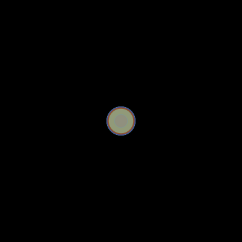

# Particulas com orientação a objetos

Vamos ver aqui alguns conceitos introdutórios de orientação a objetos:
- Como definir uma classe e instanciar objetos;
- Como definir e consultar atributos (variáveis de instância ou campos) de um objeto;
- Como definir e invocar métodos de um objeto.

Prerequisitos para aproveitar melhor este material:
- Vocabulário básico de desenho, tal como a função `circle()` e controle de atributos gráficos `fill`, `stroke`, `no_stroke`, `no_fill` e `background`;
- Conhecimento da estrutura `setup()`/`draw()` do py5, que vem do Processing;
- Uso de variáveis, conceito de atribuição, escopos global e local;
- Controle de fluxo de execução com condições (`if` e `else`) e laços de repetição (`for`);
- Declaração de novas funções.

## 0. Começando sem orientação a objetos

**Redesenhando formas e atualizando variáveis no laço principal do Processing**

Para obter o efeito de movimento(animação de uma partícula) criaremos um par de variáveis globais `x` e `y`, que serão inicializadas no `setup()` com as coordenadas do meio da àrea de desenho. Note que o escopo global dessas variáveis precisa ser indicado com a palavra chave `global` quando pretendemos alterá-las.


O código que vai em `draw()` tem a execução repetida continuamente, é o "laço principal" do * sketch*. Neste bloco vamos inicialmente limpar a tela com `background()` e em seguida invocar a função de desenho `circle()` na posição indicada pelas variáveis `x` e `y`, atualizar as variáveis de posição e por fim checar se estas estão além de um certo limite e precisam ser redefinidas para um novo ciclo da animação.

```python
tamanho = 50

def setup():
    """Código de configuração, executado no início pelo py5."""
    global x, y     # a instrução global permite atribuir nomes a variáveis globais nesta função
    size(100, 100)  # área de desenho
    x, y = width / 2, height / 2   # coordenadas do meio da área de desenho


def draw():
    """O laço principal de repetição do Processing usado para animações e sketches interativos."""
    global x, y
    background(0)  # limpeza do frame, fundo preto
    circle(x, y, tamanho)  # desenha um círculo
    x += 1  # incrementa o x (equivale a x = x + 1)
    y += 1  # incrementa o y
    if x > width + tamanho / 2:
        x = -tamanho / 2
    if y > height + tamanho / 2:
        y = -tamanho / 2
```
## 1. Primeira aproximação de uma classe

**Definindo a classe Partícula**

Vamos agora obter o mesmo comportamento usando um objeto da classe definida pelo bloco `class Particula(): `.

A definição da classe começa com o método especial `__init__()` que inicializa os atributos de dados(campos) de posição e tamanho quando um novo objeto é criado.
No bloco `setup()` criamos uma instância de particula no meio da àrea de desenho com a linha`particula = Particula(width / 2, height / 2)` e o bloco `draw()` vai repetidamente limpar a tela e chamar os métodos de desenho e atualização, `particula.desenhar()` e `particula.atualizar()` respectivamente.
Na definição da classe `Particula`, o método `desenhar()` contém a parte de desenho que escrevemos no passo inicial, mas em vez de variáveis globais agora vai usar usa os atributos de posição e tamanho do próprio objeto (instância do objeto) quando executado. Já o método `atualizar()` contém o código anteriormente usado para atualizar a posição nas variáveis globais, agora atualiza os dados (campos ou atributos) de posição do objeto.

```python
def setup():
    """Código de configuração, executado no início pelo py5."""
    global pa
    size(100, 100)  # área de desenho
    pa = Particula(width / 2, height / 2, 50)


def draw():
    """ Laço principal de repetição do Processing """
    background(0)  # atualização do desenho, fundo preto
    pa.desenhar()
    pa.atualizar()


class Particula():
    """ Classe Particula, com métodos de desenho e atualização."""

    def __init__(self, x, y, tamanho):
        self.x = x
        self.y = y
        self.tamanho = tamanho

    def desenhar(self):
        """ Desenha círculo """
        circle(self.x, self.y, self.tamanho)

    def atualizar(self):
        """ atualiza a posição do objeto """
        self.x += 1
        self.y += 1
        if self.x > width + self.tamanho / 2:
            self.x = - self.tamanho / 2
        if self.y > height +  self.tamanho / 2:
            self.y = - self.tamanho / 2
```

Pode parecer custosa demais toda essa buroracia para obter o mesmo comportamento que tínhamos anteriormente, vejamos então quais são os possíveis benefícios.

## 2. Instanciando mais objetos

**Criando algumas partículas**


A vantagem da estruturação e encapsulamento de ter uma classe Particula pode começar a fazer sentido quando instanciamos mais de uma particula.

```python
def setup():
    """ Instancia três particulas """
    global pa, pb, pc
    size(100, 100)  # área de desenho (width, height)
    pa = Particula(50, 50, 40)
    pb = Particula(80, 10, 30)
    pc = Particula(10, 40, 20)

def draw():
    """ Limpa a tela, desenha e atualiza particulas """
    background(0)  # atualização do desenho, fundo preto
    pa.desenhar()
    pa.atualizar()
    pb.desenhar()
    pb.atualizar()
    pc.desenhar()
    pc.atualizar()
```
```
...o código continua com a classe Particula mostrada anteriormente
```
## 3. Ampliando a classe Particula

**Mudando o comportamento e adicionando outras propriedades.**


O passo seguinte é dado ampliando o código da classe Particula.

No método `__init__()`:
1. Sorteio do tamanho, caso nenhum tenha sido fornecido quando o objeto é instanciado.
2. Sorteio da velocidade, decomposta nos componentes horizontal `self.vx` e vertical `self.vy`
3. Sorteio da cor, ligeiramente translúcida. 

No método `desenhar()`:
1. Remoção do contorno com `no_stroke()`
2. Aplicação da cor de preenchimento com `fill(self.cor)`.

No método `atualizar()`:
1. Atualização da posição pela soma dos componentes de velocidade na posição
2. Tratamento da saída do objeto da área de desenho por qualquer dos lados.

```python
class Particula():
    """ Classe Particula, cor sorteada, velocidade sorteada """

    def __init__(self, x, y, tamanho=None):
        self.x = float(x)
        self.y = float(y)
        if tamanho:
            self.tamanho = tamanho
        else:
            self.tamanho = random(50, 200)
        self.vx = random(-1, 1)
        self.vy = random(-1, 1)
        self.cor = color(random(256),  # R
                         random(256),  # G
                         random(256),  # B
                         200)  # alpha

    def desenhar(self):
        """ Desenha círculo """
        no_stroke()
        fill(self.cor)
        circle(self.x, self.y, self.tamanho)

    def atualizar(self):
        """ atualiza a posição do objeto e devolve do lado oposto se sair """
        self.x += self.vx
        self.y += self.vy
        metade = self.tamanho / 2
        if self.x > width + metade:
            self.x = -metade
        if self.y > height + metade:
            self.y = -metade
        if self.x < -metade:
            self.x = width + metade
        if self.y < -metade:
            self.y = height + metade
```

## 4. Muitas partículas!

**Uma lista de objetos**



Uma estrutura de dados, no caso uma lista, pode de maneira muito simples conter referências para um grande número de objetos.
Aqui chegamos rapidamente a um comportamento visualmente interessante instanciando 50 particulas no `setup()` e em seguida no `draw()` iteramos por estas particulas de maneira bastante típica em Python com um laço `for `*`object`*` in `*`collection_of_objects`*`: `

```python
particulas = []  # lista de objetos

def setup():
    """ Define área de desenho e popula lista de particulas """
    size(400, 400)  # área de desenho (width, height)
    meia_largura, meia_altura = width / 2, height / 2
    for _ in range(50):
        nova_particula = Particula(meia_largura, meia_altura)
        particulas.append(nova_particula)

def draw():
    """ Limpa a tela, desenha e atualiza particulas """
    background(0)  # atualização do desenho, fundo preto
    for particula in particulas:
        particula.desenhar()
        particula.atualizar()
```

```
...o código continua com a classe Particula mostrada anteriormente
```

> Baseado inicialmente em: VILLARES, A. B. A.; MOREIRA, D. DE C.; GOMES, M. R. [Ensino de programação em um contexto de exploração gráfica com Processing modo Python](https://villares.github.io/mestrado/VILLARES_MOREIRA_GOMES_GRAPHICA_2017). In: Anais GRAPHICA 2017 - XII International Conference on Graphics Engineering for Arts and Design. Anais…Araçatuba(SP) UNIP, 2017.

