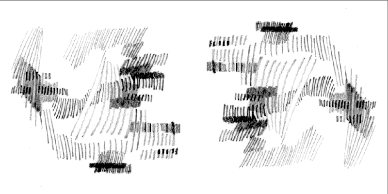

# Pixels e imagens
> Baseado em ** arteprog ** Programação Criativa / [Pixel e imagens](https: // github.com/arteprog/programacao-criativa/blob/master/conteudo/pixels-e-imagens.md)

Uma imagem digital, por vezes chamada de uma imagem bitmap, nada mais é do que uma sequência de números indicando variações de vermelho, verde e azul numa localização particular de uma grade de ** *pixels***, um neologismo cunhado na década de 60 juntado * pix*, abreviação de * picture*, e * el * de * element*, é o menor elemento de uma imagem.

A maior parte do tempo nós visualizamos esses pixels como retângulos miniatura justapostos na tela do computador. No entanto, com um pouco de pensamento criativo e com a manipulação dos pixels com código, podemos mostrar esta informação de inúmeras maneiras. Apesar disso, de tempos em tempos, podemos querer quebrar nossa rotina de desenho corriqueira e manipular os pixels da tela diretamente. O Processing proporciona isso através de um ** array ** de pixels(uma estrutura de dados que lembra uma lista mas que tem todos os elementos do mesmo tipo e um tamanho predefinido).

Estamos acostumados com a ideia de cada pixel na tela ter uma posição X e Y numa janela. No entanto, um array de pixels tem apenas uma dimensão, armazenado os valores de cor numa sequência linear.

Como os pixels aparecem:

| 0 | 1 | 2 | 3 | 4 |
| -- | --- | --- | --- | --- |
| **5 ** | **6 ** | **7 ** | **8 ** | **9 ** |
| **10 ** | **11 ** | **12 ** | **13 ** | **14 ** |
| **15 ** | **16 ** | **17 ** | **18 ** | **19 ** |
| **20 ** | **21 ** | **22 ** | **23 ** | **24 ** |


Como os pixels são armazenados:

| 0 | 1 | 2 | 3 | 4 | 5 | 6 | 7 | 8 | 9 | 10 | 11 | 12 | 13 | 14 | 15 | ... | 24 |
| --- | --- | --- | --- | --- | --- | --- | --- | --- | --- | --- | --- | --- | --- | --- | --- | --- | --- |
| |


# Um exemplo de acesso aos pixels com `.get`


```pyde


def setup():
    global img
    size(400, 400)
    no_stroke()
    rect_mode(CENTER)
    img = load_image("ale.jpg")  # carregando uma imagem da pasta /data/


def draw():
    # desenha a imagem (PImage, x, y, [largura, altura]*) *opcionais
    image(img, 0, 0)
    cor = img.get(mouse_x, mouse_y)  # pega a cor do pixel sob o mouse
    r = red(cor)  # componente vermelho do pixel
    g = green(cor)  # componente verde do pixel
    b = blue(cor)  # componente azul do pixel
    fill(cor)
    ellipse(mouse_x, mouse_y, 60, 60)  # desenha um círculo com a cor do pixel
    fill(255, 0, 0)  # vermelho
    rect(mouse_x, mouse_y + 60, r, 20)
    fill(0, 255, 0)  # verde
    rect(mouse_x, mouse_y + 80, g, 20)
    fill(0, 0, 255)  # azul
    rect(mouse_x, mouse_y + 100, b, 20)


```

 

# Manipulando individualmente os pixels de uma imagem

O método `load_pixels()` dá acesso a um array contendo os pixels da imagem e `update_pixels()` atualiza na imagem modificações que tenham sido feitas no array.

Use `create_image()` para criar um novo objeto `Py5Image` (tipo de dados para armazenar imagens) vazio, fornecendo assim um buffer de pixels que pode ser manipulado.

```pyrhon
# w (largura em pixels), h (altura em pixels),
# formato (RGB, ARGB ou ALPHA: canal alpha em escala de cinzas)
create_image(w, h, formato)
```

Um exemplo de inversão de uma lista de pixels

- Copie na pasta `data`: [desenho.gif](assets/desenho.gif)
- Aperte a tecla ** i**

```python


def setup():
    global img  # define um objeto PImage chamado imagem
    global img_aux  # define um objeto PImage chamado imagem auxiliar
    img = load_image("desenho.gif")  # carrega uma imagem
    img_aux = img  # carrega a imagem auxiliar
    # define o tamanho da tela
    this.surface.set_size(img.width * 2, img.height)


def draw():
    background(255)
    image(img, 0, 0)
    image(img_aux, img.width, 0)


def key_pressed():
    global foto, img_aux
    img.load_pixels()
    img_aux.load_pixels()
    foto = create_image(img.width, img.height, RGB)
    foto.load_pixels()

    if key == 'i':
        origem = img.width * img.height
        # multiplicar a largura pela altura para encontrar o último pixel
        destino = 0
        for temp in range(origem-1, -1, -1):
            # origem -1 pq começamos contar do 0
            foto.pixels[destino] = img.pixels[temp]
            destino += 1

    img_aux = foto
    img_aux.update_pixels()```


```


<!-- exemplo de sorting quebrado

```python


def setup():
    global img, img_temp
    size(800, 400)
    img = load_image("monica.jpg")
    img_temp = img.get()
    no_loop()


def draw():
    scale(2)
    image(img, 0, 0)
    image(img_temp, img.width, 0)
    for i in range(len(img_temp.pixels)):
        record = -1
        selected_pixel = i
        for j in range(len(img_temp.pixels)):
            pix = img_temp.pixels[j]
            b = hue(pix)
            if (b > record):
                selected_pixel = j
                record = b

        cor = img_temp.pixels[i]
        img_temp.pixels[i] = img_temp.pixels[selected_pixel]
        img_temp.pixels[selected_pixel] = cor

    img_temp.update_pixels()


```


-- ->

# Filtros de imagem

Processing oferece uma série de filtros prontos que podem ser aplicados em qualquer imagem. O comando filtro() aplica um filtro em uma imagem usando a sintaxe `filter(MODE)` ou `filter(MODE, level)`

# Modos disponíveis como parâmetros de filter()

THRESHOLD: Converte a imagem em pixels pretos ou brancos, dependendo se eles estão acima ou abaixo do limite definido pelo parâmetro de nível. O nível deve estar entre 0, 0 (preto) e 1, 0 (branco). Se nenhum nível for especificado, 0, 5 será usado.
```python
img = load_image("exemplo.jpg")
image(img, 0, 0)
filter(THRESHOLD)
```

`GRAY`: Converte as cores na imagem em equivalentes de escala de cinza. Nenhum parâmetro é usado.

`INVERT`: Define cada pixel para o seu valor inverso. Nenhum parâmetro é usado.

`POSTERIZE`: Limita cada canal da imagem ao número de cores especificado como parâmetro. O parâmetro pode ser configurado para valores entre 2 e 255, mas os resultados são mais visíveis nos intervalos inferiores.

`BLUR`: executa um borramento Gaussiano(n.t. Guassian blur), sendo que o parâmetro level especifica a extensão do borramento. Nos casos em que o parâmetro level não é utilizado, o borramento equivalente a um borramento gaussiano de raio 1.

`OPAQUE`: Define o canal alfa de forma totalmente opaca. Nenhum parâmetro é usado.

`ERODE`: Reduz as áreas de luz. Nenhum parâmetro é usado.

`DILATE`: Aumenta as áreas de luz. Nenhum parâmetro é usado.

# Manipulação de bits em Pixels

O valor de um pixel é representado no Processing(e no Java) como um número inteiro. Nesse sentido, uma imagem digital é um array de números inteiros, como vimos acima. Um inteiro é composto de 32 bits ou 4 bytes para armazenar a informação sobre a cor dos pixels. Especificamente, o primeiro byte(ou seja, 8 bits - um número entre 0 and 255) armazena o grau de transparência(canal alpha), o segundo byte para vermelho, terceiro byte para verde e o quarto byte para azul. Esquematicamente, os bits de inteiros, representando um pixel, aparecem assim:


| Alpha | Vermelho | Verde | Azul |
| --- | --- | --- | --- |
| 00000000 | 00000000 | 00000000 | 00000000 |

Esses valores podem ser manipulados com "bit shifting". Isso significa que para acessar uma cor, nós precisamos mexer no nível dos bits para extrair os 8 bits específicos que desejamos.
