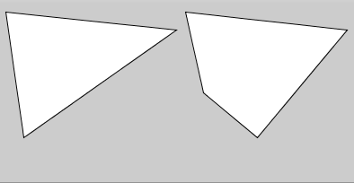

# Desenhando polígonos - I

## Primeiro contato

<!-- para o thumbnail do sumário
 
-->

Processing oferece funções para desenhar triângulos `triangle()` e quadriláteros `quad()` que são chamadas usando 3 e 4 pares de números, as coordenadas para 3 e 4 vértices, respectivamente. Veja o exemplo a seguir:

<!-- editor-pyp5js -->
```python
size(400, 400)

# vi(10, 10) v2(200, 30) v3(30, 150)
triangle(10, 10, 200, 30, 30, 150)

# v1(210, 10 v2(390, 30) v3(290, 150) v4(230, 100)
quad(210, 10, 390, 30, 290, 150, 230, 100)
```



Mas e se quisermos desenhar um polígono com 5, 6 ou com um número arbitrário de vértices?

Neste caso usamos um conjuto de funções!

Tudo começa com `begin_shape()`, seguido da repetição da função `vertex()` para cada vértice, terminando com `end_shape()`. Quando usado com a constante `CLOSE`, `end_shape(CLOSE)`, produz polígonos fechados.


<!-- editor-pyp5js -->
```python
size(400, 200)

begin_shape()  # inicia o desenho do polígono da esquerda
vertex(10, 10)
vertex(50, 50)
vertex(190, 30)
vertex(90, 150)
vertex(30, 100)
end_shape()  # encerra o desenho de um polígono aberto

begin_shape()  # inicia o desenho do polígono da direita
vertex(210, 10)
vertex(250, 50)
vertex(390, 30)
vertex(290, 150)
vertex(230, 100)
end_shape(CLOSE)  # encerra o desenho de um polígono fechado
```


## Desenhando uma estrela de quatro pontas

<!-- editor-pyp5js -->
Vejamos um exemplo que combina a estrutura que vimos antes com o uso de variáveis para calcular a possize(400, 200)

begin_shape()  # inicia o desenho do polígono da esquerda
vertex(10, 10)
vertex(50, 50)
vertex(190, 30)
vertex(90, 150)
vertex(30, 100)
end_shape()  # encerra o desenho de um polígono aberto

begin_shape()  # inicia o desenho do polígono da direita
vertex(210, 10)
vertex(250, 50)
vertex(390, 30)
vertex(290, 150)
vertex(230, 100)
end_shape(CLOSE)  # encerra o desenho de um polígono fechadoição dos vértices, formando um estrela!

```python
size(400, 400)
background(0, 0, 200)  # um fundo azul
x, y = width / 2, height / 2  # coordenadas do centro

largura_total, largura_menor = 250, 150
a = largura_total / 2
b = largura_menor / 2

begin_shape()
vertex(x - a, y - a)
vertex(x - b, y)
vertex(x - a, y + a)
vertex(x, y + b)
vertex(x + a, y + a)
vertex(x + b, y)
vertex(x + a, y - a)
vertex(x, y - b)
end_shape(CLOSE)
```


# Assuntos relacionados
- 
- Animando uma estrela com[`setup()`, `draw()` e o movimento do mouse](indentacao.md).
- Usos mais avançados de `begin_shape()` na [referência](https://py5coding.org/reference/sketch_begin_shape.html).
- [Criando os vértices a partir de estruturas de dados com laços de repetição e como fazer polígonos com furos](poligonos_2.md).
- Crie estrelas de muitas pontas usando [laços de repetição `while`](while.md).
