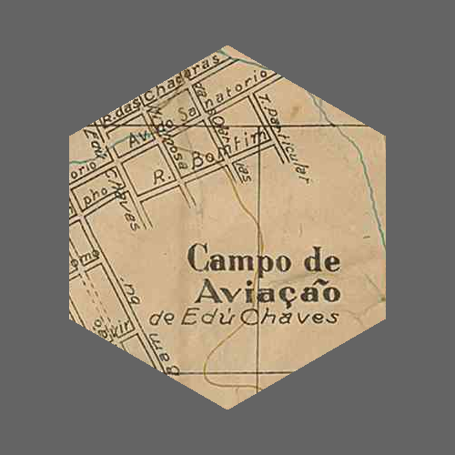
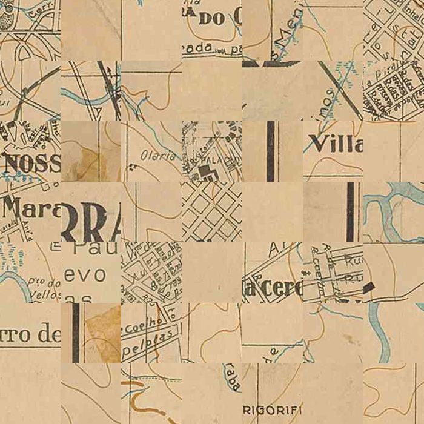
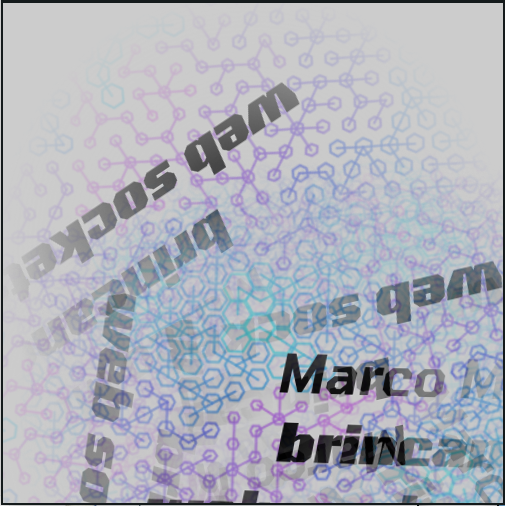
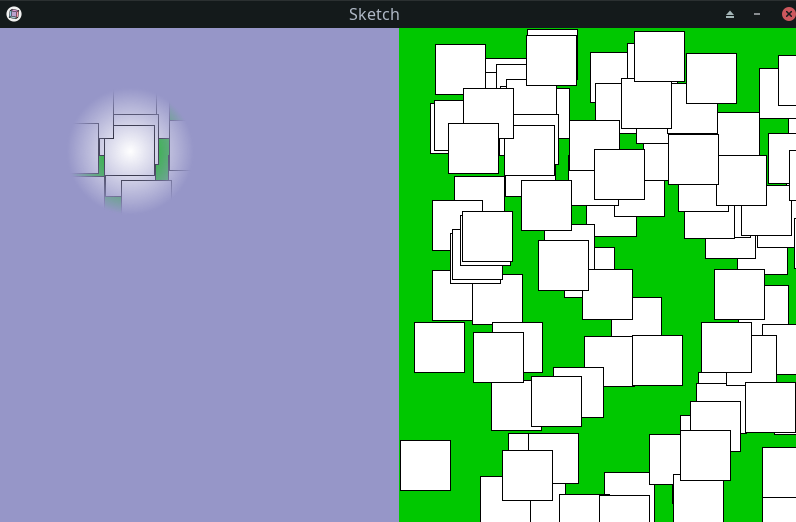

# Recortando imagens

<!-- thumb para o sumário

-->

## Copiando trechos retangulares de uma imagem



É possível se obter uma parte da tela de desenho usando a função `get_pixels()` ou uma parte de um objeto Py5Image ou Py5Graphics usando o método `.get_pixels()`, em ambos os casos passando como argumentos uma posição e dimensões de um retângulo (`x, y, w, h`) como no exemplo abaixo.

```python
url = 'https://upload.wikimedia.org/wikipedia/commons/c/cb/Mapa_de_S%C3%A3o_Paulo_-_1924.jpg'

def setup():
    global img
    size(700, 700)
    img = load_image(url) # demora um pouco carregar a imagem
    no_loop()

def draw():
    for i in range(7):
        for j in range(7):
            x = random_int(img.width - width)
            y = random_int(img.height - height)
            result = img.get_pixels(x, y, 100, 100)
            image(result, i * 100, j * 100)

def key_pressed():
    save_frame('recorte_retangular###.png')
    redraw()
```


## Recortando imagens com outras formas


O método `.mask()` modifica uma imagem usando como máscara de recorte uma outra imagem (um objeto Py5Image, ou um [*offscreen buffer*](offscreen_buffer.md), uma área de desenho fora da tela em um objeto Py5Graphic), que precisa ter as mesmas dimensões da imagem que está sendo recortada, mesmo que a região recortada seja menor. No exemplo abaixo,  a outra imagem tem o fundo transparente desenhamos um círculo branco nela.

```python
url = 'https://garoa.net.br/mediawiki/images/thumb/Convite_NdP_ago.png/750px-Convite_NdP_ago.png'

def setup():
    size(500, 500)
    
    img = load_image(url)
    # a máscara tem que ter tamanho igual a da imagem que vai ser clipada
    clip_mask = create_graphics(img.width, img.height)
    clip_mask.begin_draw()
    clip_mask.fill(255)
    clip_mask.circle(img.width / 2, img.height / 2, 400)
    clip_mask.end_draw()
    
    img.mask(clip_mask)  # esta operação modifica a imagem `img`
    image_mode(CENTER)

    background(100)
    image(img, 250, 250)
    
    save('recorte_circular.png')

```

### Recortes que geram regiões translúcidas

Repare que as partes brancas da imagem-máscara são as que permanecem na imagem modificada. As partes transparentes ou pretas serão recortadas.

Se fizermos um gradiente do branco ao preto como no exemplo abaixo, podemos ter um recorte "suave" com uma transição de opacidade no resultado.



```python
url = 'https://garoa.net.br/mediawiki/images/thumb/Convite_NdP_ago.png/750px-Convite_NdP_ago.png'

def setup():
    global img
    size(500, 500)
    img = load_image(url)
    clip_mask = create_graphics(img.width, img.height)
    clip_mask.begin_draw()
    clip_mask.no_fill()
    for i in range(256):
        clip_mask.stroke(255 - i)  # cor de traço vai de branco a preto
        clip_mask.circle(img.width / 2, img.height / 2, i * 2)
    clip_mask.end_draw()
    img.mask(clip_mask)  # esta operação modifica a imagem
    image_mode(CENTER)

def mouse_pressed():
    translate(mouse_x, mouse_y)
    rotate(random(PI))
    image(img, 0, 0)
```

### Uma função para simplificar recortes em imagens grandes

Agora se quisermos recortar um trecho não retangular de uma imagem grande, e não quisermos produzir uma máscara do mesmo tamanho, podemos combinar as duas estratégias anteriores, copiando um trecho retangular e depois recortando, com a função mostrada abaixo.


```python
url = 'https://upload.wikimedia.org/wikipedia/commons/c/cb/Mapa_de_S%C3%A3o_Paulo_-_1924.jpg'

def setup():
    global img, mascara
    size(500, 500)
    img = load_image(url)
    mascara = mascara_hexagonal(400, 400)
    no_loop()

def draw():
    background(100)
    x = random_int(200, img.width - 200)
    y = random_int(200, img.height - 200)
    recorte = recorte_com_mascara(img, mascara, x, y)
    image_mode(CENTER)
    image(recorte, 250, 250)          
    save('recorte_hexagonal.png')

def mascara_hexagonal(w, h):
    m = create_graphics(int(w), int(h))
    m.begin_draw()
    m.fill(255)
    m.no_stroke()
    with m.begin_shape():
        for n in range(6):
            ang = (n + 0.5) * TWO_PI / 6 
            x = w / 2 * cos(ang) + w / 2
            y = h / 2 * sin(ang) + h / 2
            m.vertex(x, y)
    m.end_draw()
    return m

def recorte_com_mascara(img, mascara, x, y):    
    w, h = mascara.width, mascara.height
    resultado = create_image(mascara.width, mascara.height, ARGB)
    resultado.copy(img, int(x), int(y), w, h, 0, 0, w, h)
    resultado.mask(mascara)
    return resultado

def key_pressed():
    redraw()
```


## Outros exemplos avançados

### Criando uma máscara dinamicamente

Neste exemplo abaixo o objeto Py5Graphic usado como máscara de recorte é alterado a cada frame, tendo o seu conteúdo redesenhado. Aproveitar o mesmo objeto é mais eficiente do ponto de vista da performance (do que criar um novo objeto a cada frame).

```python
def setup():
    global offscreen, clip_mask
    size(800, 500)
    # vamos usar uma área de desenho fora da tela "offscreen buffer"
    offscreen = create_graphics(400, height)
    offscreen.begin_draw()  # necessário antes de desenhar na área
    offscreen.background(0, 200, 0)
    offscreen.fill(255)
    for _ in range(100):
        offscreen.rect(random(width / 2), random(height), 50, 50)
    offscreen.end_draw()  # também é preciso encerrar o desenho
    cursor(CROSS)  # cursor em cruz
    clip_mask = create_graphics(int(width / 2), height)

def draw():
    background(150, 150, 200)
    # Uma outra área de desenho que vai ser uma máscara de recorte:  Regiões
    # brancas na máscara indicam posiçoes da imagem final que são mostradas,
    # regiões pretas serão ocultadas e as cinzas intermediárias mostradas
    # translúcidas
    clip_mask.begin_draw()
    clip_mask.clear()
    clip_mask.no_fill()  # usaremos círculos vazados
    for i in range(128):
        clip_mask.stroke(255 - i * 2)  # cor de traço variável
        clip_mask.circle(mouse_x, mouse_y, i)
    clip_mask.end_draw()

    result = offscreen.copy()  # uma cópia da imagem original
    result.mask(clip_mask)     # esta operação modifica a imagem
    image(result, 0, 0)        # mostra a imagem modificada
    image(offscreen, 400, 0)   # mostra a imagem original
```



### Recortando com Numpy e preservando a transparência

Outra estratégia que pode melhorar a perfomance na manipulação de imagens com recortes é usar arrays Numpy para manipular de forma "vetorizada" os pixels da imagem. No exemplo abaixo há uma opoção que preserva o canal alpha (partes translúcidas de transparentes) da imagem recortada, e outra que não preserva.

```python
# from https://github.com/py5coding/py5generator/discussions/159#discussioncomment-3567982
import numpy as np

def setup():
    global offscreen, clip_mask, offscreen_alpha_channel
    size(500, 500)
    clip_mask = create_graphics(width, height)
    offscreen = create_graphics(width, height)
    offscreen.begin_draw()
    offscreen.clear()  # fundo transparente
    # Note que seria possível um fundo translúcido com a linha abaixo
    # offscreen.background(0, 200, 0, 100) 
    offscreen.fill(255, 0, 0, 128)  # vermelho translúcido
    for _ in range(100):
        offscreen.rect(random(width), random(height), 50, 50)
    offscreen.end_draw()
    # faremos uma coía do canal alpha da camada a ser recortada
    offscreen.load_np_pixels()
    offscreen_alpha_channel = offscreen.np_pixels.copy()[:, :, 0]


def draw():
    background(150, 150, 200)
    y = frame_count % height
    line(0, y, width, y)

    clip_mask.begin_draw()
    clip_mask.clear()  # é preciso limpar este buffer para reutilizar
    clip_mask.fill(255)
    clip_mask.circle(mouse_x, mouse_y, 250)
    clip_mask.end_draw()
    clip_mask.load_np_pixels()
    offscreen.load_np_pixels()
    if is_mouse_pressed:
        # calcula e usa os valores mínimos entre os do alpha da máscara e os da imagem
        offscreen.np_pixels[:, :, 0] = np.where(clip_mask.np_pixels[:, :, 0] < offscreen_alpha_channel,
                                                clip_mask.np_pixels[:, :, 0], offscreen_alpha_channel)
    else:
        # usa os  valores do canal vermelho da máscara como alpha 
        # isso gera uma imagem recortada que não tem partes translúcidas. 
        offscreen.np_pixels[:, :, 0] = clip_mask.np_pixels[:, :, 1]
    offscreen.update_np_pixels()
    image(offscreen, 0, 0)
```


