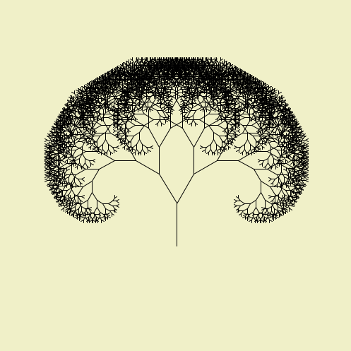
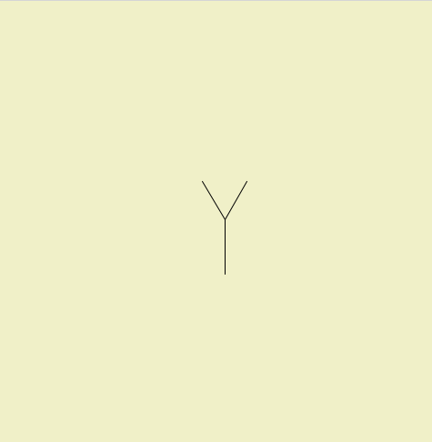

# Recursão
<!-- thumb para o sumário

-->

Allen Downey [no livro Pense em Python 2e](https://penseallen.github.io/PensePython2e/05-cond-recur.html#termo:recursividade) define *recursividade* como o processo de chamar uma função que está sendo atualmente executada. A ideia central da recursividade, ou recursão, é de que uma função pode chamar outras funções, e no caso de uma função recursiva, a função pode também chamar ela mesma!

Para que isso funcione, e não caia em uma cilada conhecida como "recursão infinita", é preciso que a função sendo chamada possa, em certas condições, chegar em uma opção de execução que não requer chamar ela mesma. Essa condição que executa sem recursão é também conhecida como "caso base".

## Árvore recursiva

Um exemplo clássico de desenho que tira partido de uma função recursiva é uma árvore cujos galhos vão se subdividindo inúmeras vezes. Vamos começar com uma função (ainda náo recursiva) que desenha apenas uma forquilha da seguinte maneira:



```python
def setup():
    size(500, 500)
    background(240, 240, 200) 
    translate(250, 300)     # desloca a origem, o (0,0) das coordenadas do canvas de desenho
    galho(60)

def galho(tamanho):
    line(0, 0, 0, -tamanho) # uma linha vertical, subindo da origem a distância "tamanho"
    angulo = radians(30)    # 30 graus em radianos
    encurtamento = 0.8      # fator para encurtar 20% o galho
    translate(0, -tamanho)  # desloca origem para ponta da linha inicial (será o centro das rotações)
    rotate(angulo)          # gira o sistema de coordenadas do canvas 30° no sentido anti-horário
    line(0, 0, 0, -tamanho * encurtamento)  # desenha uma linha (será a da direita depois)
    rotate(2 * -angulo)     # gira o sistema de coordenadas 60° no sentido horário
    line(0, 0, 0, -tamanho * encurtamento)  # desenha outra linha  (será a da esquerda depois)
    rotate(angulo)          # gira 30° o canvas o deixando como no início.
    translate(0, tamanho)   # translação que desfaz o primeiro deslocamento da origem desta função


```

Ao tentarmos tornar a função `galho()` recursiva, substituindo a chamada `line(0, 0, 0, -tamanho * encurtamento)` por chamadas à própria função, tendo como argumento um valor reduzido do tamanho, `galho(tamanho * encurtamento)` inicialmente o sketch "trava".  É produzido o erro `RecursionError: maximum recursion depth exceeded`, pois sempre que a função é chamada ela chama a si mesmo todas as vezes, numa sequência sem fim.

A solução para se obter o desenho abaixo é limitar a chamada recursiva a `galho()`, no corpo da própria função de `galho()`, a ocasiões em que o tamanho do galho ainda não é muito pequeno, e não o fazer caso a variável `tamanho` tenha um valor abaixo de algum certo limite (no exemplo abaixo o limite é 5).


```python
def setup():
    size(500, 500)
    background(240, 240, 200) 
    translate(250, 350)     # desloca a origem, o (0,0) das coordenadas do canvas de desenho
    galho(60)

def galho(tamanho):
    line(0, 0, 0, -tamanho) # uma linha vertical, subindo da origem a distância "tamanho"
    angulo = radians(30)    # 30 graus em radianos
    encurtamento = 0.8      # fator para encurtar 20% o galho
    if tamanho > 5:   # o limite de tamanho para as chamadas recursivas!
        translate(0, -tamanho)  # desloca origem para ponta da linha (será o centro das rotações)
        rotate(angulo)          # gira o sistema de coordenadas do canvas 30° no sentido anti-horário
        galho(tamanho * encurtamento)  # desenha uma linha (será a da direita depois)
        rotate(2 * -angulo)     # gira o sistema de coordenadas 60° no sentido horário
        galho(tamanho * encurtamento)  # desenha outra linha  (será a da esquerda depois)
        rotate(angulo)          # gira 30° o canvas o deixando como no início.
        translate(0, tamanho)   # translação que desfaz o primeiro deslocamento da origem desta função
    # o caso base aqui é quando a linha no começo da função é desenhada, mas não os dois subgalhos,
    # pois o tamanho é menor ou igual a 5.
```

Note como a função `galho()`, no seu corpo, chama `galho()` com valores sucessivamente menores, isso é essencial para que a condição limite, quando `tamanho` for menor que 5, não chame mais a si mesma a partir de um certo número de execuções recursivas.

Por fim, vejamos um exemplo interativo em que o ângulo entre os galhos da árvore é definido pela posição do mouse na tela (mova o mouse sobre o _sketch_ abaixo para interagir alterando o ângulo dos galhos conforme a posição X do mouse).

<iframe src="https://abav.lugaralgum.com/sketch-a-day/2019/sketch_191025pybr2019/index.html" width=500 height=500> Exemplo interativo com pyp5js</iframe>

```python
def setup():
    size(500, 500)

def draw():
    background(240, 240, 200)
    translate(250, 300)  # desloca a origem, o 0,0 das coordenadas
    galho(60)

def galho(tamanho):
    line(0, 0, 0, -tamanho)
    angulo = radians(mouse_x)
    encurtamento = 0.8
    if tamanho > 5:
        push_matrix()  # uma maneira de salvar o estado atual das coordenadas, usado em conjunto com `pop_matrix()`
        translate(0, -tamanho)
        rotate(angulo)
        galho(tamanho * encurtamento)
        rotate(2 * -angulo)
        galho(tamanho * encurtamento)
		pop_matrix()  # retoma o estado do sistema de coordenadas salvo por `push_matrix()`
```

## Uma grade recursiva

No exemplo a seguir uma função `grade()`que desenha uma grade feita por grades menores, com chamadas à própria função `grade()`. Por vezes a grade menor tem apenas uma divisão (uma fila e uma coluna) e é desenhada como um quadrado azul, ou se os elementos tiverem o tamanho menor que 20, são desenhados círculos verdes.


```python
def setup():
    size(600, 600)
    background(0)
    grade(0, 0, width, 4)  # width é a largura da área de desenho

def grade(x_grade, y_grade, tamanho_grade, divisoes):
    tamanho_elemento = tamanho_grade / divisoes
    for i in range(divisoes):
        x = x_grade + i * tamanho_elemento
        for j in range(divisoes):
            y = y_grade + j * tamanho_elemento
            if divisoes == 1:  # uma grade de uma divisão vira um quadrado azul
                fill(0, 0, 200)
                square(x, y, tamanho_elemento)
            elif tamanho_elemento < 20:  # desenha círculos para gradedes pequenas
                fill(0, 200, 0)
                circle(x + tamanho_elemento / 2,
                       y + tamanho_elemento / 2,
                       tamanho_elemento)
            else:  # senão, chama uma subgrade com o número de divisões "sorteadas"
                grade(x, y, tamanho_elemento, int(random(1, 5)))


```


