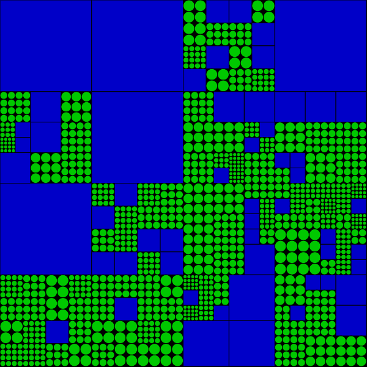

# Recursão

Allen Downey[no livro Pense em Python 2e](https://penseallen.github.io/PensePython2e/05-cond-recur.html  # termo:recursividade) define *recursividade* como o processo de chamar uma função que está sendo atualmente executada. A ideia central da recursividade, ou recursão, é de que uma função pode chamar outras funções, e no caso de uma função recursiva, a função pode também chamar ela mesma!

Para que isso funcione, e não caia em uma cilada conhecida como "recursão infinita", é preciso que a função sendo chamada possa, em certas condições, chegar em uma opção de execução que não requer chamar ela mesma. Essa condição que executa sem recursão é também conhecida como "caso base".


## Uma grade recursiva

```python
def setup():
    size(600, 600)
    background(0)
    grid(0, 0, width, 4)

def grid(grid_x, grid_y, grid_size, n):
    cell_size = grid_size / n
    for i in range(n):
        x=grid_x + i * cell_size
        for j in range(n):
            y=grid_y + j * cell_size
            if cell_size < 20:
                fill(0, 200, 0)
                circle(x + cell_size / 2,
                       y + cell_size / 2,
                       cell_size)
            elif n == 1:
                fill(0, 0, 200)
                square(x, y, cell_size)
            else:
                grid(x, y, cell_size, int(random(1, 5)))
```




## Árvore recursiva

```python
def setup():
    size(500, 500)

def draw():
    background(240, 240, 200)
    translate(250, 300)  # desloca a origem, o 0,0 das coordenadas
    galho(60)

def galho(tamanho):
    ang=radians(mouse_x)
    encurtar=0.8
    line(0, 0, 0, -tamanho)
    if tamanho > 5:  # caso base quando tamanho não é maior que 5
        translate(0, -tamanho)  # desloca origem para ponta do galho
        rotate(ang)
        galho(tamanho * encurtar)
        rotate(2 * -ang)
        galho(tamanho * encurtar)
        rotate(ang)            # desfaz rotação
        translate(0, tamanho)  # desfaz deslocamento da origem
```

[exemplo interativo com pyp5js](https://abav.lugaralgum.com/sketch-a-day/2019/sketch_191025pybr2019/index.html)

<iframe src="https://abav.lugaralgum.com/sketch-a-day/2019/sketch_191025pybr2019/index.html" width=500 height=500></iframe>


---
Texto e imagens / text and images: CC BY-NC-SA 4.0; Código / code: GNU GPL v3.0 exceto onde explicitamente indicado por questões de compatibilidade.
