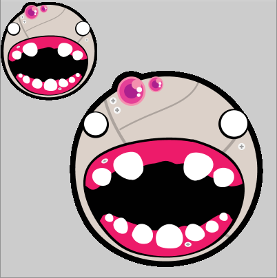

# Como usar recursos vetoriais externos

# Carregando um arquivo SVG com `loadShape()`


>arquivo: [bot1.svg](assets/bot1.svg), uma ilustração de George Brower.


Podemos carregar(*load*) na memória dados de arquivos vetoriais externos nos formatos SVG e OBJ. Para isso usamos a função `load_shape()`, mas é preciso indicar onde está o arquivo(o chamado 'caminho completo' do arquivo), ou que ele esteja na pasta `/ data /` dentro da pasta do seu * sketch * (programa).

```
sketch_2020_04a(pasta/folder do sketch)
L  sketch_2020_04a.pyde(arquivo com o código)
L  data(pasta/folder)
L  bot1.svg(arquivo svg)
```

Note que a operação de carregar o arquivo é relativamente demorada e nunca deve ser executada dentro do laço `draw()`. Em geral só precisamos carregar uma vez e fazemos isso no `setup()`. Também é comum criarmos uma variável global que faz referência aos recurso vetoriais carregados, neste exemplo a variável `svg`:

```pyde


def setup():
    size(400, 400)
    global svg
    svg = load_shape("bot1.svg")  # arquivo SVG na pasta /data/


def draw():
    # shape(svg, x, y) desenha o arquivo no tamanho original
    shape(svg, 100, 100)
    # shape(svg, x, y, largura, altura) força um tamanho
    # svg.width e svg.height apontam as dimensões do arquivo original
    # podemos mostrar o recurso com metade da sua largura e altura originais
    # assim:
    shape(svg, 0, 0, svg.width / 2, svg.height / 2)


```



Os objetos `Py5Shape`, que armazenam os dados vetoriais, tem uma série de métodos(funções internas desses objetos) que podem ser consultados na referência do[Processing modo Java / Py5Shape](https: // processing.org/reference/PShape.html). A página da referência do Processing modo Python está incompleta mas os métodos de * Py5Shape * são os mesmos.

Um dos métodos mais úteis é o `.disable_syle()` que permite ignorar os atributos grágifos das formas no arquivo SVG, permitinho aplicar o traço e preenchimento por nossa conta. O `.enable_style()` devolve o comportamento original.

```python


def setup():
    size(400, 200)
    bot = load_shape("bot1.svg")
    background(102)
    bot.disable_style()    # Ignore as cores no SVG
    fill(0, 102, 153)     # preenchimento azul
    stroke(255)           # traço branco
    stroke_weight(2)       # traço mais espesso
    shape(bot, 5, 5, 190, 190)
    bot.enable_style()
    shape(bot, 205, 5, 190, 190)
    save_frame("disable_style.png")


```


# Assuntos relacionados

- [Carregando imagens externas](imagens_externas.md)
- [Exportando SVG](exportando_svg.md)
- Para carregar objetos 3D no formato OBJ, consulte a página sobre[P3D](https: // github.com/villares/material-aulas/blob/master/Processing-Python/desenho-3_d.md)
