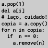

# Removendo itens de coleções

<!-- thumb para o sumário

-->
## O problema de remover itens ao mesmo tempo em que se "percorre" uma lista

Este problema sempre aparece quando queremos remover itens de uma estrutura de dados "dinâmica" isto é com número variável de itens, como uma lista. Se tentarmos remover itens em uma iteração (como um laço for) que percorra a mesma estrutura que vamos modificar, podemos ter problemas. 

Um exemplo comum na programação criativa é termos um sistema de partículas que são objetos que interagem e se desenham na tela, mas precisamos remover alguns deles depois de algum tempo, por "decaimento"/morte ou caso saiam da tela. O exemplo a seguir é bem mais simples que isso, são só alguns números em uma lista e queremos remover os zeros:

```python
# errado

a = [1, 2, 4, 0, 0, 0, 0, 8, 0, 9, 0]
for n in a:
    print(n)
    if  n == 0:
        a.remove(n)

print(a)  # exibe: [1, 2, 4, 8, 0, 9, 0]
```

Uma das soluções possíveis é copiar a estrutura e "andar" pela cópia enquanto se remove itens da estrutura original. 

```python
# certo

a = [1, 2, 4, 0, 0, 0, 0, 8, 0, 9, 0]
for n in a.copy():
    if  n == 0:
        a.remove(n)
        
print(a)  # exibe  [1, 2, 4, 8, 9]
``` 
Em vez `a.copy()` é possível também usar `a[:]`, que é uma 'fatia' contendo uma cópia da lista toda, ou ainda a função embutida `reversed()`, que cria um objeto iterável e também pode ser usada neste caso. Essa última forma lembra a estratégia de iteração do final para o começo usada em outras linguagens que necessitam de um índice para consultar os itens da coleção.

```python
a = [1, 2, 4, 0, 0, 0, 0, 8, 0, 9, 0]
for n in reversed(a):
    if  n == 0:
        a.remove(n) 
        
print(a)  # exibe  [1, 2, 4, 8, 9]

# experimente também: `for i, n in reversed(list(enumerate(a))):`
# E nesse caso é possível usar `del a[i]` ou `a.pop(i)`
```
Uma outra solução é construir uma nova lista sem os itens que você quer remover, seja com um laço também ou com uma compreensão de listas no exemplo abaixo:

```python
a = [1, 2, 4, 0, 0, 0, 0, 8, 0, 9, 0]
a = [n for n in a if n != 0]   # compreensão de listas
```
Em caso de listas grandes isso pode fazer boa diferença em termos de performance, uma vez que remover itens do meio de uma lista não é muito eficiente.
