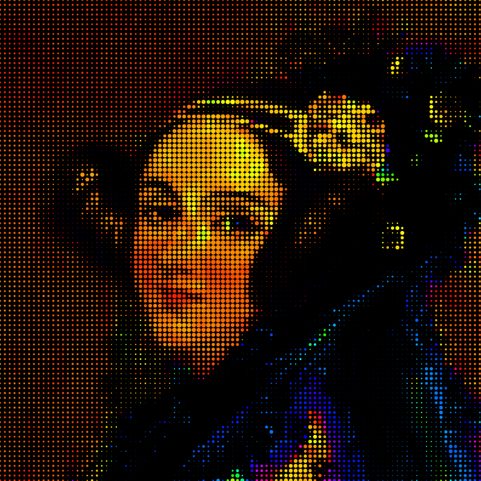
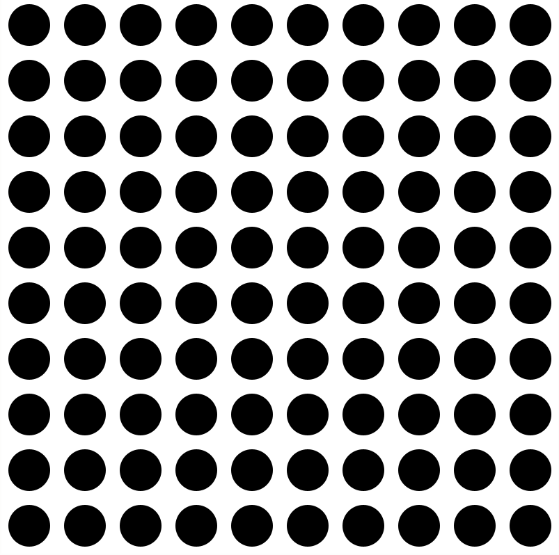
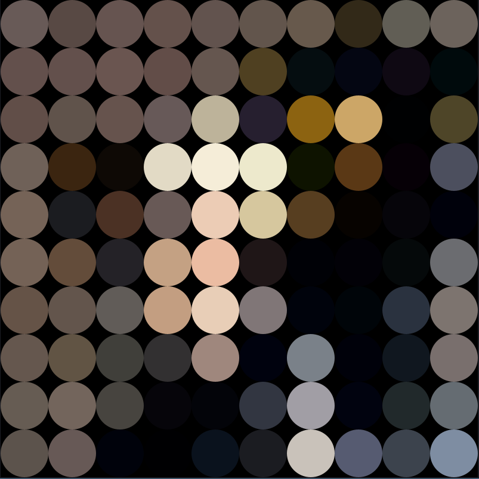
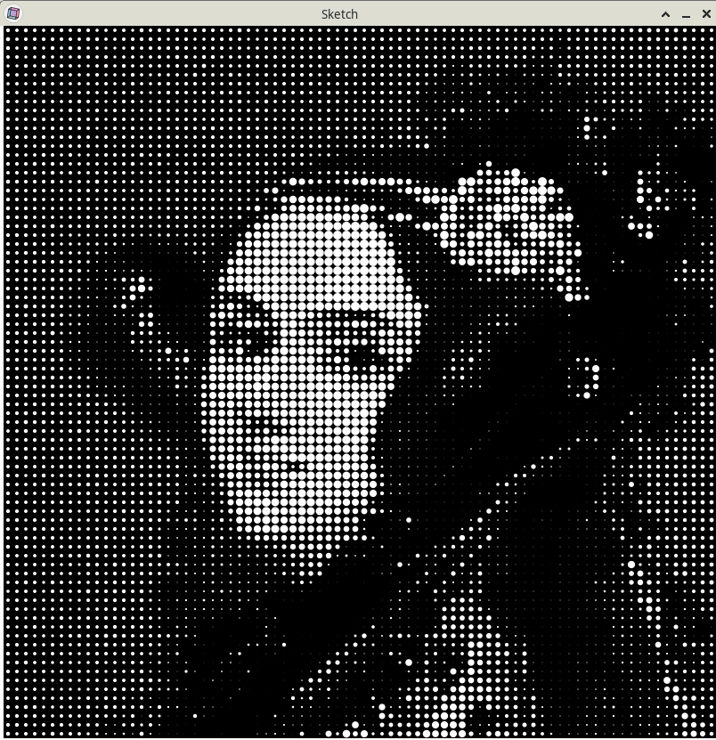
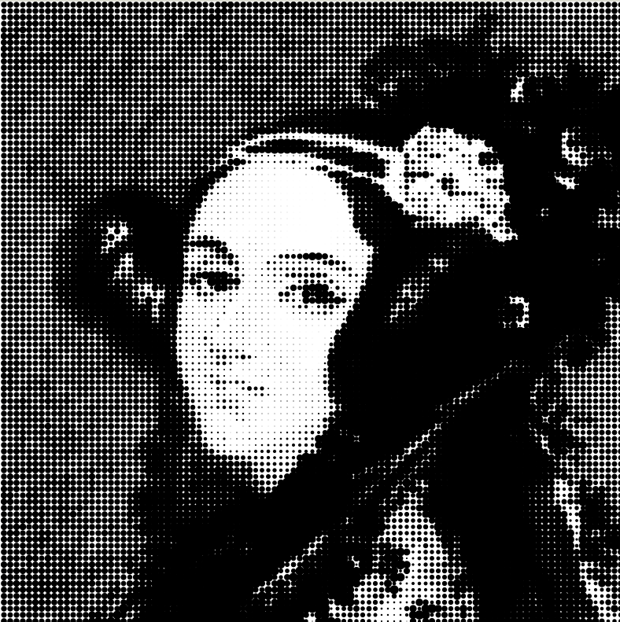
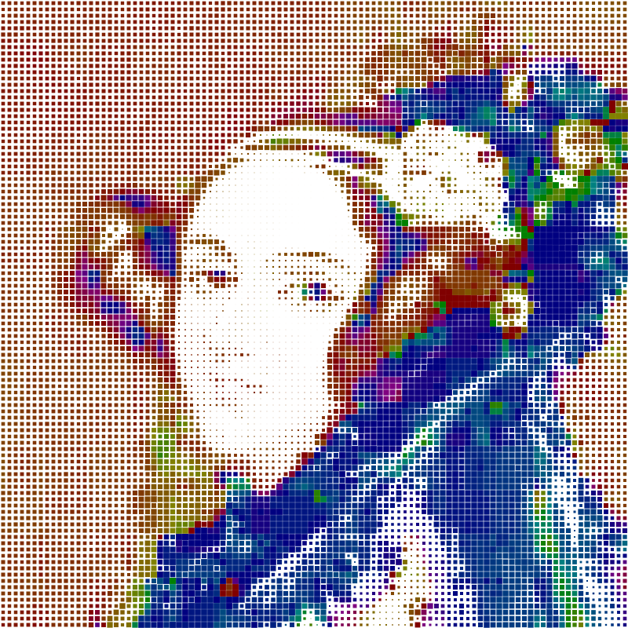

# Experimentos com retículas e imagens

<!--

-->

### Criando uma grade de elementos

<!-- editor-pyp5js -->

```python
num_colunas = num_filas = 10

def setup():
    size(800, 800)
    background(255) # fundo branco
    no_stroke() # sem contorno nos elementos
    fill(0)     # preenchimento preto
    esp = width / num_colunas  # calcula o espaçamento
    for fila in range(num_filas):
        y = esp / 2 + esp * fila
        for coluna in range(num_colunas):
            x = esp / 2 + esp * coluna
            diametro = esp * 0.75
            circle(x, y, diametro)  
```



Agora vamos carregar esta imagem na memória:


<!-- editor-pyp5js -->
```python
def setup():
    size(800, 800)
    img = load_image("https://upload.wikimedia.org/wikipedia/commons/d/dd/Adalovelace.jpg")
    no_stroke()
    num_colunas = num_filas = 100
    esp = width / num_colunas
    background(0)  # fundo preto
    for m in range(num_filas):
        y = m * esp + esp / 2
        for n in range(num_colunas):  # 0, 1, 2, 3, 4, 5
            x = n * esp + esp / 2
            xi = int(remap(x, 0, width, 0, img.width))
            yi = int(remap(y, 0, height, 0, img.height))
            cor = img.get_pixels(xi, yi)
            fill(cor)
            circle(x, y, esp)
```


Vamos ignorar as cores, mas mudar o diâmetro usando o valor da luminosidade dos pixels.

<!-- editor-pyp5js -->
```python
num_colunas = num_filas = 80

def setup():
    size(800, 800)
    global img
    img = load_image("https://upload.wikimedia.org/wikipedia/commons/d/dd/Adalovelace.jpg")
    
def draw():    
    background(0) # fundo preto
    if img:
        #image(img, 0, 0, 800, 800)
        no_stroke() # sem contorno nos elementos
        esp = width / num_colunas  # calcula o espaçamento
        for fila in range(num_filas):
            y = esp / 2 + esp * fila
            for coluna in range(num_colunas):
                x = esp / 2 + esp * coluna
                xi = remap(x, 0, width, 0, img.width)
                yi = remap(y, 0, height, 0, img.height)
                cor = img.get_pixels(int(xi), int(yi))
                #fill(cor)
                fill(255)
                diametro = brightness(cor) / 255 * esp
                circle(x, y, diametro)    
```





### Exemplo retícula pontos pretos

<!-- editor-pyp5js -->
```python
num_colunas = num_filas = 100

def setup():
    global img
    size(800, 800)
    img = load_image("https://upload.wikimedia.org/wikipedia/commons/d/dd/Adalovelace.jpg")
    # img = load_image("Adalovelace.jpg")
    
def draw():
    background(255)  # fundo branco
    esp = width / num_colunas
    if img:
        for m in range(num_filas):
            y = m * esp + esp / 2
            for n in range(num_colunas):  # 0, 1, 2, 3, 4, 5
                x = n * esp + esp / 2
                # remap(v, inicial_origem, final_origem, inicaial_algo, final_alvo)
                xi = int(remap(x, 0, width, 0, img.width))
                yi = int(remap(y, 0, height, 0, img.height))
                cor = img.get_pixels(xi, yi)
                b = brightness(cor)
                fill(0)
            #fill(cor)
            d = remap(b, 0, 255, esp + 5, 0) 
            no_stroke()
            circle(x, y, d)
```



### Cores saturadas 

<!-- editor-pyp5js -->
```python
def setup():
    global img
    size(800, 800)
    img = load_image("Adalovelace.jpg")    
    
def draw():
    background(0)  # fundo
    num_colunas = num_filas = 100
    esp = width / num_colunas
    if img:
        for m in range(num_filas):
            y = m * esp + esp / 2
            for n in range(num_colunas):  # 0, 1, 2, 3, 4, 5
                x = n * esp + esp / 2
                # remap(v, inicial_origem, final_origem, inicaial_algo, final_alvo)
                xi = int(remap(x, 0, width, 0, img.width))
                yi = int(remap(y, 0, height, 0, img.height))
                cor = img.get_pixels(xi, yi)
                b = brightness(cor)
                h = hue(cor)
                color_mode(HSB) # Matiz, Sat, Bri
                nova_cor = color(h, 255, 255)
                fill(nova_cor)
                d = remap(b, 0, 255, 0, esp) 
                no_stroke()
                circle(x, y, d)
```


### Cores saturadas escuras com quadradinhos

<!-- editor-pyp5js -->
```python
num_colunas = num_filas = 100

def setup():
    global img
    size(800, 800)
    img = load_image("https://upload.wikimedia.org/wikipedia/commons/d/dd/Adalovelace.jpg")
    # img = load_image("Adalovelace.jpg") # se tiver uma cópia local   
    
    
def draw():
    background(255)  # fundo branco
    esp = width / num_colunas
    if img:
        for m in range(num_filas):
            y = m * esp + esp / 2
            for n in range(num_colunas):  # 0, 1, 2, 3, 4, 5
                x = n * esp + esp / 2
                # remap(v, inicial_origem, final_origem, inicaial_algo, final_alvo)
                xi = int(remap(x, 0, width, 0, img.width))
                yi = int(remap(y, 0, height, 0, img.height))
                cor = img.get_pixels(xi, yi)
                b = brightness(cor)
                h = hue(cor)
                color_mode(HSB) # Matiz, Sat, Bri
                nova_cor = color(h, 255, 128)
                fill(nova_cor)
                d = 0 + remap(b, 0, 255, esp, 0) 
                no_stroke()
                rect_mode(CENTER)
                #circle(X, Y, D)
                square(x, y, d)

```



