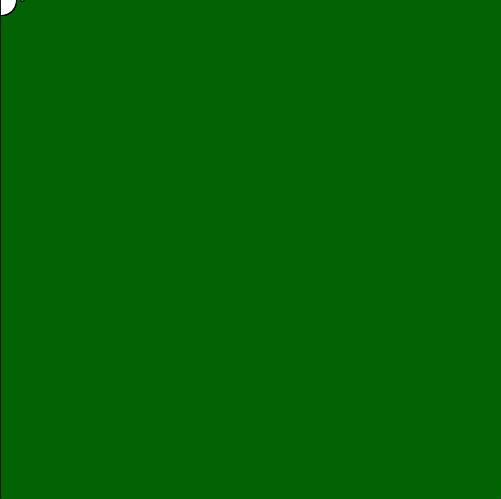
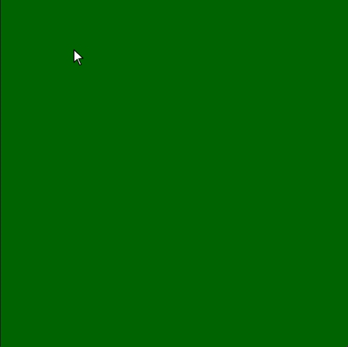
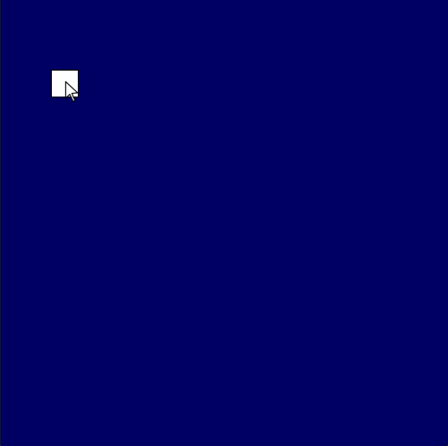

# Movimento e interatividade

## A estrutura `setup()` e `draw()`

A forma mais comum de se estruturar um *sketch* (um "esboço", como chamamos os nossos programas, na tradição do Processing) é definindo duas funções com nomes especiais `setup()` e `draw()`, que a biblioteca py5 vai chamar para nós. 

A expressão *setup* em inglês pode ser entendida como "configurações iniciais", então dentro da função `setup()` vai tudo aquilo que precisa ou só pode ser feito uma vez e no começo, como, por exemplo, definir a àrea de desenho com `size()`, e essa função será chamada logo que executarmos o sketch, uma vez só. 

O verbo *to draw* em inglês pode ser traduzido no nosso caso como "desenhar", e por isso dentro da função `draw()` vão principalmente as instruções de desenho propriamente ditas, que podem ou não ser precedidas por uma limpeza da tela ou fundo. Se desenharmos sem uma "limpeza" da tela os elementos "acumulam" ou "deixam um rastro". Essa função vai ser executada repetidas vezes sem parar, chegando a cerca de 60 vezes por segundo, se possível.

Veja um exemplo mínimo, e a seguir um GIF com a captura de tela da execução.

```python
def setup():
    size(500, 500)
    background(0, 100, 0)  # fundo verde

def draw():
    circle(mouse_x, mouse_y, 30)  # círculo branco na ponta do mouse
```


## Acrescentando a condição do botão do mouse estar apertado

Neste exemplo, um quadrado branco é desenhado na ponta do mouse, mas só se um botão do mouse estiver apertado.

```python
def setup():
    size(500, 500)
    rect_mode(CENTER)  # para desenhar os quadrados pelo centro
    background(0, 100, 0)  # fundo verde

def draw():
    if is_mouse_pressed:
        square(mouse_x, mouse_y, 50)  # quadrado branco na ponta do mouse
```




## Limpando a área de desenho no começo do `draw()`

Para se obter um efeito semelhante a uma animação, isto é, como se os elementos do desenho estivessem se transformando ou se deslocando na tela, devemos "limpar" o quadro no começo de cada execução da função `draw()`, usando `background()`, por exemplo. Para um exemplo que se mexe sozinho, sem a interação com o mouse, veja [Criando uma animação simples](movimento_py.md)

```python
def setup():
    size(500, 500)
    rect_mode(CENTER)  # para desenhar os quadrados pelo centro

def draw():
    background(0, 0, 100)  # fundo azul, agora no draw() limpa a área de desenho a cada quadro
    if is_mouse_pressed:
        circle(mouse_x, mouse_y, 50)  # desenha um círculo quando o botão do mouse está apertado
    else:
        square(mouse_x, mouse_y, 30)  # desenha um quadradinho quando o mouse está sem apertar

```


## Assuntos relacionados

- [Execução condicional (`if`/`else`)](condicionais_py.md), operadores relacionais e operadores lógicos
- [Criando uma animação](movimento_py.md) - que move sem usarmos o mouse


