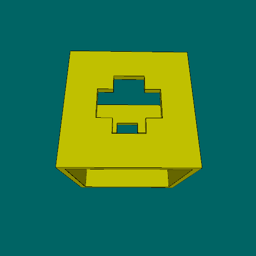

# Primeiros passos de orientação a objetos: usando `shapely` e `trimesh`
<!-- para o sumário

-->

As bibliotecas `shapely` e `trimesh`, pacotes do ecossistema Python que permitem manipular objetos, geometrias 2D e 3D, que podem ser produzidos e combinados de diversas maneiras. Veremos que ambas oferecem diversas classes, estruturas de código que produzem as instâncias, os objetos, descrevendo a geometria de formas planas ou malhas tridimensionais que vamos manipular. E estes objetos tem funções, os métodos, que permitem as operações, tais como união, intersecção, subtração, e etc.

## Primeiros passos no `shapely`


```python
from shapely import Polygon, Point, LineString

def setup():
    size(800, 400)
    background(0, 150, 150)
    # Dois polígonos, um triângulo e um retângulo
    p = Polygon([(50, 50), (150, 50), (50, 150)])
    shape(p)
    q = Polygon([(70, 70), (150, 70), (150, 150), (70, 150)])
    shape(q)
    translate(150, 0)  # empurra o próximo desenho mais para a direita
    # Podemos pedir para que shapely calcule um recorte, subtração
    L = p - q  # isto equivale  `p.difference(q)`
    shape(L)
    translate(150, 0)  # empurra o próximo desenho mais para a direita
    # Podemos pedir para que shapely calcule um "offset", uma forma expandida
    L_aumentado = L.buffer(10)
    shape(L_aumentado)
    translate(150, 0)  # empurra o próximo desenho mais para a direita
    # Podemos fazer a fusão, união entre formas (mas o operador + não funciona)
    forma_unida = p.union(q)  # `p + q` não funciona! 
    shape(forma_unida)
    translate(150, 0)  # empurra o próximo desenho mais para a direita
    # Podemos fazer um furo, subtraindo uma versão encolhida da própria forma
    forma_reduzida = forma_unida.buffer(-10)  # offset negativo, para dentro
    forma_com_furo = forma_unida.difference(forma_reduzida)
    shape(forma_com_furo)    
    reset_matrix()  # volta sistema de coordenadas para a origem no canto
    translate(0, 200)  # empurra os próximos desenhos para baixo
    # Para fazer um círculo podemos fazer um offset de um ponto.
    c = Point(100, 100).buffer(50)  # o valor buffer é o raio
    shape(c)
    # Um exemplo de uma linha e uma linha com buffer
    ls = LineString([(200, 50), (450, 50)])
    lsb = LineString([(200, 100), (450, 100)]).buffer(10)
    shape(ls)
    shape(lsb)
    # Podemos calcular a intersecção entre duas formas
    ca = Point(550, 100).buffer(50)
    shape(ca)
    cb = Point(600, 100).buffer(50)
    shape(cb)
    translate(150, 0)
    ci = ca.intersection(cb)
    shape(ci)
```

## Primeiros passos no `trimesh`

...

## Um exemplo animado combinando as duas bibliotecas

Neste exemplo, a função ajudante `draw_mesh()` desenha uma malha obtida com a manipulação dos objetos *shapely* e *trimesh*, suprimindo arestas desnecessários das faces. É possível também exportar um arquivo STL usando o método `.export()` das malhas *trimesh*.


```python
import shapely
import trimesh
import py5_tools

def setup():
    global caixa_furada
    size(500, 500, P3D)
    # Produz a geometria da caixa furada
    circulo = shapely.Point(0, 0).buffer(50)  # circulo a partir de ponto, o buffer é o raio
    circulo_deslocado = shapely.affinity.translate(circulo, 50, 0)  # produz cópia deslocada!
    lua = circulo - circulo_deslocado   # equivale a circulo.difference(circulo_deslocado)
    prisma_lua = trimesh.creation.extrude_polygon(lua, 250)  # extrusão da forma de lua
    prisma_lua.apply_translation((0, 0, -125))  # centraliza o prisma com base em forma de lua
    apply_rotation(prisma_lua, PI/2, direction=(0, 1, 0))  # gira o prisma_lua (modifica a malha!)
    prisma_cruz = translated_box(0, 0, 0, 100, 50, 300).union(translated_box(0, 0, 0, 50, 100, 300))
    furo_central = translated_box(0, 0, 0, 180, 300, 180)
    paredes = translated_box(0, 0, 0, 200).difference(furo_central)  
    caixa_furada = paredes.difference(prisma_lua).difference(prisma_cruz)
    # para exportar um gif animado
    py5_tools.animated_gif('trimesh_demo.gif', duration=0.05, frame_numbers=range(1, 361, 3))
   
def draw():
    background(0, 100, 100)
    lights()
    translate(width / 2, height / 2)
    rotate_x(PI / 8)
    rotate_y(radians(frame_count))
    fill(200, 200, 0)
    draw_mesh(caixa_furada)
  

def key_pressed():
    if key == 's':
        print('exportando "caixa_furada.stl"')
        caixa_furada.export('caixa_furada.stl')
    
def apply_rotation(obj, angle, direction=[1, 0, 0], center=[0, 0, 0]):
    rot_matrix = trimesh.transformations.rotation_matrix(angle, direction, center)
    obj.apply_transform(rot_matrix)  # modifica a malha!

def translated_box(x, y, z, w, h=None, d=None):
    h = h or w
    d = d or h
    mesh = trimesh.creation.box((w, h, d))
    mesh.apply_translation((x, y, z))  # modifica a manha!
    return mesh

def draw_mesh(m):
    """Desenha malha trimesh reduzindo arestas coplanares."""
    import numpy as np
    vs = m.vertices
    bs = m.facets_boundary
    # desenha as faces trianguladas sem as arestas
    push_style()  # para poder reverter o desligamento do traço
    no_stroke()   # desliga o  traço, some com as arestas
    with begin_closed_shape(TRIANGLES):
        vertices(vs[np.concatenate(m.faces)])
    pop_style()
    # desenha apenas as linhas dos limites das facetas
    a, b = np.vstack(bs).T
    lines(np.column_stack((vs[a], vs[b])))
```
