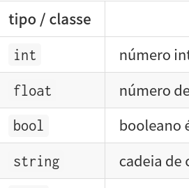

# Valores e seus tipos

<!--  -->

Em computação existe uma classificação dos valores armazenados na memória do computador, dizemos que os valores tem um *tipo*.  Diferentes linguagens de programação tratam da especificação dos tipos, e da forma como manipulamos valores de diferentes tipos, de maneiras diferentes. Em Python, quando fazemos uma atribuição, criando ou alterando uma variável, não somos obrigados a mencionar o tipo. Podemos dizer que os tipos em Python são atributos dos objetos e não das variáveis, os nomes que apontam para eles. 

Vejamos alguns exemplos. Fazendo uma atribuição com `i = 10`, o `i` é um nome que aponta para um valor na memória, `10`, um número **inteiro**, do tipo *integer* que é normalmente abreviado como `int`. 

Outros exemplos de valor numérico são `10.5` e `0.2`, números que tem uma parte fracionária, ou até mesmo `10.` (dez seguido de um ponto), são considerados **números de ponto flutuante**, *floating point* ou abreviadamente `float`. Valores numéricos em Python são, na maior parte das vezes, dos tipos ***inteiro***  ou  ***número de ponto flutuante***. Mas há também tipos como ***número complexo***, entre outros que você pode encontrar na [documentação do Python](https://docs.python.org/pt-br/3/library/stdtypes.html#numeric-types-int-float-complex).

Textos, que aparecem entre aspas (tanto faz duplas ou simples) quando no meio do código de um programa, como por exemplo `'hello'` ou `"Eric Idle"`, são do tipo ***string*** (cadeia de caracteres em português) que abreviamos como `str`. Repare que `"1010"` é um *string* enquanto `1010` é um número inteiro, `int`, e `1010.0` é `float`. 

Outro tipo importante que já encontramos é o **booleano** (*boolean*), com apenas os dois valores `True` ou `False` (verdadeiro ou falso), é o tipo dos valores resultantes das operações lógicas (como `and`,  `or` e `not`), comparações (como `==`, `!=`,  `>`, `<`, `>=` e etc.) ou ainda valores que indicam um estado (como `is_mouse_pressed` é verdadeiro ou falso dependendo do estado dos botões do mouse)

### Objetos, tipos e classes

Em linguagens de programação que trabalham com a ideia de *orientação a objetos*, e especialmente em Python, os valores são *objetos* e usamos o termo *classe* e *tipo* de maneira mais ou menos intercambiável. A definição de uma classe estabelece as propriedades e comportamentos dos objetos de um certo tipo.

### Inspecionando os tipos dos valores

É comum dizer que em Python as variáveis não tem tipo (como em Java, por exemplo) mas sim os valores para os quais apontam. Podemos descobrir a classe/tipo de um objeto/valor usando a função embutida `type()`

```python
a = 1
print(type(a))
# resultado no console: <class 'int'>

a = "oi"
print(type(a))
# resultado no console <class 'str'>
```

## Conversão, tipos dos argumentos e dos valores devolvidos for funções

Os valores que usamos entre parênteses em uma chamada de função (argumentos, dentro da função são chamados parâmetros) frequentemente precisam ser de tipos específicos. Por exemplo `range()` só aceita como argumentos números inteiros. A função `text()`, precisa de um *string* e dois números (para as coordenadas): `text("Texto", x, y)`. 

É necessário então converter os dados de um tipo para outro, como por exemplo o número 'sorteado' pela função `random()` que é um `float` pode ser convertido em `int`, sendo truncado (encurtado) perdendo a parte não inteira. 

Números podem ser convertidos em texto (*string*) usando `str(num)` ou então injetados no meio de um texto (string) das seguites maneiras:
- `'Meu número {}!'.format(num)` (usando o método `format()` do string)
- `f'Meu número {num}!'` (o `f` antes das aspas indica um *f-string*, que vai interpretar os valores entre chaves dentro).

```python
r = random(256)
print(r)  # exibe número aleatório float, algo como 1.8726343264680

r = int(random(256))  # r é um número inteiro
print(r)  # exibe número aleatório int, algo como `12`, por exemplo
print('Red: ' + str(r))  # exibe o string `Red: 12`
print('Red: {}'.format(r))  # exibe o string `Red: 12`
print(f'Red: {r}')  # exibe o string `Red: 12`
```
### Como saber os tipos dos argumentos

Para descobrir quais são os tipos dos argumentos que devemos usar com uma determinada função, precisamos ler a documentação (no caso de funções embutidas, pré-definidas, ou de bibliotecas externas) ou então olhar a definição da função. Alguns editores de código (IDE) conseguem apresentar os *docstrings* e dicas de tipos dos parâmetros (tambbém chamados de "assinatura") da função.

### Tipos dos valores devolvidos

Da mesma forma, é do nosso interesse saber o tipo dos valores devolvidos por uma função. Isso também pode ser descoberto lendo a documentação, a definição da função, ou ainda usando `print(type(valor))` com o valor obtido.

Algumas funções executam operações mas não devolvem nenhum valor, como `setup()`, `draw()`, `noStroke()` e `rect()`, por exemplo. Sendo mais precisos, em Python, essas funções devolvem o valor especial [`None`](None.md) (que poderíamos imaginar como "nada" ou "nenhum").

Mas muitas funções devolvem algum valor como resultado. Além da função `random()` que devolve um número *float* como acabamos de comentar, `color()`, por exemplo, devolve um número que representa uma cor, e podemos nós também construir funções que devolvem valores:

```python
def cor_sorteada(opacidade):
   r = int(random(256)
   g = int(random(256)
   b = int(random(256)
   return color(r, g, b, opacidade)

minha_cor = cor_sorteada(255) # sorteia uma cor 
```

## Alguns tipos/classes de valores/objetos

Nesta tabela apresento apenas alguns dos tipos que vamos encontrar. Vou marcar com *Python* os que são nativos do Python e *Py5* os que vem do Processing, e não existem no Python sozinho.

| tipo / classe | descrição | origem |
| ---      | --- | --- |
| `int`     | número inteiro, como `-5`, `0` ou `42`| Python|
| `float`  | número de ponto flutante, como `.5` `3.` ou `6.267` (note que o separador decimal é o ponto)| Python|
| `bool`| booleano é o tipo dos valores `True` ou `False`| Python|
| `string` | cadeia de caracteres, são sequencias de glifos, podem ser criados com aspas: `“texto”` ou `'maçã'` | Python|
| `list`   | lista, coleção ordenada de itens, construída com `list(itens)` ou com colchetes no código `[ ,]` | Python|
| `tuple`  | coleção ordenada e imutável de itens, construída com `tuple(itens)` ou com parenteses no código `( ,)` | Python|
| `set`    | conjunto não ordenado de itens 'hasheáveis', com `set(itens)` ou com chaves no código `{ ,}` | Python|
| `dict`   | dicionário, um 'mapeamento' de chaves (*keys*) e valores, criado com `dict()` ou pares `{chave : valor,}` | Python|
| `None`   | o "nenhum" é de um tipo especial único `None` é devolvido por funções que não devolvem nada  | Python|
| `Py5Image` | imagens raster/bitmap, podem ser criadas/carregadas na memória com `loadImage(arquivo_de_imagem)` | Py5 |
| `Py5Shape` | contém formas vetoriais, como as descritas num SVG, pode ser criado com `loadShape(arquivo)`| Py5 |
| `Py5Vector`| vetor, usado geralmente para descrever posição, velocidade ou aceleração (em 2, 3  ou 4 dimensões) | Py5 |
| `Py5Color`<sup>＊</sup>| uma cor é meio que um `int` disfarçado, pode ser construída com `color(R,G,B, Alfa)`, se estivermos no modo RGB | Py5 |

> ＊ As cores inicialmente não eram um tipo 'de verdade' no Processing, eram apenas números inteiros grandes, com 4 bytes, para R, G, B e Alpha (opacidade) respectivamente, a função `color()` monta esse número grande pra nós, e no py5, embala em um objeto Py5Color. Mas os `int` grandões ainda funcionam também. 

Existe uma discussão relativamente complexa sobre o tipo `bytes` do Python que lembra um *string* mas só com caracteres *ASCII*, e isso dá uma certa confusão com os *strings*, pois não são texto *Unicode*, mas essa é uma questão avançada que eu queria evitar neste primeiro momento.

## Glossário

[**valor**](https://penseallen.github.io/PensePython2e/01-jornada.html#termo:valor) Uma das unidades básicas de dados, como um número ou *string*, que um programa manipula.

[**tipo**](https://penseallen.github.io/PensePython2e/01-jornada.html#termo:tipo) Uma categoria de valores. Alguns tipos que vimos por enquanto são números inteiros (tipo `int`), números de ponto flutuante (tipo `float`) e *strings* (tipo `str`).

[**inteiro**](https://penseallen.github.io/PensePython2e/01-jornada.html#termo:inteiro) Um tipo que representa números inteiros.

[**ponto flutuante**](https://penseallen.github.io/PensePython2e/01-jornada.html#termo:ponto%20flutuante) Um tipo que representa números com partes fracionárias.

[**string**](https://penseallen.github.io/PensePython2e/01-jornada.html#termo:string) Um tipo que representa sequências de caracteres.

## Assuntos relacionados

- [Números inteiros (*int*) e de ponto flutuante (*float*)](numeros.md)
- [Primeiros passos de orientação a objetos: usando a classe Slider](slider_com_OO.md)
- Externo: [Documentação do Python sobre tipos numéricos](https://docs.python.org/pt-br/3/library/stdtypes.html#numeric-types-int-float-complex)
