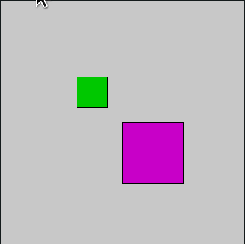

# Transformando o sistema de coordenandas

> baseado no tutorial[2D transformations](https: // py.processing.org/tutorials/transform2d /)([versão traduzida](http: // arteprog.space/processando-processing/tutoriais-PT/python-transformacoes_2_d)) de j. david eisenberg

processing tem funções embutidas que tornam fácil você mover, girar, e crescer ou encolher objetos por meio da manipulação do sistema de coordenadas. isso torna possível, por exemplo desenhar um retângulo girado na tela, uma vez que a função `rect()` só sabe desenhar retângulos com os lados alinhados com o sistema de coordenadas.

esta página apresenta funções `translate`, `rotate`, e `scale`, mas também algumas funções que permitem 'guardar' e 'devolver' o estado anterior do sistema de coordenadas(`push_matrix()`  e `pop_matrix()`).

# sumário

- [translação: movendo a grade](  # translação-movendo-a-grade)
   - [qual é a vantagem?](  # qual-é-a-vantagem)
- [rotação](  # rotação)
- [A matriz de transformação](  # a-matriz-de-transformação)
   - [O significado de * push * e * pop*](  # o-significado-de-push-e-pop)

# Translação: Movendo a grade

quando você quer desenhar alguma coisa, especifica as cordenadas. veja um retângulo simples desenhado com o código `rect(20, 20, 40, 40)`. O sistema de coordenadas é como uma espécie de grade ou papel milimetrado, e está mostrado em cinza.


se você quiser mover o retângulo 60 unidades para a direita e 80 unidades para baixo, pode mudar as coordenadas somando ao * x * e * y * do ponto inicial: `rect(20 + 60, 20 + 80, 40, 40)` e o retângulo vai aparecer em um local diferente. (A seta é só para efeito dramático.)


mas tem uma maneira mais interessante de fazer isso: **em vez disso mover o sistema de coordenadas**. se você move a grado 60 unidades para a direita e 80 para baixo vai obter exatamente o mesmo resultado visual. mover o sistema de coordenadas é chamado de translação.


A coisa importante de se notar no diagrama anterior é que, do ponto de vista do retângulo, ele não se moveu nada. O canto superior esquerdo continua em(20, 20). quando você usa transformações, as coisas que você desenha * não mudam de posição*; o sistema de cordenadas muda.

abaixo o código que desenha o retângulo em vermelho mudando suas coordenadas, e então desenha em azul movendo a grade. os retângulos são translúcidos de maneira que você pode ver que estão(visualmente) no mesmo lugar. apenas o método usado para movê-los mudou. copie este código no processing e experimente:

```python
def setup():
    size(200, 200)
    background(255)
    no_stroke()

    # desenha na posição original em cinza
    fill(192)
    rect(20, 20, 40, 40)

    # vermelho translúcido mudando as coordenadas
    fill(255, 0, 0, 128)
    rect(20 + 60, 20 + 80, 40, 40)

    # azul translúcido mudando a grade
    fill(0, 0, 255, 128)
    push_matrix()
    translate(60, 80)
    rect(20, 20, 40, 40)
    pop_matrix()
```


vamos olhar o código de conversão em mais detalhes:

- `push_matrix()` é uma função embutida que salva a posição atual do sistema de coordendas, como se fizesse um * backup*...

- `translate(60, 80)` move o sistema de coordenadas 60 para direita e 80 para baixo.

- `rect(20, 20, 40, 40)` desenha o retângulo no mesmo local em que estava originalmente. lembre-se de que as coisas que você desenha não se movem - a grade se move.

- por fim, `pop_matrix()` restaura o sistema de coordenadas como estava antes de você fazer a translação.

sim, você podia ter feito uma translação `translate(-60, -80)` para mover a grade de volta a sua posição original. no entanto, quando você começa a executar operações mais sofisticadas com o sistema de coordenadas, é mais fácil usar `push_matrix()` e `pop_matrix()` para salvar e restaurar o status em vez de precisar desfazer todas as suas operações. mais adiante vamos falar da origem desses nomes tão estranhos.

# Qual é a vantagem?

você pode estar pensando que pegar o sistema de coordenadas e movê-lo é muito mais complicado do que apenas adicionar às coordenadas. para um exemplo simples, como o retângulo, você está correto. mas vamos dar um exemplo de onde o `translate()` pode facilitar a vida. aqui está um código que desenha uma fileira de casas. ele usa um loop que chama a função chamada `casa()`, que recebe o * x * e * y * da posição do canto superior esquerdo da casa como parâmetros.


```python
def setup():
    size(400, 100)
    background(255)
    for i in xrange(10, 350, 50):
        casa(i, 20)
```

este é o código para desenhar a casa alterando sua posição. veja todos os acréscimos que você precisa fazer.

```python
def casa(x, y):
    triangle(x + 15, y, x, y + 15, x + 30, y + 15)
    rect(x, y + 15, 30, 30)
    rect(x + 12, y + 30, 10, 15)
```

compare isso com a versão da função que usa `translate()`. neste caso o código desenha a casa no mesmo lugar, com o canto superior esquerdo em(0, 0), e deixa a translação fazer todo o trabalho.

```python
def casa(x, y):
    push_matrix()
    translate(x, y)
    triangle(15, 0, 0, 15, 30, 15)
    rect(0, 15, 30, 30)
    rect(12, 30, 10, 15)
    pop_matrix()
```

# Rotação

além da translação, que move a grade, é possível girar o sistema de coordenadas com a função `rotate()`. essa função tem um parâmetro ou argumento, um número de * radianos * que você quer rodar. em graus, um círculo tem 360°. quando descrevemos os ângulos em radianos, a circuferência completa tem 2π radianos. eis aqui um diagrama de como processing mede ângulos em graus(preto) e radianos(vermelho).


como a maioria das pessoas pensa em graus, o processing possui uma função embutida `radians()` que recebe um número em graus como argumento e o converte para você. ele também possui uma função `degrees()` que converte radianos em graus. dado esse cenário, vamos tentar girar um quadrado 45 graus no sentido horário.

```python
def setup():
    size(200, 200)
    background(255)
    smooth()
    fill(192)
    no_stroke()
    rect(40, 40, 40, 40)

    push_matrix()
    rotate(radians(45))
    fill(0)
    rect(40, 40, 40, 40)
    pop_matrix()
```


ei o que aconteceu? como o quadrado foi movido e cortadao A resposta é: o quadrado não se moveu. A ** grade ** foi girada. aqui está o que realmente aconteceu. como você pode ver, no sistema de coordenadas girado, o quadrado ainda tem seu canto superior esquerdo em(40, 40).


# Girando da maneira certa

A maneira certa de girar o quadrado depende de fazer uma translação antes:

1. faça a translação da origem do sistema de coordenadas(0, 0) para onde você quer que seja o canto superior esquerdo do quadrado.
2. gire a grade π/4 radianos(45°)
3. desenhe o quadrado na origem.


E aqui está o código que gera o resultado, sem as marcas de grade.

```python
def setup():
    size(200, 200)
    background(255)
    smooth()
    fill(192)
    no_stroke()
    rect(40, 40, 40, 40)

    push_matrix()
    # mova a origem para o ponto de giro
    translate(40, 40)

    # em seguida gire a grade
    rotate(radians(45))

    # e desenhe o quadrado na origem
    fill(0)
    rect(0, 0, 40, 40)
    pop_matrix()
```

veja agora um outro sketch que gira dois retângulos em torno do próprio centro usando rotação.


```python
def setup():
    size(400, 400)

def draw():
    background(200)
    angulo=radians(mouse_x)

    push_matrix()
    translate(150, 150)
    rotate(-angulo * 2)
    fill(0, 200, 0)
    rect(-25, -25, 50, 50)
    pop_matrix()

    push_matrix()
    translate(250, 250)
    rotate(angulo)
    fill(200, 0, 200)
    rect(-50, -50, 100, 100)
    pop_matrix()
```
# Para pensar:

- você conseguiria re-escrever usando `rect_mode(CENTER)` pra desenhar os retângulos pelo centro? ficaria mais simples?

- este exemplo é útil por demonstrar uma estratégia para girar um objeto, que tem um, ponto inicial arbitrário, no caso o canto superior esquerdo, o girando em torno de outro ponto arbitrário(neste caso o centro). nem sempre vamos ter disponível, para formas especiais que desenharmos, o equivalente a um `rect_mode(CENTER)`.

# A ordem importa

além da rotação e translação mencionadas anteriormente, é possível também escalar o sistema de coordenadas com a função `scale()`. quando você faz várias transformações, a ordem faz diferença. uma rotação seguida de uma translação seguida por uma mudança de escala não produzirá os mesmos resultados que uma translação seguida de uma rotação e uma mudança de escala. aqui está um exemplo de código e os resultados.

```python
def setup():
    size(200, 200)
    background(255)
    smooth()
    line(0, 0, 200, 0)    # desenha eixos
    line(0, 0, 0, 200)

    push_matrix()
    fill(255, 0, 0)    # quadrado vermelho
    rotate(radians(30))
    translate(70, 70)
    scale(2.0)
    rect(0, 0, 20, 20)
    pop_matrix()

    push_matrix()
    fill(255)    # quadrado branco
    translate(70, 70)
    rotate(radians(30))
    scale(2.0)
    rect(0, 0, 20, 20)
    pop_matrix()
```


# A matriz de transformação

sempre que você faz uma rotação, translação ou mudança de escala, as informações necessárias para a transformação são acumuladas em uma tabela de números. essa tabela, ou matriz, possui apenas algumas linhas e colunas; no entanto, através do milagre da matemática, ela contém todas as informações necessárias para realizar qualquer série de transformações. E é por isso que `push_matrix()` e `pop_matrix()` têm essa palavra * matrix * em seu nome.

# A origem dos termos *push* e *pop*

E a parte * push * e * pop * dos nomes `push_matrix` e `pop_matrix`? elas vêm de um conceito de computação conhecido como pilha, que funciona como um dispensador de bandejas com mola em uma lanchonete. quando alguém coloca uma bandeja para a pilha, seu peso empurra a plataforma para baixo. quando alguém precisa de uma bandeja, ela a pega da parte superior da pilha e as bandejas restantes aparecem um pouco.

de maneira semelhante, `push_matrix()` coloca o status atual do sistema de coordenadas no topo de uma área de memória, e `pop_matrix()` pega de volta o status. O exemplo anterior usou `push_matrix()` e `pop_matrix()` para garantir que o sistema de coordenação estivesse "limpo" antes de cada parte do desenho. em todos os outros exemplos, as chamadas para essas duas funções não eram realmente necessárias, mas não custa nada salvar e restaurar o status da grade.

# Notas:
- **sempre execute `push_matrix()` e `pop_matrix()` em pares ** ou você vai encontrar erros, um deles é meio que uma proteção antes que ocorra o famoso * estouro * ou * transbordamento * da pilha, *stack overflow*, `push_matrix() cannot use push more than 32 times`. O outro é aviso de que está faltando um * push * anterior: `missing a push_matrix() to go with that pop_matrix()`.

- em processing, o sistema de coordenadas é restaurado ao seu estado original(origem na parte superior esquerda da janela, sem rotação e sem mudança de escala) toda vez que a função `draw()` é executada.
- é possível também voltar para o estado inicial o sistema de coordenadas com `reset_matrix()`.

# Transformações tridimensionais

se você estiver trabalhando em três dimensões, poderá chamar a função `translate()` com três argumentos para as distâncias * x*, *y*, e * z*. da mesma forma, você chama `scale()` com três argumentos que indicam o quanto você deseja que a grade seja redimensionada em cada uma dessas dimensões

para rotação, chame as funções `rotate_x()`, `rotate_y()`, ou `rotate_z()` para girar em torno de cada um dos eixos. todas essas três funções esperam um argumento: o número de radianos a serem rotacionados.

# Assuntos relacionados

- veja a[versão completa traduzida do tutorial na qual este material foi baseado](http: // arteprog.space/processando-processing/tutoriais-PT/python-transformacoes_2_d), tem um exemplo bacana de um robô que balança os braços.
