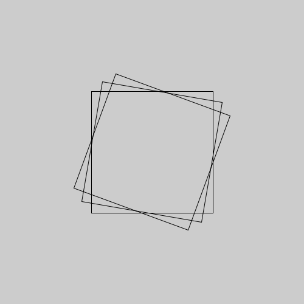

# Transformando o sistema de coordenandas

O py5 tem funções embutidas que tornam fácil você mover, girar, e crescer ou encolher objetos por meio da manipulação do sistema de coordenadas. 

Esta página apresenta funções `translate`, `rotate`, e `scale`, mas também algumas funções que permitem 'guardar' e 'devolver' o estado anterior do sistema de coordenadas(`push_matrix()`  e `pop_matrix()`).

Isso torna possível, entre outras coisas,  desenhar um retângulo girado na tela, uma vez que a função `rect()` só sabe desenhar retângulos com os lados alinhados com o sistema de coordenadas. A alternativa, a aprender girar o sistema de coordendadas, seria pegar as coordenadas dos pontos de um retângulo e calcular a posição girada de cada um deles para desenhá-los como um polígono usando `begin_shape()` e `end_shape()`.


## Começando com a rotação, para ver como as coisas são estranhas

> Nota: É preciso saber que no py5 quando uma função pede um ângulo como argumento, espera que você informe esse ângulo em *radianos*, por isso, se você pensa em graus, use `radians(angulo_em_graus)` para converter.

Vejamos o que acontece quando tentamos girar um quadrado que desenhamos no meio da tela. Para isso vamos primeiro desenhar o quadrado, usar a função `rotate()` e desenhar o "mesmo quadrado" novamente. Por fim, vamos repetir a rotação e o desenho do quadrado mais uma vez.

```python
def setup():
    size(500, 500)
    rect_mode(CENTER)
    no_fill()
    square(250, 250, 200)
    rotate(radians(10))
    square(250, 250, 200)
    rotate(radians(10))
    square(250, 250, 200)
```


Você percebe o que está acontecendo? Pense nestas questões:
- Em primeiro lugar, onde está o centro de rotação? É possível escolher o centro da rotação?
- Por qual motivo o segundo pedido de rotação, sendo igual ao primeiro, não fez o terceiro quadrado cair sobre o primeiro?

As respostas para essas perguntas são: A rotação está acontecento em torno da *origem do sistema de coordenadas*, isto é (0, 0), o ponto onde x e y valem zero. É possível escolher esse ponto usando `translate()` mara mover a origem. As operações de transformação do sistema de coordenadas, como a rotação com a função `rotate()`, são cumulativas, e isso vai ser um problema a ser resolvido um pouco mais a frente.

## Resolvendo a primeira parte do problema da rotação, usando a translação

Se movermos a origem para o ponto no centro da área de desenho, usando `translate(250, 250)` consguimos girar o sitema de coordenadas em torno do centro e obtemos o seguinte resultado:

```
def setup():
    size(500, 500)
    rect_mode(CENTER)
    no_fill()
    square(250, 250, 200)
    translate(250, 250)
    rotate(radians(10))
    square(0, 0, 200)
    rotate(radians(10))
    square(0, 0, 200)
```



Note que o segundo e terceiro quadrados são desenhados com `square(0, 0, 200)`, nas novas coordenadas do centro da tela após o `translate(250, 250)`, e não mais em `square(250, 250, 200)`.

## O sutil problema de *translate()* e *rotate()*

A segunda parte do problema, que se manifestou sutilmente até agora, é de que as transformações do sistema de coordenadas não cumulativas. Veja este exemplo ingênuo de uma função que desenha um quadrado girado, e veja como ele falha em permitir que desenhemos uma fila de quadrados girados.

```python
def setup():
    size(500, 500)
    rect_mode(CENTER)
    no_fill()

def quadrado_girado(x, y, lado, rot):
    translate(x, y)
    rotate(rot)
    square(0, 0, lado)
    
def draw():
    background(200)
    quadrado_girado(100, 100, 100, radians(10))
    quadrado_girado(250, 100, 100, radians(10))
    quadrado_girado(400, 100, 100, radians(10))
```


## A solução com *push_matrix* e *pop_matrix*

É possível fazer uma espécie de "backup" do atual sistema de coordenadas, usando a função `push_matrix()` depois de feito o desenho que precisamos com as coordenadas alteradas, `pop_matrix()` devolve ao sketch o estado anterior do sistema de coordenadas.

```python
def quadrado_girado(x, y, lado, rot):
    push_matrix()
    translate(x, y)
    rotate(rot)
    square(0, 0, lado)
    pop_matrix()
```


### A matriz de transformação e a origem de *push_matrix* e *pop_matrix*

 Na matemática temos a ideia de matriz, que são objetos formados por linhas e colunas de números. Sempre que você faz uma rotação, translação ou mudança de escala, as informações necessárias para essa transformação são guardadas em uma matriz de 3 colunas e duas linhas, e é por isso que as funções `push_matrix()` e `pop_matrix()` têm essa palavra *matrix* no nome.

```python
def setup():
    size(500, 500)
    print_matrix()
```
O resultado no console:
```
 1.0000  0.0000  0.0000
 0.0000  1.0000  0.0000
```

E a parte *push* e *pop* dos nomes vêm de uma estrutura de dados muito comum na computação conhecida como pilha.  Imagine uma pilha de livros, e considere que se você acrescenta um livro na pilha ele vai por cima, e se acrescentar mais um ele vai por cima do anterior. Já na hora de tirar livros o mais natural é remover o mais de cima antes do seguinte, e assim por diante. 

Tradicionalmente, adicionamos itens em uma pilha com instruções nomeadas `push` e removemos com instruções nomeadas `pop`. A influência dessa nomenclatura é tão grande que, no Python, usamos `.pop()` para acessar e remover o último item de uma lista, e, no JavaScript, `.push()` é usado para acrescentar itens em um array (semelhante ao `.append()` para listas no Python).

De maneira parecida então, `push_matrix()` coloca a descrição do estado atual do sistema de coordenadas no topo de uma pilha na memória, e `pop_matrix()` remove e restaura a última descrição de estado da pilha. 

### Uma forma alternativa de uso do *push_matrix*

No py5 é possível usar a sintaxe dos chamados "gerenciadores de contexto" com `with` para indicar um bloco de código onde está valendo uma certa transformação do sistema de coordenadas. Quando a indentação acaba, acontece um `pop_matrix()` "automático".

```python
def quadrado_girado(x, y, lado, rot):
    with push_matrix():
        translate(x, y)
        rotate(rot)
        square(0, 0, lado)
```

> Notas:
> - **Sempre execute `push_matrix()` e `pop_matrix()` em pares** ou **use o gerenciador de contexto `with push_matrix():`** senão você vai encontrar erros. Um dos erros é basicamente uma proteção antes do famoso *estouro* ou *transbordamento* da pilha, *stack overflow*, `push_matrix() cannot use push more than 32 times`. O outro erro é o aviso de que está faltando um *push* anterior, e a pilha está vazia, `missing a push_matrix() to go with that pop_matrix()`.
> - No py5, como no Processing, o sistema de coordenadas é restaurado ao seu estado original (origem na parte superior esquerda da janela, sem rotação e sem mudança de escala) toda vez que a função `draw()` é executada. É possível também voltar para o estado inicial o sistema de coordenadas com `reset_matrix()`.


## Mudando a escala

  TODO

## Transformações tridimensionais


Se você estiver trabalhando em três dimensões, poderá chamar a função `translate()` com três argumentos para as distâncias *x*, *y*, e *z*, a função `scale()` pode ser chamada também com três argumentos e as funções `rotate_x()`, `rotate_y()` e `rotate_z()`, que recebem um argumento em radianos e fazem a rotação em torno de cada eixo.

## Assuntos relacionados

- [Um pouco de ângulos, com seno, cosseno e arco tangente](seno_cosseno_atan2.md)
- [Desenhando em 3D: Primeiros passos com `size(…, …, P3D)`](desenho-3D.md)
- Páginas externas: Tutorial [2D Transformations](https://py.processing.org/tutorials/transform2d /) de J. David Eisenberg ([versão traduzida em português](http://arteprog.space/Processando-Processing/tutoriais-PT/python-transformacoes_2D)) 

