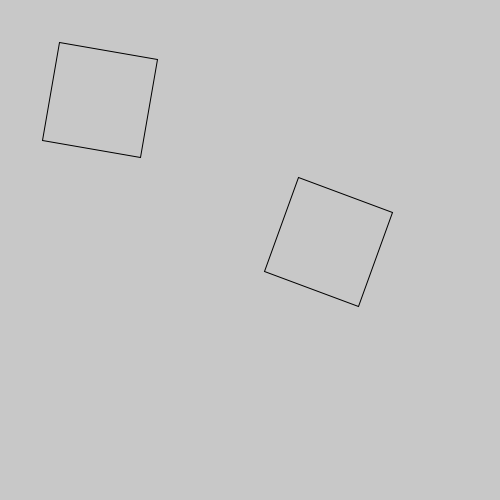

# Transformações do sistema de coordenandas

O py5 tem funções embutidas que tornam relativamene fácil você mover, girar, crescer ou encolher objetos por meio da manipulação do sistema de coordenadas. São as funções `translate()`, `rotate()`, e `scale()`, apresentadas nesta págima. Também serão apresentadas as funções, de grande importância, que permitem 'guardar' e 'devolver' o estado anterior do sistema de coordenadas, são elas: `push_matrix()` e `pop_matrix()`.

Essas funções mencionadas, em conjunto, tornam possível, entre outras coisas, desenhar um retângulo inclinado na tela. Note que até agoras, usando apenas a função `rect()`, só podemos desenhar retângulos com os lados alinhados ao sistema de coordenadas. Uma forma possível de se desenhar um retângulo inclinado é elencar as coordenadas dos vértices do retângulo e calcular a posição girada de cada um deles, [usando seno e cosseno](seno_cosseno_atan2.md), para por fim desenhar um polígono com as novas posições usando `begin_shape()`, `vertex()` e `end_shape()`, o que pode ser interessante também, mas costuma ser mais trabalhoso.

## Começando com a rotação, para ver como as coisas são estranhas

Suponha que queremos desenhar um quadrado no centro da tela, inclinado em 10 graus. Vejamos o que acontece quando usamos a função  [`rotate()`](https://py5coding.org/reference/sketch_rotate.html) que gira o sistema de coordenadas.

Para termos um elemento inicial de comparação, vamos primeiro desenhar um quadrado sem girar, usando as coordendadas da metade da largura e da altura da área de desenho (vamos chamar este de "quadrado 0").

Então, vamos usar a função `rotate()`, e em seguida vamos desenhar um quadrado com os mesmos argumentos novamente ("quadrado 1"). Por fim, vamos repetir tanto a rotação como o a chamada de função que desenha o quadrado mais uma vez ("quadrado 2").

> Nota: No py5 quando uma função pede um ângulo como argumento, espera que você informe esse ângulo em *radianos*, por isso, se você pensa em graus, use `radians(angulo_em_graus)` para converter.

```python
def setup():
    size(500, 500)
    rect_mode(CENTER)
    no_fill()
    square(250, 250, 200)  # quadrado 0
    rotate(radians(10))
    square(250, 250, 200)  # quadrado 1
    rotate(radians(10))
    square(250, 250, 200)  # quadrado 2
```

O resultado é o seguinte.


Você percebe o que está acontecendo? Pense nestas questões:
- Em primeiro lugar, onde está o centro de rotação?
- Será que é possível escolhermos o centro da rotação?
- Por qual motivo o último pedido de rotação e desenho, sendo exatamente igual ao anterior, não faz o "quadrado 2" cair sobre o "quadrado 1"?

As respostas para essas perguntas são:
- A rotação está acontecento em torno da *origem*, o ponto de referência inicial do sistema de coordenadas, onde X e Y valem zero. Imagine um papel milimetrado com uma tachinha fixada na origem e estamos então girando o papel em torno desse ponto.
- É sim possível escolher a origem usando `translate()` mara mover a origem. Podemos tirar a tachinha, mover o papel e fixá-la novamente.
- As operações de transformação do sistema de coordenadas, como a rotação com a função `rotate()`, são cumulativas, e isso vai ser um problema a ser resolvido um pouco mais a frente.

## Resolvendo a primeira parte, a escolha do centro da rotação, usando a translação

Se movermos a origem para o ponto no centro da área de desenho, usando [`translate()`](https://py5coding.org/reference/sketch_translate.html), com os argumentos `250, 250`,  conseguiremos girar o sitema de coordenadas em torno de um novo centro.

```python
def setup():
    size(500, 500)
    rect_mode(CENTER)
    no_fill()
    square(250, 250, 200)
    translate(250, 250)
    rotate(radians(10))
    square(0, 0, 200)
    rotate(radians(10))
    square(0, 0, 200)
```


Note que o segundo e terceiro quadrados são desenhados com `square(0, 0, 200)`, nas novas coordenadas do centro da tela após o `translate(250, 250)`, e não mais em `square(250, 250, 200)`.

## A questão da acumulação de `translate()` e `rotate()`

A segunda parte do problema, que se manifestou sutilmente até agora, é de que as transformações do sistema de coordenadas não cumulativas. Como mover e girar o mesmo papel milimetrado sucessivamente.

Suponha que queremos desenhar uma fila de quadrados girados, e veja este exemplo ingênuo de uma função `quadrado_girado_errado()` que desenha, bem, um quadrado girado. O código a seguir, usando a função `quadrado_girado_errado()`  falha horrívelmente na missão de desenhar uma fila com os quadrados alinhados com Y valendo 100, como parecem indicar as coordenadas passadas como argumentos (100, 100), (250, 100) e (400, 100).

```python
def setup():
    size(500, 500)
    rect_mode(CENTER)
    no_fill()

def quadrado_girado_errado(x, y, lado, rot):
    translate(x, y)
    rotate(rot)
    square(0, 0, lado)
    
def draw():
    background(200)
    quadrado_girado_errado(100, 100, 100, radians(10))
    quadrado_girado_errado(250, 100, 100, radians(10))
    quadrado_girado_errado(400, 100, 100, radians(10))
```


Cada chamada a função `quadrado_girado_errado()` empurra a origem do sistema de coordenadas mais um pouco, e também gira 10 graus, então o segundo quadrado girado cai mais longe e mais girado, o terceiro já fica para fora da tela, mais abaixo à direita!

### A solução com *push_matrix* e *pop_matrix*

É possível fazer uma espécie "backup" do atual sistema de coordenadas, usando a função [`push_matrix()`](https://py5coding.org/reference/sketch_push_matrix.html) depois de feito o desenho que precisamos com as coordenadas alteradas,  [`pop_matrix()`](https://py5coding.org/reference/sketch_pop_matrix.html) devolve ao sketch o estado anterior do sistema de coordenadas. Com esta versão modificada da função `quadrado_girado()` conseguimos posicionar à vontade nossos quadrados girados.

```python
def quadrado_girado(x, y, lado, rot):
    push_matrix()  # guarda a matriz atual do sistema de coordenadas
    translate(x, y)
    rotate(rot)
    square(0, 0, lado)
    pop_matrix()  # recupera a matriz do sistema de coordenadas anterior
```


### Um exemplo de uso do quadrado girado

O artista pioneiro da arte computacional Georg Nees tem uma obra ["Schotter" (1968-1970)](https://collections.vam.ac.uk/item/O221321/schotter-print-nees-georg/), cujas formas podemos tentar recriar com os quadrados girados e um aumento gradual de deslocamentos e rotações usando `random()`.


```python
colunas = 12
filas = 22
tam = 30  # tamanho dos quadrados

def setup():
    size(500, 800)
    rect_mode(CENTER)
    no_loop() # desativa a repetição do draw
    no_fill()
     
def draw():
    background(240, 240, 230)
    largura_grade = tam * colunas
    altura_grade = tam * filas
    margem = (width - largura_grade) / 2
    margem_vertical = (height - altura_grade) / 2
    desordem = 0
    for fila in range(filas):
        y = margem_vertical + fila * tam + tam / 2         
        for col in range(colunas):
            x = margem + col * tam + tam / 2
            dx = random(-desordem / 16, desordem / 16)  # deslocamento x
            dy = random(-desordem / 16, desordem / 16)  # deslocamento y
            ar = random(-desordem / 16, desordem / 16)  # rotação em graus
            quadrado_girado(x + dx, y + dy, tam, radians(ar))
            desordem = desordem + 1
        
def quadrado_girado(x, y, lado, rot):
    push_matrix()  # preserva do sistema de coordenadas
    translate(x, y)
    rotate(rot)
    square(0, 0, lado)
    pop_matrix()  # restaura o sistema de coordenadas
    
def key_pressed():
    save_frame('###.png')
    redraw()
```


## Mudando a escala

Além da translação e rotação é possível também escalar o sistema de coordenada com  [`scale()`](https://py5coding.org/reference/sketch_scale.html) e entortar com [`shear_x()`](https://py5coding.org/reference/sketch_shear_x.html) e [`shear_y()`](https://py5coding.org/reference/sketch_shear_y.html). São transformações um pouco mais difíceis de imaginar com a metáfora do papel milimetrado, que precisaria ser de uma borracha mágica, mas, vejamos um exemplo curto só com a transformação da mudança de escala.


```python
def setup():
    size(500, 500)
    rect_mode(CENTER)
    no_fill()
    no_loop()
    square(100, 100, 50)
    scale(1.5)
    square(100, 100, 50)
    scale(1.5)
    square(100, 100, 50)
    scale(1.5)
    square(100, 100, 50)
    scale(1.5)
```

Repare no exemplo acima como a aplicação do fator de escala acontece baseada na origem do sistema de coordanadas, que não foi modificada, e a transformação de escala é cumulativa. Note também como a escala afeta a espessura de linha do traço, o atributo gráfico que pode ser controlado com `stroke_weight()`.

Você consegue imaginar qual o código que gera a imagem a seguir?


<details>
  <summary>Pense em como você escreveria o código e depois clique para a resposta</summary>

<pre>
def setup():
    size(500, 500)
    rect_mode(CENTER)
    no_fill()
    no_loop()
    translate(250, 250)
    square(0, 0, 50)
    scale(1.5)
    square(0, 0, 50)
    scale(1.5)
    square(0, 0, 50)
    scale(1.5)
    square(0, 0, 50)
    scale(1.5)
</pre>

</details>


### A matriz de transformação e a origem de *push_matrix* e *pop_matrix*

Na matemática temos a ideia de matriz, que são objetos formados por linhas e colunas de números. Sempre que você faz uma rotação, translação ou mudança de escala, as informações necessárias para essa transformação são armazenadas em uma matriz de 3 colunas e duas linhas, e é por isso que as funções `push_matrix()` e `pop_matrix()` têm essa palavra *matrix* no nome.

Você não precisa interagir diretamante com essa "matriz de transformações" se não quiser, mas por curiosidade veja o exemplo abaixo que exibe os valores dela com `print_matrix()`.

```python
def setup():
    size(500, 500)
    print('estado inicial')
    print_matrix()
    translate(250, 250)
    print('depois de translate(250, 250)')
    print_matrix()
    rotate(radians(10))        
    print('depois de rotate(radians(10))')
    print_matrix()
```
O resultado no console:
```
estado inicial
 1.0000  0.0000  0.0000
 0.0000  1.0000  0.0000
depois de translate(250, 250)
 001.0000  000.0000  250.0000
 000.0000  001.0000  250.0000
depois de rotate(radians(10))
 000.9848 -000.1736  250.0000
 000.1736  000.9848  250.0000
```

Já a parte *push* e *pop* dos nomes vêm de uma estrutura de dados muito comum na computação conhecida como pilha (*stack*).  Imagine uma pilha de livros, e considere que se você acrescenta um livro na pilha ele vai por cima, e se acrescentar mais um ele vai por cima do anterior. Já na hora de tirar livros o mais natural é remover o mais de cima antes do seguinte, e assim por diante. 

Tradicionalmente, adicionamos itens em uma pilha com instruções nomeadas `push` e removemos com instruções nomeadas `pop`. A influência dessa nomenclatura é tão grande que, no Python, usamos `.pop()` para acessar e remover o último item de uma lista, e, no JavaScript, `.push()` é usado para acrescentar itens em um array (semelhante ao `.append()` para listas no Python).

De maneira parecida então, `push_matrix()` coloca a descrição do estado atual do sistema de coordenadas no topo de uma pilha na memória, e `pop_matrix()` remove e restaura a última descrição de estado da pilha. 

### Uma forma alternativa de uso do *push_matrix*

No py5 é possível usar a sintaxe do que chamamos "gerenciadores de contexto", a linha `with push_matrix():` indica o início de um bloco de código onde vai acontecer uma transformação do sistema de coordenadas, e quando a indentação acaba, acontece um `pop_matrix()` "automático".

```python
def quadrado_girado(x, y, lado, rot):
    with push_matrix():
        translate(x, y)
        rotate(rot)
        square(0, 0, lado)
```

## Algumas dicas importantes

- **Sempre execute `push_matrix()` e `pop_matrix()` em pares** ou **use o gerenciador de contexto `with push_matrix():`** senão você vai encontrar erros. Um dos erros é basicamente uma proteção antes do famoso *estouro* ou *transbordamento* da pilha, *stack overflow*, `push_matrix() cannot use push more than 32 times`. O outro erro é o aviso de que está faltando um *push* anterior, e a pilha está vazia, `missing a push_matrix() to go with that pop_matrix()`.

- No py5, como no Processing, **o sistema de coordenadas é restaurado ao seu estado original toda vez que a função `draw()` é executada** (origem volta a ser na parte superior esquerda da janela, sem rotação e sem mudança de escala). É possível também voltar para o estado inicial o sistema de coordenadas com `reset_matrix()`.


### Transformações tridimensionais


Se você estiver trabalhando em três dimensões, poderá chamar a função `translate()` com três argumentos para as distâncias *x*, *y*, e *z*, a função `scale()` pode ser chamada também com três argumentos e as funções `rotate_x()`, `rotate_y()` e `rotate_z()`, que recebem um argumento em radianos e fazem a rotação em torno de cada eixo. Vej o código que produz esta imagem na [página sobre desenho em 3D](desenho-3D.md).

## Assuntos relacionados

- [Um pouco de ângulos, com seno, cosseno e arco tangente](seno_cosseno_atan2.md)
- [Desenhando em 3D: Primeiros passos com `size(…, …, P3D)`](desenho-3D.md)
- Páginas externas: Tutorial [2D Transformations](https://py.processing.org/tutorials/transform2d/) de J. David Eisenberg ([versão traduzida em português](http://arteprog.space/Processando-Processing/tutoriais-PT/python-transformacoes_2D)) 

