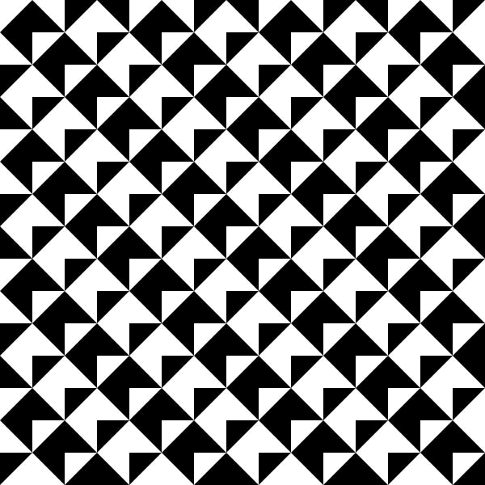
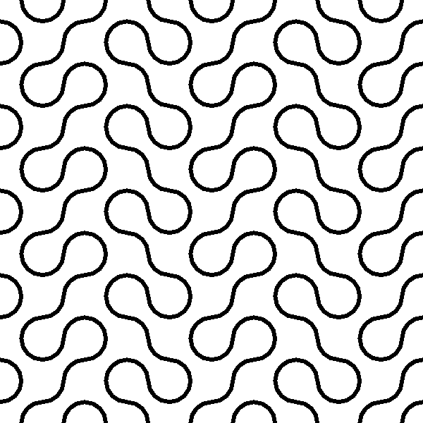

# Módulos ou mosaicos de Truchet

O padre dominicano francês Sébastien Truchet explorou largamente padrões formados pelo ladrilhamento, ou tesselação, isto é o recobrimento de superfícies, com um padrão de quadrados decorados, com desenhos que não tem simetria rotacional. Esses estudos inspiraram gerações de designers e artistas que fizeram trabalhos com esses módulos, seja em trabalhos gráficos seja com cerâmicas e azulejos.

Vamos começar com uma grade de quadrados, e uma função que seja capaz desenhar um elemento gráfico que costumamos chamar de módulo, e que possa ser girado 0, 90, 180 ou 270 graus. O primeiro exemplo vai ser próximo aos azulejos divididos na diagonal e com duas cores que Truchet usou.

Também veremos uma variante dessa ideia usando arcos que, ao que parece, foi popularizada pelo trabalho de Cyril Stanley Smith and Pauline Boucher, [The Tiling Patterns of Sebastien Truchet and the Topology of Structural Hierarchy](https://www.jstor.org/stable/1578535?origin=crossref&seq=1#metadata_info_tab_contents).


## Um primeiro exemplo com diagonais

```python
COLS = FILS = 15

def setup():
    global tam
    size(600, 600)
    rect_mode(CENTER)   # retângulos pelo centro
    no_stroke()         # formas sem contorno
    tam = width / COLS  # tamanho do módulo
    
def draw():
    angulo = 0
    for fila in range(FILS):
        y = tam / 2 + tam * fila
        for coluna in range(COLS):
            x = tam / 2 + tam * coluna
            azulejo(x, y, tam, radians(angulo))
            angulo = angulo + 90

def azulejo(x, y, tam, rot):
    push_matrix()    # guarda coordenadas atuais
    translate(x, y)  # muda o 0, 0
    rotate(rot)
    fill(255)
    square(0, 0, tam)
    fill(0)
    triangle(tam / 2, -tam / 2,
             tam / 2,  tam / 2,
            -tam / 2,  tam / 2)
    pop_matrix()  # volta coordenadas anteriores

def key_pressed():
    save('truchet_diagonal.png')
```


## Um exemplo com arcos sem preenchimento

Infelizmente o antialiasing dos arcos, nas saídas raster (como PNG) tem apresentado visualmente pequenas discontinuidades nos arcos ("dentes"), se exportarmos uma versão vetorial (como SVG) é possível confirmar que a geometria dos arcos está correta, bem encaixada, sem discontinuidades. 

```python
COLS = FILS = 10

def setup():
    global tam
    size(800, 800)
    rect_mode(CENTER)   # retângulos pelo centro
    no_stroke()         # formas sem contorno
    tam = width / COLS  # tamanho do módulo
    
def draw():
    angulo = 90
    for fila in range(FILS):
        y = tam / 2 + tam * fila
        for coluna in range(COLS):
            x = tam / 2 + tam * coluna
            azulejo(x, y, tam, radians(angulo))
            if (fila + coluna) % 2 == 0:
                angulo = angulo + 90

def azulejo(x, y, tam, rot):
    push_matrix()    # guarda coordenadas atuais
    translate(x, y)  # muda o 0, 0
    rotate(rot)
    fill(255)
    no_stroke()
    square(0, 0, tam)
    no_fill()
    stroke(0)
    stroke_weight(6)
    arc(-tam / 2, -tam / 2, tam, tam, 0, PI / 2)
    arc(tam / 2, tam / 2, tam, tam, PI, 3 * PI / 2)
    pop_matrix()  # volta coordenadas anteriores

def key_pressed():
    save('truchet_arcos.png')
```



## Um exemplo com arcos e regiões preenchidas

Exemplo, bastante mais avançado, é inspirado em um código para Processing Java do livro [Processing: Creative Coding and Generative Art in Processing 2](https://rd.springer.com/book/10.1007/978-1-4302-4465-3), depende de uma classe Celula, e permite a interação com cliques do mouse. 

### Versão interativa


```python
from itertools import product

lado = 40
filas = 40
colunas = 30

def setup():
    size(600, 400)
    stroke_weight(3)
    for coluna in range(colunas):
        for fila in range(filas):
            celula = Celula(coluna, fila, lado)
            celula.gira(random_int(0, 1))
            celula.arruma_cor()
            
def draw():
    background(200)
    for celula in Celula.grade.values():
        celula.desenha()

def mouse_clicked():
    for celula in Celula.grade.values():
        if celula.sob_mouse(mouse_x, mouse_y):
            if is_key_pressed and key_code == SHIFT:
                celula.muda_desenho()
            else:
                celula.gira()

def key_pressed():
    for i, j in product(range(colunas), range(filas)):
        celula = Celula.grade[i, j]
        if key == 'm' and random(100) < 50:
            celula.muda_desenho()
        elif key == 'r' and random(100) < 50:
            celula.gira()
        elif key == ' ':
            celula.arruma_cor()

def modulo1(x, y, lado):
    #no_stroke()
    rect_mode(CENTER)
    fill(0, 0, 200)
    ml = lado / 2 # metade da lado
    rect(x, y, lado, lado)
    fill(0)
    arc(x - ml, y - ml, lado, lado, 0, PI / 2)
    arc(x + ml, y + ml, lado, lado, PI, 3 * PI / 2)
    
def modulo2(x, y, lado):
    no_stroke()
    rect_mode(CENTER)
    fill(0)
    ml = lado / 2 # metade da lado
    rect(x, y, lado, lado)
    fill(0, 0, 200)
    arc(x - ml, y - ml, lado, lado, 0, PI / 2)
    arc(x + ml, y + ml, lado, lado, PI, 3 * PI / 2)

class Celula:
    grade = {}
    variantes = [modulo2, modulo1]
    
    def __init__(self, i, j, lado):
        self.coluna = self.i = i
        self.fila = self.j = j
        self.x = lado / 2 + i * lado
        self.y = lado / 2 + j * lado
        self.lado = lado
        self.variante = 0
        self.rot = 0
        Celula.grade[i, j] = self
    
    def desenha(self):
        push_matrix()
        translate(self.x, self.y)
        rotate(HALF_PI * self.rot)
        funcao_desenho = self.variantes[self.variante]
        funcao_desenho(0, 0, self.lado)
        pop_matrix()
 
    def sob_mouse(self, x, y):
        return (self.x - self.lado / 2 < x < self.x + self.lado / 2 and
                self.y - self.lado / 2 < y < self.y + self.lado / 2)
         
    def gira(self, rot=None):
        if rot is None:
            self.rot = not self.rot 
        else:
            self.rot = rot

    def muda_desenho(self, i=None):
        if i is None:
            self.variante = not self.variante
        else:
            self.variante = i
            
    def arruma_cor(self):
        """
        Baseado em "Processing: Creative Coding and Generative Art in Processing 2"
        by Ira Greenberg, Dianna Xu, Deepak Kumar
        """
        i, j = self.i, self.j
        if i > 0 and j == 0:   # first tile of a row, starting from the 2nd row
            # same rot as tile directly above
            if Celula.grade[i-1, 0].rot == self.grade[i, 0].rot:
                # set to opposite coloring of my neighbor above
                self.grade[i, 0].variante = not self.grade[i-1, 0].variante
            else:
                # set to same coloring of my neighbor above
                self.grade[i, 0].variante = self.grade[i-1, 0].variante
        if j > 0:  # subsequent grade in a row, including the first
            # same rot as tile to the left
            if self.grade[i, j-1].rot == self.grade[i, j].rot:
                # set to opposite coloring of my neighbor to the left
                self.grade[i, j].variante = not self.grade[i, j-1].variante
            else:
                # set to same coloring of my neighbor to the left
                self.grade[i, j].variante = self.grade[i, j-1].variante        
```

### Uma versão estática mais parecida com o código original

Esta versão tem uma estrutura mais pareceida com a do exemplo original em Java.

```python
# Translated to Processing Python mode from the Java example at
# "Processing: Creative Coding and Generative Art in Processing 2" by Ira Greenberg, Dianna Xu, Deepak Kumar
# And then adapted for Python + py5 (imported mode)

from random import choice

tile_size = 49
rows = 20
cols = 20

tiles = [[None] * rows for _ in range(cols)]
ic = color(100, 125, 0)     # orange # ic = color(100, 125, 0)
oc = color(20, 150, 255)    # blue # oc = color(20, 150, 255)

def setup():
    size(1000, 1000)
    translate(10, 10)
    fill(255, 0, 0)
    for i in range(rows):
        for j in range(cols):
            tiles[i][j] = Tile(j * tile_size, i * tile_size, tile_size, ic, oc)
            color_swap(i, j)
            tiles[i][j].display()

def color_swap(i, j):
    if i > 0 and j == 0:   # first tile of a row, starting from the 2nd row
        # same orientation as tile directly above
        if tiles[i-1][0].orientation == tiles[i][0].orientation:
            # set to opposite coloring of my neighbor above
            tiles[i][0].swapped_colors = not tiles[i-1][0].swapped_colors
        else:
            # set to same coloring of my neighbor above
            tiles[i][0].swapped_colors = tiles[i-1][0].swapped_colors
    if j > 0:  # subsequent tiles in a row, including the first
        # same orientation as tile to the left
        if tiles[i][j-1].orientation == tiles[i][j].orientation:
            # set to opposite coloring of my neighbor to the left
            tiles[i][j].swapped_colors = not tiles[i][j-1].swapped_colors
        else:
            # set to same coloring of my neighbor to the left
            tiles[i][j].swapped_colors = tiles[i][j-1].swapped_colors

class Tile:

    def __init__(self, x, y, w, ic, oc):
        self.x, self.y = x, y  # x, y coords of top left corner of tile
        self.sz = w  # size of tile
        self.ic = ic  # inside – fill of arc if swapColor is False
        # outside – fill of background square if swapColor is False
        self.oc = oc
        self.orientation = choice((0, 1))  # orientation of tile
        # whether we should swap inside and outside colors
        self.swapped_colors = False

    def display(self):
        push_matrix()
        # move to tile's x-y location (upper left corner)
        translate(self.x, self.y)
        no_stroke()
        if self.swapped_colors:
            fill(self.ic)
        else:
            fill(self.oc)
        rect(0, 0, self.sz, self.sz)  # draw background square
        translate(self.sz / 2, self.sz / 2)  # move to the center of the tile
        rotate(self.orientation * PI / 2)  # rotate by the appropriate angle
        translate(-self.sz / 2, -self.sz / 2)  # back to the upper left corner
        stroke(255)
        stroke_weight(5)
        if self.swapped_colors:
            fill(self.oc)
        else:
            fill(self.ic)
        arc(0, 0, self.sz, self.sz, 0, PI / 2)
        arc(self.sz, self.sz, self.sz, self.sz, PI, 3 * PI / 2)
        pop_matrix()
```

