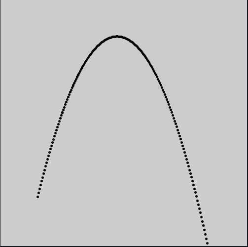

# Operações com vetores e a classe `PVector`

Vetores no fundo são são listas de números, algo como `[105, 42]` ou `[120, 81, 35]`. Os números são os * componentes * e os vetores, que podem ter o número de componentes que você quiser, mas nos interessam mais neste momento os vetores com 2 ou 3 componentes pois eles são úteis para representar coordenadas, velocidades e acelerações em duas e três dimensões. Podemos visualizá-los como pontos ou como segmentos de reta orientados, a representação gráfica usual é como uma seta.

> < sub > É possível trabalhar com vetores de muito mais dimensôes, que não são fáceis de visualizar, muito usados em computação científica, da álgebra linear à representação de palavras para processamento de linguagem natural e tradução automatizada. < /sub >

É possível somar e subtrair vetores somando os componentes de cada um nas mesmas posições, é fácil também multiplicar ou dividir um vetor por um número comum, multiplicando cada componente pelo número(e isso multiplica ou divide a magnitude do vetor). Já para multiplicar vetores entre si tem mais de uma maneira de fazer, o chamado produto escalar(*dot product*) e o produto vetorial(*cross product*). Mas podemos pedir para o computador fazer para nós essas operações!

# A classe `PVector`

Os vetores 2-D e 3-D, de duas e três dimensões, podem ser expressos no Processing como objetos da classe `Py5Vector`, construídos com `Py5Vector(x, y)`e `Py5Vector(x, y, z)`, respectivamente. Acredito que em breve você vai concordar comigo que essa classe vai facilitar muito fazer operações, contas e transformações, com vetores, o que é especialmente útil para animar partículas e calcular diversas geometrias.

```python
pos = Py5Vector(75, 400)  # posição inicial
vel = Py5Vector(2, -8)   # velocidade inicial
acel = Py5Vector(0, 0.1)  # aceleração, para baixo


def setup():
    size(500, 500)
    stroke_weight(5)


def draw():
    global pos, vel
    point(pos.x, pos.y)
    pos += vel
    vel += acel


```


No exemplo acima, o vetor `pos` representa a posição de uma partícula, o vetor `vel` a sua velociade, e o vetor `acel` uma aceleração para baixo(que pode ser interpretada como resultado de uma força causada pela ação da gravidade, por exemplo).

No código o operador de atribuição aumentada `+=`, aplicado à variável global `pos`, faz a velocidade alterar a posição, algo equivalente a `pos = pos + vel`, e da mesma maneira a velocidade é alterada pela aceleração `acel`.

# Uma classe de partículas que fogem do mouse

```python
particles = []


def setup():
    size(400, 400)
    stroke_weight(5)
    for i in range(200):
        particles.append(Particle(random(width), random(height)))


def draw():
    background(200)
    mouse_pos = Py5Vector(mouse_x, mouse_y)
    for p in particles:
        p.update(mouse_pos)


class Particle:
    def __init__(self, x, y):
        self.pos = Py5Vector(x, y)
        self.vel = Py5Vector(0, 0)  # PVector.random2D()

    def update(self, mouse_pos):
        delta = self.pos - mouse_pos
        d = delta.mag()
        if 0 < d < 50:
            acel = delta.normalize() * 0.01
            self.vel += acel
        self.pos += self.vel
        self.vel = self.vel * 0.995  # slow down

        stroke(max(0, 255 - d * 5,), 0, 0)
        point(self.pos.x, self.pos.y)

        if self.pos.x < 0:
            self.pos.x = width
        elif self.pos.x > width:
            self.pos.x = 0
        if self.pos.y < 0:
            self.pos.y = height
        elif self.pos.y > height:
            self.pos.y = 0


```


Neste segundo exemplo a diferença(subtração) entre um vetor criado com as cordenadas da posição do mouse(`mouse_pos`) e o vetor que indiaca a posição de cada partícula(`self.pos`) é usada para calcular um vetor `delta` cuja magnitude `delta.mag()` afeta a aceleração das partículas. Podem ser visto também o uso do método `.normalize()` para obter um vetor unitário(de magnitude 1) que, mantendo apenas a direção do vetor original `delta`, é usado para calcular a direção da aceleração. O código poderia talvez ser tornado mais eficiente usando o método que cálcula o quadrado da magnitude(`.mag_sq()`) que é mais econômico que o cálculo da magnitude.

# Métodos dos vetores `PVector`

| método | descrição |
| ------------------------------------------------------------------------------ | ---------------------------------------------------------------------------------------------------------------------------------- |
| [set()](https://py.processing.org/reference/PVector_set.html) | Define(altera) os componentes do vetor. |
| [random2_d()](https://py.processing.org/reference/PVector_random2D.html) | Cria um novo vetor unitário 2D com uma direção aleatória. |
| [random3_d()](https://py.processing.org/reference/PVector_random3D.html) | Cria um novo vetor unitário 3D com uma direção aleatória. |
| [from_angle()](https://py.processing.org/reference/PVector_fromAngle.html) | Cria um novo vetor unitário 2D a partir de um ângulo. |
| [copy()](https://py.processing.org/reference/PVector_copy.html) | Produz um novo vetor, cópia do original. |
| [mag()](https://py.processing.org/reference/PVector_mag.html) | Calcula a magnitude do vetor. |
| [mag_sq()](https://py.processing.org/reference/PVector_magSq.html) | Calcula a magnitude ao quadrado do vetor. É mais rápido que calcular a magnitude! |
| [add()](https://py.processing.org/reference/PVector_add.html) | Soma compontentes x, y, e z, ou um segundo vetor a um vetor. Pode-se usar o operador `+`  para somar dois vetores também. |
| [sub()](https://py.processing.org/reference/PVector_sub.html) | Subtrai compontentes x, y, e z, ou um segundo vetor a um vetor. Pode-se usar o operador `-` pra subtrair um vetor de outro também. |
| [mult()](https://py.processing.org/reference/PVector_mult.html) | Multipica um vetor por um valor escalar. Pode-se usar o operador `*` |
| [div()](https://py.processing.org/reference/PVector_div.html) | Divide um vetor por um valor escalar. Pode-se usar o operador `/` |
| [dist()](https://py.processing.org/reference/PVector_dist.html) | Calcula a distância entre dois pontos representados por dois vetores. |
| [dot()](https://py.processing.org/reference/PVector_dot.html) | Calcula o produto escalar(*dot product*) entre dois vetores. |
| [cross()](https://py.processing.org/reference/PVector_cross.html) | Calcula o produto vetorial(*cross product*) entre dois vetores. |
| [normalize()](https://py.processing.org/reference/PVector_normalize.html) | Normaliza o vetor, isto é faz com que fique com a magnitude 1, mantendo a mesma direção. |
| [limit()](https://py.processing.org/reference/PVector_limit.html) | Limita a magnitude do vetor a um certo valor. |
| [set_mag()](https://py.processing.org/reference/PVector_setMag.html) | Define, isto é altera, a magnitude do vetor. |
| [heading()](https://py.processing.org/reference/PVector_heading.html) | Calcula o ângulo de rotação do vetor, isto é, para onde ele aponta. |
| [rotate()](https://py.processing.org/reference/PVector_rotate.html) | Gira o vetor um certo ângulo em radianos(funciona apenas em 2D). |
| [lerp()](https://py.processing.org/reference/PVector_lerp.html) | Produz o resultado da interpolação linear entre dois vetores. |
| [angle_between()](https://py.processing.org/reference/PVector_angleBetween.html) | Calcula o ângulo entre dois vetores. |
