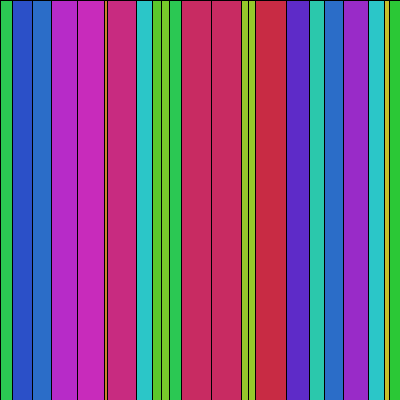

# Laço de repetição `while`

Veja aqui motivos para usar laços com `while`, a sintaxe, a descrição de estratégias de uso, em abstrato, e, em seguida, alguns exemplos mais concretos. 

Quando é comum usar o `while`?

- Você precisa de contadores ou uma sequênica de números não-inteiros e a forma do laço `for` com `for i in range(inicio, parada, passo):` só funciona com inteiros. Isso pode ser resolvido implementando um [`frange()`](java_para_python.md#implementando-um-range-com-passos-não-inteiros) mas é mais comum ser feito com `while`;
- Você só vai saber a hora de parar o laço no meio do processo de repetições, isto é, o número de de iterações, o número de "voltas" do laço, não é conhecido com antecedência, é um chamado "laço indetermidado".

### Sintaxe dos laços `while`

De forma geral os laços de repetição baseados no `while` tem a seguinte estrutura: 

```python 
while «condição»: #  enquanto a condição for verdadeira, execute:
    «corpo» 
```
Em contraste com estrutura do `if`, em que quando a condição é avaliada como True (verdadeiro) o bloco de código do corpo é executado uma única vez, No caso do `while`, o bloco do corpo será executado diversas vezes, enquanto a condição for verdadeira, podendo inclusive resultar em um loop infinito. Para evitar essa repetição infinita é necessário garantir que, no código do corpo, em algum momento:

- Alguma ação acontece que torna a condição avaliada pelo laço seja `False` (falsa)
- Alguma condição no corpo, em uma estrutura com `if`, por exemplo, permite a execução da instrução `break`. 
 
Uma dessas duas coisas é necessária para evitar uma repetição infinita.

Vejamos uma descrição em abstrato de algumas dessas estratégias (que podem inclusive ser combinadas):

```python
«é criada uma variável-contador» 
while «condição que depende do contador»:
    «corpo do laço, deve incluir 
    atualização ou incremento do contador»     
```

```python
«é criada uma estrutura de dados» 
while «condição que envolve a estrutura de dados»:
    «corpo do laço, deve incluir
    modificação da estrutura de dados»      
```

```python
while True: # um laço inicialmente infinito
    «corpo do laço, deve incluir
    efeito que afeta a condição de saída»
    if «condição de saída»:
        break # saída do laço    
```

### Primeiro exemplo

No exemplo abaixo usaremos o laço `while` testando se o valor de um ângulo `ang` é menor que 360 graus (em radianos, a constante Pi vezes dois, ou, no Processing `TWO_PI`). 

O corpo do laço produz os vértices, que são pontos de um polígono em forma de estrela, a cada ciclo, e `ang` vai tendo o seu valor aumentado (`ang += passo`), até deixar de ser menor que `TWO_PI`, dessa forma encerrando o laço.

```python
def setup():
    size(400, 400)
    background(0)
    estrela(width / 2, height / 2, 190, 100, 10)

def estrela(x, y, raio_a, raio_b, num_pontas):
    passo = TWO_PI / num_pontas
    begin_shape()
    ang=0
    while ang < TWO_PI:  # enquanto o ângulo for menor que 2 * PI:
        sx = cos(ang) * raio_a
        sy = sin(ang) * raio_a
        vertex(x + sx, y + sy)
        sx = cos(ang + passo / 2.) * raio_b
        sy = sin(ang + passo / 2.) * raio_b
        vertex(x + sx, y + sy)
        ang += passo  # aumente o ângulo um passo
    end_shape(CLOSE)
```


### Uma variante com círculos

```python
def setup():
    size(600, 600)
    background(0)
    mandala(width / 2, height / 2, 100, 10)

def mandala(x, y, raio, num_petalas):
    passo = TWO_PI / num_petalas
    angulo=0
    while angulo < TWO_PI:
        sx = x + cos(angulo) * raio
        sy = y + sin(angulo) * raio
        fill(255, 255, 255, 50)
        circle(sx, sy, raio * 2)
        angulo += passo
```


### Acumulando itens em uma coleção

##### Adicionando tuplas sorteadas à uma lista, dependendo de uma regra, a restrição da distância.

Suponha que você quer uma coleção de 1000 pontos, descritos por tuplas (x, y), produzidos (pseudo-)aleatoriamente, mas que cumpram um requisito, no caso estar a uma certa distância do centro do desenho. A cada ciclo do laço é "sorteada" uma posição, mas ela é adicionada à lista apenas se cumprir o requisito. Como garantir que são adicionadas exatamente 1000 posições, uma vez que podem ser sorteadas posições que não atendem o requisito em alguns ciclos? A resposta é este uso de `while`.

```python
posicoes = []  # uma lista para guardar tuplas de posições

def setup():
    size(400, 400)
    background(0, 0, 100)
    while len(posicoes) < 1000:
        x = random(width)
        y = random(height)
        if dist(x, y, 200, 200) < 195:
             posicoes.append((x, y))
             circle(x, y, 5)
    print(len(posicoes))  # exibe: 1000
```


Note que neste exemplo, muito simples, não garantimos que não teremos posições sobrepostas. Isto pode ser resolvido consultando se a posição "sorteada" já existir na estrutura de dados. Para listas isso é algo não eficiente. Veja o exemplo a seguir, que resolve este problema, mas se trata de um desenho diferente, e a não-sobreposição é a única restrição.

##### Sorteando elementos que não se sobrepõe, as posições não repetem, usando um conjunto/set

Imagine uma grade com 6400 posições, vocẽ quer sortear exatamente 3200 quadrados, mas não quer sobreposições.

```python
quadrados = set()  # conjunto, coleção que não preserva a ordem

def setup():
    size(400, 400)
    background(0, 0, 100)
    while len(quadrados) < 3200:
        x = int(random(width) / 5)
        y = int(random(height) / 5)
        if (x, y) not in squares:   # esta operação é rápida em conjuntos
             quadrados.add((x, y))    # note .add() e não .append()
             rect(x * 10, y * 10, 10, 10)
    print(len(quadrados))  # exibe: 3200
```


# Somando larguras variáveis

Neste terceiro exemplo queremos acumular retângulos de larguras aleatórias até uma determinada largura total máxima. No corpo do `while()`
há um mecanismo que checa se a adição da largura da vez passa do limite, e ajusta apropriadamente a última largura.

```python
def setup():
    size(400, 400)
    background(0)
    color_mode(HSB)
    total = 0
    while total < 400:
        largura = int(random(1, 32))
        if total + largura > 400:
            largura = 400 - total
        fill(largura * 8, 200, 200)
        rect(total, 0, largura, height)
        total += largura
        print(total)
```



# `While` e `else`

### `While` e `else` 

Uma sintaxe que pode ser usada também nos laços `for`, é uma cláusula `else` após o laço, o código neste bloco só executa se o laço transcorreu até o fim sem interrupção (sem um `break`).

```python
while True: # um laço inicialmente infinito
    «corpo do laço, deve incluir
    efeito que afeta a condição de saída»
    if «condição de saída»:
        break # saída do laço    
else:
     «código que só executa se o while não foi interrompido»
```

Dois exemplos, em abstrato, que demonstram este comportamento.

```python
x = 0
while x < 10:
    print(x)  # enquando a condição for verdadeira
    x += 1
else:  # quando a condição for falsa e o loop terminou
    print("False: o x não é mais menor que 10")

x = 0
while x < 10:
    print(x)  # enquando a condição for verdadeira
    x += 1
    if x > 8:
        break  # interrompe o laço antes!
else:  # quando a condição for falsa
    print("False: o x não é mais menor que 10")  # nunca será executado!
```

No segundo exemplo, `break` interrompe a execução do laço, e nesse caso, o bloco do `else`, que só executa quando a condição do `while` não é mais verdadeira, não será executado.

## Assuntos relacionados

- [Dicionários e conjuntos](dicionarios.md)
