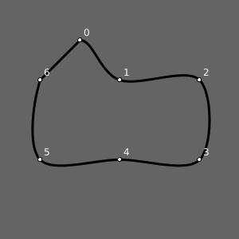
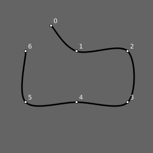
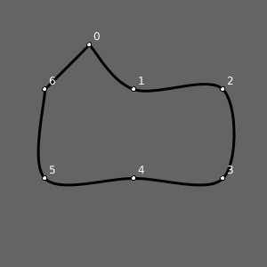

# Desenhando curvas - I

Agora que já sabemos desenhar um polígonos com `beginShape()` e `endShape()` ou `endShape(CLOSE)` podemos experimentar formas curvas.

### Sumário

[Curvas Bezier](#curvas-bezier-com-beziervertex)


## Curvas Bezier com `bezierVertex()`

As famosas curvas Bezier levam o nome de Pierre Bézier, que as desenvolveu em seus trabalhos na década de 1960 na indústria automotiva, elas descrevem curvas a partir das coordenadas de pontos, ou âncoras, que delimitam o início e o fim de uma curva, mas também precisam de "pontos de controle" que em geral ficam fora da curva, mas controlam o seu comportamento.

Você pode usar um ou mais vértices *Bezier* entre o `beginShape()` e o `endShape()`, e ela pode ser aberta ou fechada (com `endShape(CLOSE)`), mas antes de cada `bezierVertex()` é preciso que haja algum outro vértice, um ponto âncora, que marca o início e que pode ser feito com `vertex()`, como neste exemplo a seguir.

No `bezierVertex()` propriamente dito, os quatro primeiros argumentos são as cordenadas de dois pontos de controle e os últimos dois são as coordenadas do vértice (que pode servir de âncora inicial para um próximo vértice Bezier).

```
 beginShape()
    vertex(100, 50)         # 0: âncora inicial 
    bezierVertex(150, 150,  # 1: primeiro ponto de controle do primeiro vértice
                 250, 100,  # 2: segundo ponto de controle do primeiro vértice
                 250, 200), # 3: vértice final da primeira curva, âncora da segunda
    bezierVertex(150, 250,  # 4: primeiro ponto de controle do segundo vértice
                 50, 200,   # 5: segundo ponto de controle do segundo vértice
                 50, 100)   # 6: segundo vértice bezier (final)
    endShape(),
```


### `curveVertex()`

Agora que já sabemos iterar por uma estrutura de dados, e como usar as coordenadas das tuplas para desenhar um polígono, podemos experimentar a mesma estratégia com outros típos de vértice. 

Agora veremos o `curveVertex()`,que não tem pontos de controle como Bezier, mas tem a curiosa propriedade de ser influenciado pelos pontos que vem antes e depois dele.

Considere esta lista de pontos:

```python
pontos = [
    (100, 50),          
    (150, 100),
    (250, 100),
    (250, 200),
    (150, 200),
    (50, 200),
    (50, 100),
    ]  
```

Se chamarmos uma vez `curveVertex()` para cada vértice dentro de um contexto de `beginShape()` e `endShape(CLOSE)`obteremos o seguinte resultado, esquisito (estou aqui omitindo parte do código que controla os atributos gráficos e mostra os texto com os índices dos pontos):

```python
beginShape()
for x, y in pontos:
    curveVertex(x, y)
endShape(CLOSE)
```


Para obter o resultado esperado (ou, caro leitor, pelo menos o que eu esperava) temos que acrescentar uma chamada com as coordenadas do último vértice antes do primeiro, e do primeiro vértice depois do último! Diga lá se não é estranho isso!

```python
curveVertex(pontos[-1][0], pontos[-1][1])
for x, y in pontos:
    curveVertex(x, y)
curveVertex(pontos[0][0], pontos[0][1])
endShape(CLOSE)
```



É possível fazer uma curva aberta com os mesmo pontos e a mesma influência do último ponto no primeiro, e do primeiro no último, omitindo o `CLOSE`:

```python
curveVertex(pontos[-1][0], pontos[-1][1])
for x, y in pontos:
    curveVertex(x, y)
curveVertex(pontos[0][0], pontos[0][1])
endShape()
```


Agora se não queremos essa influência da curva fechada, é preciso repetir o primeiro e o último vértice.

```python
beginShape()
curveVertex(pontos[0][0], pontos[0][1])   
for x, y in pontos:
    curveVertex(x, y)
curveVertex(pontos[-1][0], pontos[-1][1])
endShape()
```



Veja como ficaria acrescentando-se o `CLOSE` em `endShape(CLOSE)`



### Assuntos relacionados

- [Desenhando Polígonos - I](poligonos_1.md)
- [Desenhando Polígonos - II](poligonos_2.md)
- [Sequências e laços de repetição](lacos_py.md)

### EXTRA: Um testador de curvas interativo

**Desafio:** Você conseguiria escrever o código que permite testar as curvas arrastando os pontos com o mouse?


<details>    
<summary>Resposta: Usando a mesma estratégia de "arrastar círculos".</summary>

```python
arrastando = None 
pontos = [
    (100, 50),          
    (150, 100),
    (250, 100),
    (250, 200),
    (150, 200),
    (50, 200),
    (50, 100),
    ]

def setup():
    size(300, 300)

def draw():
    background(100)
    strokeWeight(3)
    stroke(0)
    noFill()
    beginShape()
    curveVertex(pontos[-1][0], pontos[-1][1])
    for x, y in pontos:
        curveVertex(x, y)
    curveVertex(pontos[0][0], pontos[0][1])
    endShape(CLOSE)
    strokeWeight(1)
    for i, ponto in enumerate(pontos):
        x, y = ponto
        if i == arrastando:
            fill(200, 0, 0)
        else:
            fill(255)   
        ellipse(x, y, 5, 5)
        text(i, x + 5, y - 5)

def mousePressed():  # quando um botão do mouse é apertado
    global arrastando
    for i, ponto in enumerate(pontos):
        x, y = ponto
        dist_mouse_ponto = dist(mouseX, mouseY, x, y)
        if  dist_mouse_ponto < 10:
            arrastando = i
            break  # encerra o laço

def mouseReleased():  # quando um botão do mouse é solto
    global arrastando
    arrastando = None

def mouseDragged():  # quando o mouse é movido apertado
    if arrastando is not None:
        x, y = pontos[arrastando]
        x += mouseX - pmouseX
        y += mouseY - pmouseY
        pontos[arrastando] = (x, y)

def keyPressed():
    saveFrame("curve_smooth.png")
```

</details>
