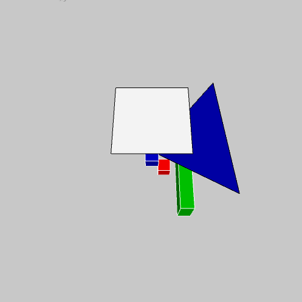

# Como desenhar em 3D

## Primeiros passos

Para começar, dentro do `setup()` é preciso usar o argumento `P3D` em `size()`, como neste exemplo:

```python
def setup():
    size(500, 500, P3D)
```

Passa então a ser possivel modificar o sistema de coordenadas com `translate(x, y, z)` (agora com **z**) e `rotateX()`, `rotateY()` e `rotateZ()` (que giram em torno dos eixos). 

Desta maneira é possível desenhar os mesmos elementos 2D que utilizamos até agora, porém deslocados e girados no espaço. Mas além dessa estratégia, também acontecem as seguintes mudanças:

- Linhas podem receber coordenadas 3D: `line(x1, y1, z1, x2, y2, z2)`

- Os elementos `PShape` criados com `beginShape()/endShape()` passam a poder ser desenhados no espaço, usando, por exemplo, `vertex(x, y, z)`.

- A função `box(w, h, d)` desenha um paralelepípedo, ou um cubo com `box(side)`, sempre na origem (0, 0, 0) do sistema de coordenadas, sendo então em geral acompanhada de uma estrutura com `pushMatrix()`/`popMatrix()` e `translate(x, y, z)` para que seja posicionada no lugar desejado.


### Um exemplo com objetos desenhados em 3D



```python
    
def setup():
    size(500, 500, P3D)
    rectMode(CENTER)
    
def draw():
    background(200)
    lights()
    translate(width / 2, height / 2)
    rotateX(radians(frameCount))
    stroke(255)
    fill(0, 200, 0)
    caixa(50, 50, 0, 20, 100, 50)
    fill(255, 0, 0)
    caixa(20, 20, -20, 20)
    fill(0, 0, 200)
    caixa(0, 20, 20, 20)
    stroke(0)
    line(0, 0, 0, 50, 50, 100)
    
    beginShape()
    vertex(0, 0, 0)
    vertex(100, 100, 100)
    vertex(100, -100, 50)
    endShape(CLOSE)
    
    # rotateY(QUARTER_PI + radians(frameCount))    
    translate(0, 0, 100)
    fill(255)
    rect(0, 0, 100, 100)    

def caixa(x, y, z, *tam):
    pushMatrix()
    translate(x, y, z)
    box(*tam)
    popMatrix()                                        
```

### Carregando recursos externos em 3D

Usando `size()` com `P3D` é possível carregar arquivos OBJ com a função `loadShape('arquivo.obj')` e mostrá-los com `shape(s, x, y)`. Veja o exemplo que vem no IDE!

### Exemplo de caixa com furos (e outros)

https://github.com/villares/Paper-objects-with-Processing-and-Python

### Desenhando uma barra em 3D

```python
def setup():
    size(500, 500, P3D)
    hint(DISABLE_DEPTH_MASK) # https://processing.org/reference/hint_.html
        
def draw():
    background(200)
    lights()
    fill(255, 0, 0, 100)
    bar(50, 50, 0, mouseX, mouseY, 250, 30)
    bar(450, 450, 0, 250, 250, 250, 30)

def bar(x1, y1, z1, x2, y2, z2, weight=10):
    """Draw a box rotated in 3D like a bar/edge."""
    p1, p2 = PVector(x1, y1, z1), PVector(x2, y2, z2)
    v1 = p2 - p1
    rho = sqrt(v1.x ** 2 + v1.y ** 2 + v1.z ** 2)
    phi, the  = acos(v1.z / rho), atan2(v1.y, v1.x)
    v1.mult(0.5)
    pushMatrix()
    translate(x1 + v1.x, y1 + v1.y, z1 + v1.z)
    rotateZ(the)
    rotateY(phi)
    box(weight, weight, p1.dist(p2))
    popMatrix()
```

### Exemplo da biblioteca PeasyCam, para orbitar em torno de objetos

```python
add_library('peasycam')  # é preciso baixar/instalar pelo IDE

def setup():
    global cam
    size(500, 500, P3D)
    cam = PeasyCam(this, 100)
    cam.setMinimumDistance(100)
    cam.setMaximumDistance(200)
    
def draw():
    # Desenho 3D que pode ser "orbitado" com drag do mouse
    lights()
    background(200)
    fill(96, 255, 0)
    box(30)
    pushMatrix()
    translate(0, 0, 20)
    fill(0, 96, 255)
    box(5)
    popMatrix()

    cam.beginHUD()  # inicia "Heads Up Display"
    # elementos 2D alinhados com a tela (como num vidro)
    fill(0, 128)
    rect(0, 0, 60, 30)
    fill(255)
    text("{:.2f}".format(frameRate), 10, 18)
    cam.endHUD()  # termina o "HUD"
```

### Documentação das opções de `hint()`

```python
# Este exemplo mostra a diferença entre as opções documentadas em:
# https://processing.org/reference/hint_.html
# Inspirado na conversa em:
# https://discourse.processing.org/t/program-to-test-hint-with-transparency/4361

# ["name", hint_enabled, hint_disable_constant, hint_enable_constant]
hints = (["DEPTH_TEST", False,
          DISABLE_DEPTH_TEST, ENABLE_DEPTH_TEST],
         ["DEPTH_SORT", False,
          DISABLE_DEPTH_SORT, ENABLE_DEPTH_SORT],
         ["DEPTH_MASK", False,
          DISABLE_DEPTH_MASK, ENABLE_DEPTH_MASK],
         ["OPTIMIZED_STROKE", True,
          DISABLE_OPTIMIZED_STROKE, ENABLE_OPTIMIZED_STROKE],
         ["STROKE_PERSPECTIVE", False,
          DISABLE_STROKE_PERSPECTIVE, ENABLE_STROKE_PERSPECTIVE],
         )
use_sphere = False

def setup():
    size(800, 600, P3D)
    apply_hints()

def draw():
    this.surface.title = 'FPS: {}'.format(round(frameRate))
    background(255)

    fill(0)
    for i, (name, status, _, _) in enumerate(hints):
        text("{} {}".format(name, str(status)), 20, 20 + i * 20)
    text("<- use the mouse to toggle settings", 200, 40)
    text("click here to toggle shape", 300, 580)
    
    fill(255, 40, 20, 100)
    translate(width / 2, height / 2)
    rotateY(frameCount * 0.005)
    for x in range(-200, 201, 200):
        for y in range(-200, 201, 200):
            pushMatrix()
            translate(x, 0, y)
            if use_sphere:
                sphere(90)
            else:
                box(180)
            popMatrix()

def mousePressed():
    global use_sphere    
    if mouseY > height - 100:
        use_sphere = not use_sphere

    id = mouseY / 20
    if id < len(hints):
        hints[id][1] = not hints[id][1]
        
    apply_hints()    

def apply_hints():
    for _, status, disable_const, enable_const in hints:
        hint(enable_const if status else disable_const)

```
# se der pau na sua placa de vídeo , veja essa dica: 

Se você estiver no Linux com uma placa intel integrada, tente acrescentar isto no início do seu sketch

```python 
from java.lang import System 
System.setProperty("jogl.disable.openglcore", "false")
```
