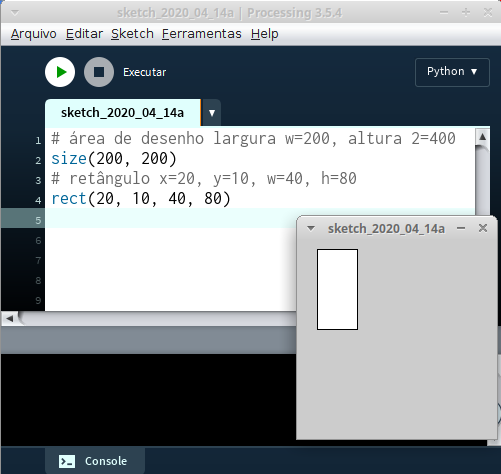
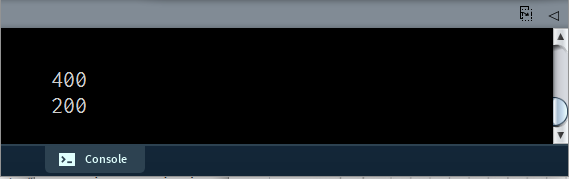

# Primeiros passos e desenho básico

Se você seguiu os passos [para instalar o Processin modo Python](https://abav.lugaralgum.com/como-instalar-o-processing-modo-python/), experimente digitar o código abaixo no IDE (nosso editor de código), e, em seguida, clique no botão com a seta triangular para frente (Executar/*Run*):

```python
size(200, 200)
rect(20, 10, 40, 80) 
```



**Experimente alterar os números entre parênteses e executar novamente...**

## Área de desenho e coordenadas

Usamos a função `size()` para determinar o tamanho da área de desenho (sem ela é gerada uma pequena tela de 100 por 100 pixels). Processing nos oferece automaticamente duas variáveis, os nomes `width` e `height`, que referenciam os valores de largura e altura da área de desenho, respectivamente. Podemos mostrar na parte de baixo da janela, no Console, esses valores usando `print()`.

```python
size(400, 200) # define o tamanho da área de deseno (w, h) 
print(width) # exibe no console largura atual da tela
print(height) # exibe no console altura atual da tela
```


O computador precisa saber a posição de cada ponto que desenha. Para fazer isso, normalmente usamos coordenadas cartesianas. Os eixos X e Y nos permitem especificar uma posição precisa na grade usando um par de números, normalmente o valor x seguido pelo valor y. 

Note que o eixo X cresce para a direita como de costume, mas o eixo Y é 'invertido' com valores crescendo 'para baixo'. Por exemplo, um ponto em (5, 14) fica a 5 unidades da borda esquerda da tela e 14 unidades para baixo do topo. 


## Desenhando algumas formas

```python
rect(20, 10, 40, 80) # retângulo (x, y, largura, altura)
ellipse(10, 20, 50, 50) # oval (x, y, largura, altura)
line(10, 10, 50,50) # linha do ponto 1 ao ponto 2 (x1, y1, x2, y2)
point(100, 50) # ponto em (x, y)
# nas versões mais novas do Processing
square(100, 50, 40) # quadrado na posição x:100 y:50 e lado:40
circle(50, 100, 40) # círculo na posição x:50 y:100 e diâmetro:40
```

### Cores e atributos gráficos (preenchimento e traço de contorno)

Para mudar as cores do preenchimento branco e do traço de contorno preto que são usadas inicialmente para desenhar as formas, indicamos inicialmente 3 números de 0 a 255 para definir uma combinação de vermelho (R), verde (G) e azul (B). 
É preciso definir a cor *antes* de pedir o desenho de uma forma! 

```python
fill(0, 255, 0) # preenchimento verde
ellipse(50, 50, 50, 50) # produz um círculo verde
```

É possível ajustar a cor de preenchimento de uma forma com `fill()` a cor de traço do contorno com `stroke()`, pedir uma forma sem preenchimento com `noFill()` ou sem traço de contorno com `noStroke()`. A espessura do traço de contorno pode ser contolada com `strokeWeight()`.

```python
noFill() # sem preenchimento, formas vazadas
stroke(0, 0, 255) # exemplo de cor do traço azul cor(R, G, B)
strokeWeight(10) # espessura do traço de contorno 10 pixels
noStroke() # sem traço de contorno
```

A cor indicada pode conter além dos 3 números (R, G, B) um quarto número de transparênica (Alpha). 

```python
fill(255, 0, 0, 100) # preenchimento vermelho (R:Vermelho, G:Verde, B:Azul, Alpha:Transparência)
```

## Fundo (*background*) e limpeza da área de desenho

O fundo também serve para apagar a área de desenho

```python
background(0, 255, 0) # fundo verde, limpa a tela background(R, G, B)
```
## Onde encontrar os nomes das funções, o vocabulário, e os seus significados?

O tempo todo vamos consultar o que é conhecido como *language reference* (referência da linguagem) que para o Processing modo Python esta em [py.processing.org/reference](https://py.processing.org/reference/).

## Comentários, o que são e como criar comentários em Python?

Comentários são anotações, pedaços de texto no código que não são executados pelo computador, são ignorados. Em Python, comentários começam com `#` e vão até o final da linha. Podem ser a linha inteira ou ficar depois de um trecho de código, e são também um jeito rápido de desativar uma linha de código! Em inglês tem até uma expressão para isso: *comment out* (desativar por meio de um comentário).

Os Comentários são feitos principalmente para o benefício as pessoas que colaboram com você e estão lendo o código, como, por exemplo, uma pessoa muito importante que é você-daqui-a-uma-semana, entender qual era o objetivo daquele pedaço do programa. Os comentários que você está vendo neste material didático talvez não sejam um exemplo muito bom de comentários pois eles estão explicando funcionamento muito elementar das funções e experessões usadas, idealmente, anote o seu código com explicações curtas que falem mais do motivo ou objetivo daquele bloco e não esqueça de mudá-los quando o objetivo e o código mudar.


```python
# Oi eu sou um comentário de uma linha inteira

size(900, 900)  # área de desenho 900 por 900 pixels para caber no meu site <- outro comentário

# background(0) <- instrução desativada, isso aqui tudo virou um comentário!

"""
Extra: Com três aspas no começo e no final podemos produzir textos (strings)
de várias linhas que são usados como uma espécie de comentário também, uma vez
que contém explicações para humanos, e não executam como o resto do código.

Quando ficam logo no começo do corpo de uma definição de função ou classe, são
chamados 'docstrings' (textos de documentação), não se preocupe com isso agora!
"""
```
### Próximos passos

- [Variáveis](variaveis.md)
- [Desenhando polígonos](poligonos_1.md)  
- [O que é indentação?](indentacao.md)  


---
Este material é baseado no material do curso [Progração Criativa](https://arteprog.space/programacao-criativa/)

---
Texto e imagens / text and images: CC BY-NC-SA 4.0; Código / code: GNU GPL v3.0 exceto onde explicitamente indicado por questões de compatibilidade.
