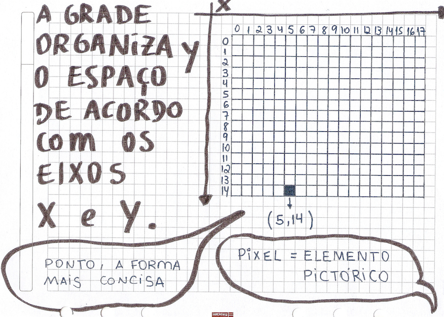

# Desenho Básico

## Área de desenho e coordenadas

```python
size(600, 400) # tamanho da tela size(largura, altura) 
print(width) # escreve no console largura atual da tela
print(height) # escreve no console altura atual da tela
```

O computador precisa saber a posição de cada ponto que desenha. Para fazer isso, normalmente usamos coordenadas cartesianas: um eixo x corre da esquerda para a direita, e o eixo y vai de cima para baixo. Esses eixos nos permitem especificar uma posição precisa na grade usando um par de números, normalmente o valor x seguido pelo valor y. Por exemplo, um ponto em (5, 14) é 5 linhas a partir da borda esquerda da tela e 14 linhas para baixo do topo.




## Formas


```python
square(100, 50, 40) # quadrado na posição x:100 y:50 e lado:40
circle(50, 100, 40) # círculo na posição x:50 y:100 e diâmetro:40
rect(20, 10, 40, 80) # retângulo (x, y, largura, altura)
ellipse(10, 20, 50, 50) # oval (x, y, largura, altura)
line(10, 10, 50,50) # linha do ponto 1 ao ponto 2 (x1, y1, x2, y2)
point(100, 50) # ponto em (x, y)
```

## Cores

É preciso definir a cor *antes* de pedir o desenho de uma forma!

```python
fill(255, 0, 0, 100) # preenchimento vermelho (R:Vermelho, G:Verde, B:Azul, Alpha:Transparência)
noFill() # sem preenchimento, formas vazadas
stroke(0, 0, 255) # exemplo de cor do traço azul cor(R, G, B)
strokeWeight(10) # espessura do traço de contorno
noStroke() # sem traço de contorno
```

## Fundo

O fundo também serve para apagar a área de desenho

```python
background(0, 255, 0) # fundo verde, limpa a tela background(R, G, B)
```

## Comentários

```python
# Comentários são anotações do código, não são executados
# Comentários de uma linha só começam com #. São um jeito rápido de desativar uma linha!

"""
Quando temos três aspas podemos ter textos de documentação (doc-strings) que funcionam
como comentários de várias linhas
"""
```


---
Este material é baseado no material do curso https://arteprog.space/programacao-criativa/

---
Texto e imagens / text and images: CC BY-NC-SA 4.0; Código / code: GNU GPL v3.0 exceto onde explicitamente indicado por questões de compatibilidade.
