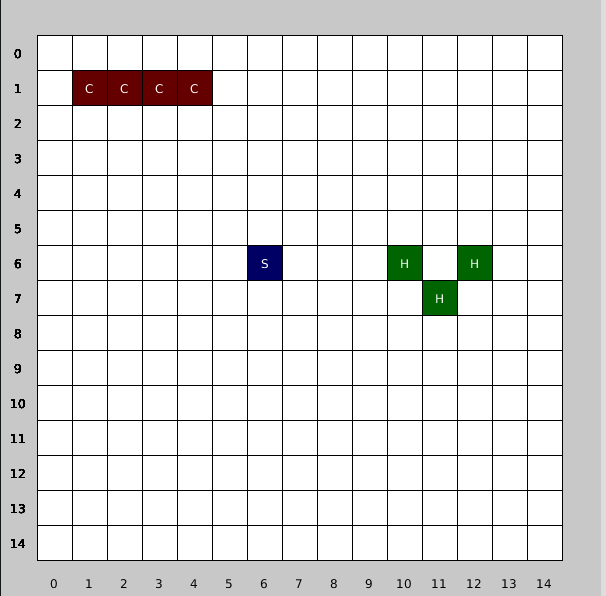

# Dicionários e conjuntos

Conjunto (*set*) e dicionário (*dict*) são duas das mais importantes estruturas de dados em Python, dicionários em especial são tão poderosos e flexíveis que são usados internamente para fazer funcionar a linguagem Python, e por isso existem piadas sobre linguagens de programação que são mais ou menos assim:

> E se tudo fosse uma lista? LISP
> 
> E se tudo fosse uma pilha (*stack*)? Forth
>
> E se tudo fosse um ponteiro? C
> 
> E se tudo fosse um dicionário? Python!

Ou ainda este meme aqui:


##### Uma metáfora para dicionários

Em uma metáfora simplificadora, imagine um dicionário como uma tabela de duas colunas, que permite que busquemos um item pela coluna da esquerda, a **chave**, e uma vez encontranda podemos consultar na coluna da direita um **valor** correspondente. Um dicionário é feito de pares chave-valor. 

Vejamos um exemplo prático em que um dicionário serve para guardar uma paleta de cores nomeadas, os nomes das cores vão ser as chaves, e as cores produzidas pela função `color()`do Processing vão ser os valores (que podem no final das contas serem usados nas funções `fill()`, `stroke()` e `background()`, por exemplo).

| chaves (*keys*) | valores (*values*) |
| --------------- | ------------------ |
| "branco"        | color(255)         |
| "preto"         | color(0)           |
| "azul"          | color(0, 0, 200)   |
| "amarelo"       | color(220, 220, 0) |
| "vermelho"      | color(200, 0, 0)   |

Em Python podemos definir um dicionário diretamente no código com a sintaxe `{chave: valor,}`.

```python
cores = {
    "branco": color(255),
    "preto": color(0),
    "azul": color(0, 0, 200), 
    "amarelo": color(220, 220, 0),
    "vermelho": color(200, 0, 0),
    }
```

Para consultar o valor atribuido a uma chave, acrescentar uma nova chave, ou modificar o valor dela usamos colchetes `[chave]`.

```python
cor_fundo = cores['azul']  # obtém a cor atribuida à chave 'azul'
background(cor_fundo)

cores['verde']  = color(0, 200, 0)  # acrescentar 'verde' ao dicionário
cores['amarelo'] = color(255, 255, 0) # modifica valor de 'amarelo'
```

No caso da consulta, se não houver a chave no dicionário, teremos um erro! Se não temos certeza da existência da chave podemos usar uma segunda forma de consulta com `.get()`.

```python
cinza = cores['cinza`]  # KeyError!

laranja = cores.get('laranja')  # Caso não haja 'laranja' obtemos `None`
if laranja:          # None é considerado 'False' e neste caso
    fill(laranja)    # em um primeiro momento fill() não executa

# podemos também propor um resultado padrão quando a chave não está lá
roxo = cores.get('roxo', color(200))  # se não houver 'roxo' cinza claro
fill(roxo)  # enquanto não houver 'roxo' no dicionário teremos color(200)
```

###### Outros exemplos

Podemos usar como chaves objetos ditos *imutáveis*, como números, texto (*strings*) ou tuplas cujos elementos internos também sejam imutáveis. Não podemos usar listas, uma vez que são *mutáveis*. Já os valores podem ser qualquer tipo de objeto/valor de Python, incluido listas e até mesmo outros dicionários!

> Uma explicação mais detalhadas sobre as limitações técnicas dos tipos que podemos usar nos dicionários não cabe neste texto introdutório, mas a sua curiosidade pode fazer você querer ler mais sobre eles em [Estruturas de dados (na documentação do Python)](https://docs.python.org/pt-br/3/tutorial/datastructures.html#dictionaries).

```
# Exemplo de diconário com uma tupla como chave - batalha naval

tam_tabuleiro = 15
tam_casa = 35
meia_casa = tam_casa / 2
borda = 36
tabuleiro_a = {
    (1, 1): "C",
    (2, 1): "C",
    (3, 1): "C",
    (4, 1): "C",
    (6, 6): "S",
    (10, 6): "H",
    (11, 7): "H",
    (12, 6): "H",
   }

cores = {
    "C": color(100, 0, 0),
    "S": color(0, 0, 100),
    "H": color(0, 100, 0),
    }

def setup():
    size(600, 600)
    textAlign(CENTER, CENTER)
    
def draw():
    background(200)
    for i in range(tam_tabuleiro):
        label(i)
        for j in range(tam_tabuleiro):
            label(j, vertical=True)
            c = tabuleiro_a.get((i, j))
            if not c:
                fill(255)
            else:
                fill(cores[c])
            square(i * tam_casa + borda, 
                   j * tam_casa + borda, 
                   tam_casa)
            if c:
                fill(255)
                text(c,
                     i * tam_casa + borda + meia_casa, 
                     j * tam_casa + borda + meia_casa) 
     
def label(n, vertical=False):
    fill(0)
    pos =  n * tam_casa + borda + meia_casa 
    if vertical:
        text(n, meia_casa, pos)
    else:
        text(n, pos, height - meia_casa)

```



```
# TODO: Exemplo de diconário com dicionários dentro??
estados = {'MG': {'capital':'Belo Horizonte', 'pop': 80000000},
           'AC': {'capital':'Rio Branco', 'pop': 880000},
           'RJ': {'capital':'Rio de Janeiro', 'pop': 70000000}, 
           }

estados['SP'] = {'capital':u'São Paulo', 'pop':44000000}
   
```


###### A questão da ordem dos elementos

Vale notar que até pouco tempo atrás os dicionários comuns em Python não guardavam ou garantiam a ordem das chaves. Em Python 3 atual isso mudou, e em Python 2 é possível recorrer a `OrderedDict` se você precisar manter registro da ordem em que as chaves foram criadas.

##### Conjuntos

Conjuntos (sets) são estruturas para guardar coleções de itens sem se preocupar com a ordem (por isso não nos referimos a eles como sequências como as tuplas e listas). São super eficientes para a consulta de existência ou não de um item  (temos X neste conjunto?) assim como operações de subtração, união e intersecção de conjuntos. Converter uma coleção em conjunto garante que não temos repetição de itens (mas perderemos a ordem se originalmente tínhamos uma coleção ordenada, uma sequência)
