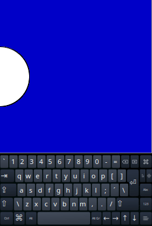
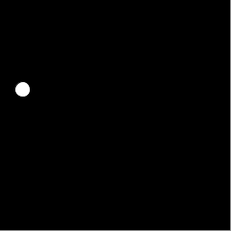

# Escopo: variáveis locais e globais

## Variáveis globais

Criamos variáveis globais quando atribuímos um valor a um nome fora do corpo das funções do nosso programa (normalmente no começo do programa). 

Essas variáveis podem ser usadas ao longo de todo o programa. Se você desejar criar uma nova variável global, ou reatribuir (alterar) o valor de uma variável global de dentro de uma função, em Python, é necessário usar a instrução `global`. Exemplo:

### Exemplo de uma variável global

```python
x = 0  # x é uma variável global

def setup():
    size(256, 256)
    background(0, 0, 200)

def draw():
    # Podemos usar/ler o valor da variável global x.
    ellipse(x, height / 2, 100, 100)
    
def keyPressed():
    # Queremos alterar o valor da variável global x. 
    global x 
    x = x + 1
```




## Variáveis locais

Quando criamos uma variável dentro da definição de uma função (como a função `setup()`, por exemplo), a variável tem *escopo local*, isto significa que somente o código dentro daquela função reconhece o nome e pode usar os valores a ele atribuídos.

Os parâmetros são os nomes que recebem os valores, argumentos, usados na chamada de uma função, são declarados no cabeçalho da definição da função, e também são nomes do escopo local da função.

### Exemplo de uma variável local

```python
def setup():
    size(256, 256)
    background(200, 200, 0)
    olho(128, 128, 200)

def olho(x, y, tamanho):  # parâmetros x, y, tamanho
    # 'tamanho' é um nome que funciona como uma variável local.
    metade = tamanho / 2  # 'metade' é uma variável local.
    noStroke()
    fill(255)
    ellipse(x, y, tamanho, metade)
    fill(0)
    ellipse(x, y, metade - 2, metade - 2)
```


#### Recapitulando

- **Variáveis globais** - Tradicionalmente criadas no início do *sketch*, e fora de qualquer função (incluindo `setup()` e `draw()`) são conhecidas em qualquer parte do código. Para criar ou alterar uma variável global dentro de uma função, em Python, é preciso usar a instrução `global` antes!

- **Variáveis locais** - São criadas dentro de uma função e, assim como os nomes dos parâmetros, pertencem ao escopo local da função.

#### Mais um exemplo, com variáveis globais e locais

```python
y = 100  # y é uma variável global, pode ser usada em qualquer ponto do programa.

def setup():
    global x # para criar uma variável global x aqui no setup()
    size(256, 256)
    x = width / 2

def draw():
    global x # necessário para poder alterar a variável global x aqui no draw()
    # repare que vamos 'ler' o valor de y, mas não vamos alterar
    background(0)
    tamanho = random(10, 50)  # tamanho é uma variável local
    ellipse(x, y, tamanho, tamanho) # x e y são variáveis globais
    x = x + 1
    if x > width:
        x = 0
```


### Conselhos sobre variáveis globais

É comum escutarmos que devemos usar variáveis globais com parcimônia, usadas descuidadamente, elas criam o risco de alterarmos inadvertidamente valores em pontos inesperados do programa.

Em projetos grandes, e com muitos programadores, o uso de variáveis globais é evitado, com o argumento é de que seu uso viola certas "boas práticas" de engenharia de software. Por exemplo, é considerado desejável o máximo encapsulamento das partes de um programa, e sento elas independentes, não necessitam variáveis globais. Mesmo assim, em certos contextos, elas são usadas.

Em pequenos *sketches* você não deve se preocupar com isso! Use variáveis globais quando precisar e só fique atento às suas modificações. Um erro comum é também criar uma variável local de mesmo nome que uma global, por esquecer de escrever a instrução `global` de Python dentro de uma função.

#### Glossário

[**variável**](https://penseallen.github.io/PensePython2e/02-vars-expr-instr.html#termo:variável) Um nome que se refere a um valor.

[**variável local**](https://penseallen.github.io/PensePython2e/03-funcoes.html#termo:variável%20local) Uma variável definida dentro de uma função. Uma variável local só pode ser usada dentro da sua função.

[**variável global**](https://penseallen.github.io/PensePython2e/11-dicionarios.html#termo:variável%20global) Variável definida fora de uma função. As variáveis globais podem ser acessadas de qualquer função.

[**instrução `global`**](https://penseallen.github.io/PensePython2e/11-dicionarios.html#termo:instrução%20global) Instrução que declara um nome de variável global.

---
Este material é baseado no material do curso https://arteprog.space/programacao-criativa/

---
Texto e imagens / text and images: CC BY-NC-SA 4.0; Código / code: GNU GPL v3.0 exceto onde explicitamente indicado por questões de compatibilidade.
